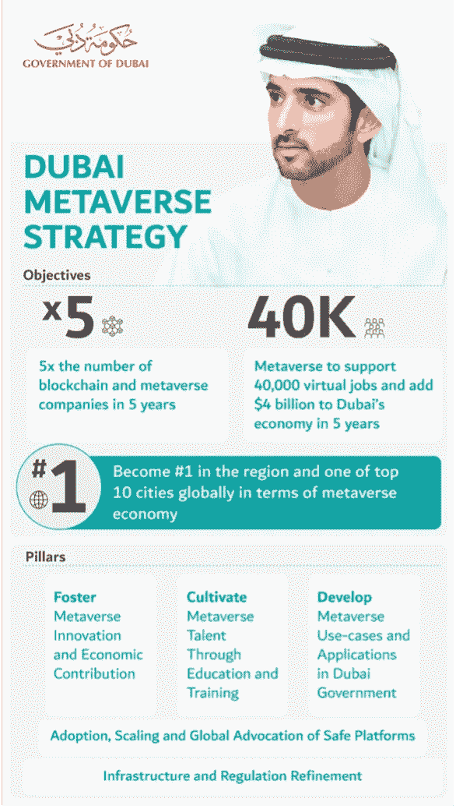
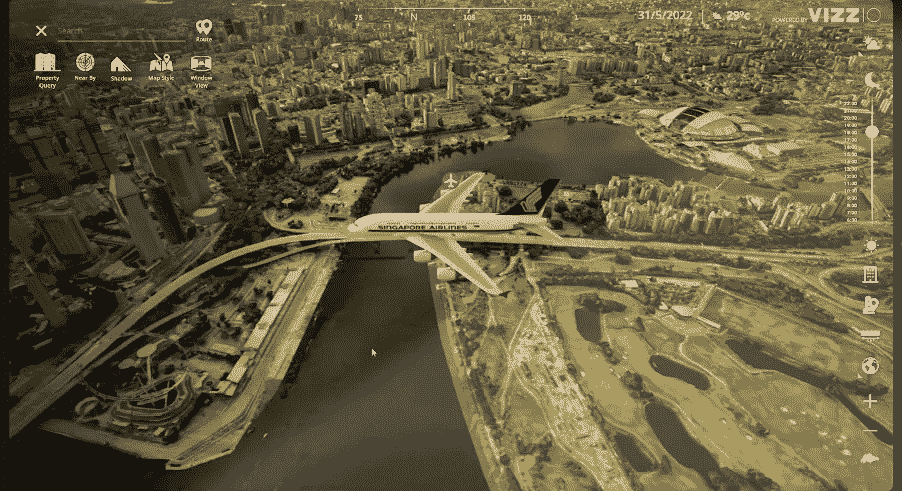

# 2022 年后值得关注的 4 个元宇宙城市

> 原文：<https://medium.com/coinmonks/the-4-metaverse-cities-to-watch-beyond-2022-5df79b9f387e?source=collection_archive---------10----------------------->

今天是马修·鲍尔期待已久的书 [*《元宇宙》以及它将如何彻底改变一切*](https://www.amazon.com/Metaverse-How-Will-Revolutionize-Everything/dp/1324092033) 的发布日，为了纪念这一天，我想深入探讨元宇宙未来最重要的方向之一:智能城市和数字双胞胎。

数字结对城市并不是一个新话题，作为智慧城市计划的一部分，它已经实施了很多年(尽管使用的是劣质技术)。然而，人们对元宇宙的兴趣激增，以及包括区块链、3D 可视化、人工智能和是的 VR/AR 在内的越来越多的工具，为智能城市提供了最大的机会，以真正利用数字双胞胎来改变生活和城市基础设施。

我个人[也相信，对元宇宙用户和建筑商来说，一些最大的机会将出现在现实世界中更加超现实的数字双胞胎](/coinmonks/hyper-realistic-metaverse-travel-beyond-d64d97bfd98b)，而不是完全虚拟的世界。

一些读者可能熟悉我每年在《快速公司》杂志上发表的关于全球智能城市的基准和排名的文章。几年前，我甚至扩展了这一点，一次性努力对区块链城市进行排名。

结合我对智能城市的历史兴趣和过去 5 年多在区块链和元宇宙的兴趣，我想借用过去的城市排名工作来提供元宇宙城市的粗略排名。

令我惊喜的是，全球一系列城市(主要在中东和 APAC)越来越热衷于拥抱强健的数字双胞胎和元宇宙。

> 交易新手？尝试[加密交易机器人](/coinmonks/crypto-trading-bot-c2ffce8acb2a)或[复制交易](/coinmonks/top-10-crypto-copy-trading-platforms-for-beginners-d0c37c7d698c)

**1)** **迪拜**

全球城市之间正在酝酿一场争夺元宇宙霸权的战争。虽然目前排名靠前的城市之间差距不大，但我觉得有必要让迪拜名列前茅。几年来，迪拜一直在努力成为区块链的一个主要地区和全球中心，与迈阿密和新加坡齐名。

今天，迪拜宣布了其雄心勃勃的元宇宙战略，其中包括到 2030 年吸引 1000 家与元宇宙相关的公司，并在该领域创造 4 万多个新的就业机会。一家新的[元宇宙加速器最近在迪拜启动](https://www.metaincubator.com/)，这座城市是越来越多对元宇宙有着积极投资兴趣的区块链风险基金的所在地，包括 Iomob 投资者 Cypher Capital。

今年 5 月，迪拜的虚拟资产监管局(VARA)成为第一个进入元宇宙的政府，当时它在沙盒中推出了 VARA MetaHQ。

**2。新加坡**

当[在 2014 年推出虚拟新加坡](https://www.nrf.gov.sg/programmes/virtual-singapore)时，新加坡是首批接受数字结对的城市之一。虽然迪拜的排名很大程度上是由于政府自身在元宇宙令人印象深刻的一系列雄心和活动，但新加坡在第一次排名中获得第二名，主要是由于私营部门的活动，这些活动推动了新加坡的元宇宙活动，将东西方联系起来。

新加坡是 Vizzio Technologies 的所在地，该公司在东盟地区拥有一系列令人印象深刻的政府客户，因为它部署了其专利技术，利用卫星技术和人工智能创建超现实的城市双胞胎。

Example screenshot from a digital twin of Singapore by Vizzio

最近，新加坡风险投资基金 NGC 风险投资公司[宣布成立一只 1 亿美元的基金](https://cointelegraph.com/news/singapore-venture-firm-launches-100m-web3-and-metaverse-fund)，专门投资本地和全球的元宇宙初创企业。总部位于新加坡的千禧酒店和度假村[宣布了他们的 M 社交品牌](https://www.phocuswire.com/singapore-hospitality-company-claims-to-have-first-hotel-in-a-metaverse)的元宇宙酒店版本(披露:我上周住在新加坡 M 社交酒店)。

如今，新加坡上榜的不仅仅是私营部门的活动。一些新加坡的优秀大学也加入了这一行列。刚刚举办了 GWEI 峰会的新加坡社会科学大学(披露:我是那里的研究员)可能是世界上第一套课程和一个元宇宙实验室的所在地。与此同时，新加坡管理大学[最近也推出了一个新的专业项目](https://news.smu.edu.sg/news/2022/06/28/smu-academy-launches-metaverse-and-dao-programmes)。

**3。首尔**

2021 年 11 月，首尔市长宣布启动元宇宙首尔项目，这是一个长达十年的雄心，旨在成为利用元宇宙技术改变城市生活的世界领导者。到 2023 年，期望已经允许“公民方便地会见阿凡达官员，以处理公民投诉和咨询，目前只有访问市政办公室才能处理。”

该项目不仅致力于为市民引入虚拟、数字和身临其境的方式与城市管理者互动，还寻求支持私营部门，甚至为韩国人和外国人提供虚拟旅游途径。

**4。上海**

2021 年底，上海[宣布了一项 5 年计划](https://www.cnbc.com/2021/12/31/shanghai-releases-five-year-plans-for-metaverse-development.html)，利用元宇宙为公共和私人利益服务。此外，上周政府[宣布了到 2025 年将当地元宇宙产业](https://www.coindesk.com/business/2022/07/12/shanghai-plans-to-cultivate-52b-metaverse-industry-by-2025/)发展到 520 亿美元的雄心，同时为当地生态系统增加 10 家全球领先企业和另外 100 家新的元宇宙公司。与此同时，该公司宣布成立一只 15 亿美元的新基金，以支持元宇宙的发展。

**结论**

许多西方读者会注意到，没有来自欧洲或美洲的命名城市。作为一名居住在巴塞罗那的美国公民，我意识到了这份名单中明显的偏见。但这是现实。就像欧洲和亚洲城市在拥抱智能城市方面远远领先于美国城市一样，就区块链而言，尤其是元宇宙，率先采取行动的城市来自中东和 APAC 地区。我确信，一些欧美的聪明城市将很快搭上元宇宙的列车，但与此同时，我们必须怀着钦佩的心情向东看。希望如果我明年重复这一点，这个名单将会更大，地理上更加多样化。

**关于作者**

*Boyd Cohen 是 Iomob 的首席执行官和联合创始人，Iomob 是一个分散式移动互联网(IoM)网络。自 2001 年在科罗拉多大学获得战略和创业博士学位以来，他在过去的二十年里致力于加速实现低碳可持续经济。这包括出版了 3 本书，多篇同行评审的文章，经常为 Fast Company 投稿，并在智能城市和可持续发展领域创办了一些企业。*