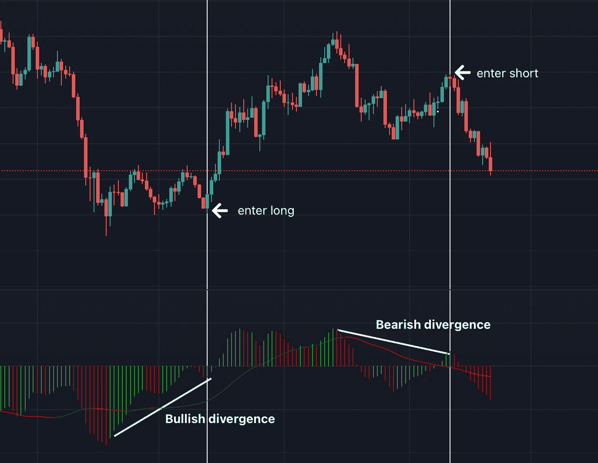

# 4 步交易策略

> 原文：<https://medium.com/coinmonks/the-4-step-trading-strategy-a27bd5f0c0b7?source=collection_archive---------7----------------------->

这是实现成功交易的四个简单步骤:识别环境，找到好的进场点，有出场策略，有耐心！

1.  识别环境

第一步是确定环境是看涨还是看跌。这对于帮助你选择有利交易的正确方向至关重要。例如，如果环境看涨，多头的表现会比空头好。如果环境不利，空头仓位会比多头仓位表现更好。

你可以用比你交易的时间框架更高的时间框架来确定环境。例如，如果你在 1 小时图上交易，你可以检查 4 小时图来识别环境。

*   EMA 100 和 EMA 200 可以帮助你在 4 小时和日线图上识别市场趋势。例如，当均线 100 穿过均线 200 时，这意味着趋势发生了变化。如果均线 100 向上交叉，这表明趋势看涨。如果均线 100 向下运行，这表明趋势看跌。
*   对于更短的时间，如 1 小时，你可以使用 EMA 25 和 SMA 50。当均线 100 向上交叉时，这表明趋势看涨。当均线 25 向下交叉时，这表明趋势看跌。

EMA 100 & EMA 200 on a 4 hour chart. Retrieved from Trading View.

EMA 25 & SMA 50 on 1 hour chart. Retrieved from Trading View.

2.找到一个好的入口

找到一个好的进场点对好的交易至关重要。你的进场越好，你的获利空间就越大。

*   您可以根据差异来查找条目
*   要找到分歧，你可以使用市场密码的市场动量波或 MACD。
*   有两种背离:看涨背离和看跌背离。当出现多头背离时，可以进入多头。当出现看跌背离时，你可以做空。

Market Cipher’s Market Momentum Wave (Market Cipher B). Retrieved from Trading View.

MACD. Retrieved from Trading View.

3.有一个退出策略

有一个退出计划是你交易策略的一个非常重要的组成部分。作为交易者，知道什么时候扣动扳机可能是最难决定的事情之一。

市场会影响你，你会做出情绪化的决定，而不是理性的决定。这就是为什么强烈建议事先制定计划并坚持执行。不要因为你不知道何时获利，就让好的交易变成坏的交易。

*   你可以根据支撑位和阻力位决定何时获利(支撑位和阻力位的刷单策略)。一旦价格达到一定水平，你知道市场肯定会改变方向。
*   你也可以使用斐波纳契回撤水平

Support & resistance levels to where determine take profit. Retrieved from Trading View.

Fibonacci Retracements levels to determine where to take profit. Retrieved from Trading View.

4.耐心点，相信你的指标

耐心是一种美德！说到交易，这是最重要的技能之一。一半的工作在等待。等待，等待，等待…等待正确的进场，等待你的交易结束，等待选择一个好的出场。

*   一旦你做了分析并下了赌注，就等着吧。衡量你认为交易结束和等待的时间。
*   相信你的指标，相信你的知识，相信你自己。

其他步骤:

1.  拥有良好的风险管理策略
2.  有一本交易日志

如果你遵循这些步骤，再加上良好的风险管理策略和日志记录，你会非常成功！

记住，交易是关于耐心、信心和风险管理的。

此外，记得玩得开心&尝试不同的策略，直到你形成自己的风格。

我希望这些信息有用:)

爱与光，

机器语言(Machine Language)

> 交易新手？试试[加密交易机器人](/coinmonks/crypto-trading-bot-c2ffce8acb2a)或者[复制交易](/coinmonks/top-10-crypto-copy-trading-platforms-for-beginners-d0c37c7d698c)