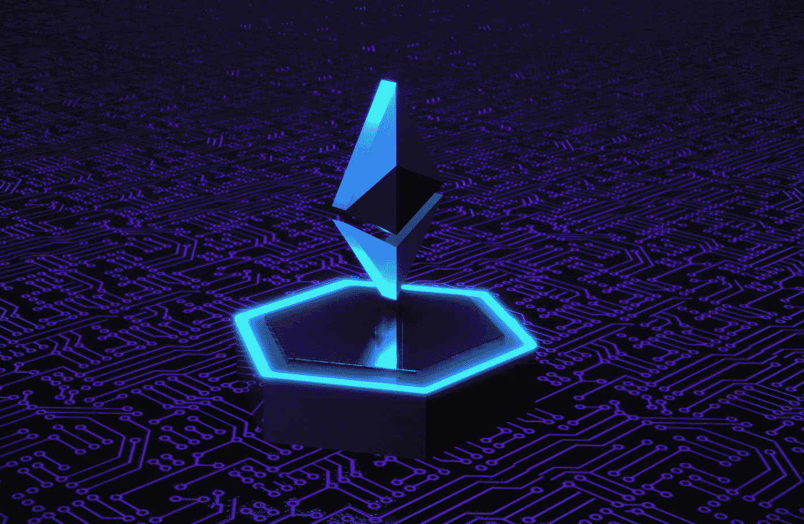

# 以太坊 6 款最佳第 2 层扩展解决方案！

> 原文：<https://medium.com/coinmonks/the-6-best-layer-2-scaling-solutions-on-ethereum-8182615f305c?source=collection_archive---------12----------------------->

Photo by [Choong Deng Xiang](https://unsplash.com/@dengxiangs?utm_source=medium&utm_medium=referral) on [Unsplash](https://unsplash.com?utm_source=medium&utm_medium=referral)

在以太坊上执行交易有时会花费一些美元和时间。频繁使用区块链会导致网络变得拥塞。这也称为网络拥塞，是以太坊的常见问题。即使在升级到 Ethereum 2.0 之后，此问题也可能继续发生，尽管严重性会降低。