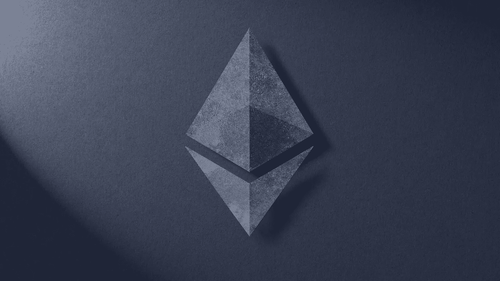

# 以太坊的 6 个特点将帮助你更好地理解它。

> 原文：<https://medium.com/coinmonks/the-6-features-of-ethereum-that-will-help-you-understand-it-better-a791d82cbaab?source=collection_archive---------39----------------------->

thereum 被认为是最受欢迎的加密货币之一，它应该和比特币一样受欢迎，尽管它的价格可能甚至比不上比特币，但它仍然为一些最重要的数字应用提供动力。在本文中，我们将深入探讨它是什么。

> “以太坊已经把比特币编程语言的四功能计算器变成了一台成熟的计算机。”—弗雷德·厄尔萨姆

# **那么是什么呢？**

以太坊是一种开放访问、数据友好、数字货币和社区构建的技术。它的特点包括每个人都可以使用银行服务，更私人的互联网，点对点网络，审查阻力，商业保证和更好的兼容性。

> 交易新手？试试[密码交易机器人](/coinmonks/crypto-trading-bot-c2ffce8acb2a)或[复制交易](/coinmonks/top-10-crypto-copy-trading-platforms-for-beginners-d0c37c7d698c)

# **具体请说！！！**

**人人银行**

事实是，不是每个人都可以使用金融工具或银行，以太坊通过允许每个人都能够访问其服务和应用程序来消除这一缺陷。

**隐私**

世界上的每个应用程序都会获取用户数据，当我谈到数据时，我指的是大数据，如果这些数据落入坏人之手，可能会给用户带来灾难。例如身份盗窃、劫持等等。在以太坊，风险降低了，你只需要提供非常少量的数据，这将有助于区分你的账户和其他账户。

**对等网络**

中间人一直是人们的一个大问题，经纪公司、银行和许多其他服务机构都利用了这一点，以至于有这么多人处理你的业务，你甚至没有安全感。在以太坊，你直接和用户交易或者和人做协议，没有中间人，没有很多佣金和时间。

**审查制度**

审查在这里并不新鲜，因为每种加密货币都有，在这里也是一样。以太坊让任何人都无法阻止你使用它的服务或进行交易。

**商业担保**

对人们来说，担心得不到你支付的东西或得不到你的钱一直是一个问题，他们感到安全的唯一方式是如果服务有那些大公司的支持。以太坊允许更公平的竞争环境和更安全的支付系统。

**兼容性**

许多服务在 iPhone 上可用，但在 android 上不可用，反之亦然，或者你可能有一个不兼容的设备，这对用户来说是一个非常大的问题。因此，以太坊通过允许几乎所有的应用程序和服务在所有设备和所有系统上可用，解决了这个问题，这可能是它更好的特性之一。

> "那些从未尝试过的人，从未充分体验过生活."—未知

总之，以太坊可能是能够与比特币竞争的新加密货币，这在许多领域不断得到证明。其中一个最大的问题是，非常高比例的非金融交易是由以太坊驱动的，这使得它比比特币有很大的优势，所以去看看吧，跳上宣传列车，你永远不知道会发生什么。

感谢阅读！！！下次见——Ryu

[https://coin shares . com/img/containers/main/resources/Research/ether eum-20-FAQ-nov-2020/eth-2.0-website-card-1 . png/c 6 AE 7 de A8 d 94 B1 FB 955622d 2c 08792 . png](https://coinshares.com/img/containers/main/resources/Research/Ethereum-20-faq-nov-2020/eth-2.0-website-card-1.png/c6ae7dea1a8d94b1fb955622d2c08792.png)