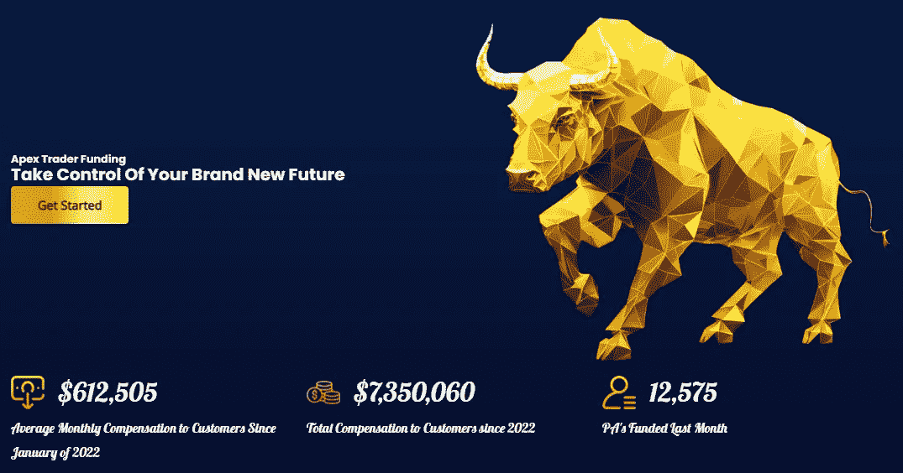
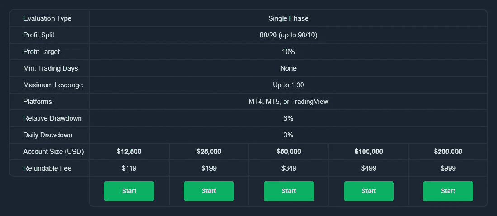

# 2023 年 7 家最佳道具交易公司(来自前 30 名)

> 原文：<https://medium.com/coinmonks/the-7-best-prop-trading-firms-in-2023-from-top-30-ed9a64549067?source=collection_archive---------23----------------------->

今天有 200 多家不同的自营交易公司，你可以和它们进行专业交易。对它们进行分类是令人麻木和困惑的，但幸运的是我已经帮你做到了。我花了 160 个小时比较了前 30 名，找到了最好的 7 个，你可以用它们开始专业交易。

参见最佳道具公司表

在评估这些时，你作为交易者成功的潜力是最重要的。但是并不是所有的 T2 道具公司都是一样的。有些人不把你的最佳利益放在心上。我已经交易了几个这样的程序，并仔细检查了所有程序，以做出最好的选择。稍后会有更多的内容，但让我们开始吧。

# 最好的道具交易公司是哪家？

1.  [Apex Trader Funding](https://epicctrader.com/best-prop-trading-firms/#tve-jump-18537304884) —期货交易者的最佳选择
2.  [Earn2Trade(交易员职业道路)](https://epicctrader.com/best-prop-trading-firms/?tve=true&tcbf=a275a27a12#t-1671594764610) —最适合期货新手
3.  [精英交易者融资](https://epicctrader.com/best-prop-trading-firms/#tve-jump-18569b67c9b) —最适合希望拥有多个账户并有每日提款限额的期货交易者
4.  [基金交易增强版(单相)](https://epicctrader.com/best-prop-trading-firms/#t-1671594764616) —外汇交易者的最佳选择
5.  [基金交易增强版(主交易计划)](https://epicctrader.com/best-prop-trading-firms/#t-1671594764622) —最适合想要跳过评估并立即获得基金账户的交易者
6.  [激增交易者](https://epicctrader.com/best-prop-trading-firms/#tve-jump-18569b7a4a1)——最适合想要一个大的初始账户(100 万美元)的人
7.  [UProfit](https://epicctrader.com/best-prop-trading-firms/#tve-jump-18569b7e24d) —如果你想随时取款，又不喜欢每月数据费，这是最好的期货计划

# 1.Apex Trader 融资

**我们的结论——最佳中的最佳**

价格:起价 147 美元/月

Apex Trader Funding 是一家自营交易公司，提供最大限度的支付和大规模的机会。我们认为这是最好的，因为你可以用高达 600 万美元的资金，在 20 个账户中以 90%的利润份额交易相同的策略。

## 最精彩的部分:

*   你可以复制交易 20 个账户，资金高达 600 万美元，只需在一个账户进行交易，从第一天开始就保留 90%的利润。
*   **如果您的帐户被封，免费每月重置包含在套餐续订中**。

## 最糟糕的部分:

*   **评估账户有一个日内跟踪阈值**，即使你没有实现利润，这个阈值也会上升。对于基金账户，当你的提款水平达到期初余额+$100 时，它就会停止跟踪。
*   每月提款两次，比每月一次的政策有所改善。

如果你想交易期货以获得最大的利润份额，使用 NinjaTrader 或 Quantower copy-trader 在一个账户中交易多达 20 个账户。

**我建议您从 50k 美元全额计划开始，因为与 150k 美元(3.33%)、250k 美元(2.6%)和 300k 美元(2.5%)账户相比，最大提款更有利(5%)。然后添加更多的帐户，以扩大到您想要的规模。**

复制并使用代码 RAGVSGRE 以获得最大折扣:

[立即尝试 Apex Trader 融资](https://epicctrader.com/recommends/apex-best-prop-firm-m/)。在结账时输入折扣代码。

# 最适合:

Apex Trader Funding 最适合希望以交易为生并最大化长期收入潜力的有经验的交易者。

## 顶级功能

*   **将你的第一笔 25，000 美元利润 100%存入你的基金账户**，除此之外还有 90%，这是业内最高的分成比例。
*   **一次登录交易多达 20 份合约**，无需在多个账户上按键即可轻松扩大交易规模。
*   **不会因为使用太多合同而失败**，专有技术会阻止您获得超过帐户允许的合同。
*   **没有每日提款限额**，只有一个简单的最大提款限额，这样你就可以专注于长期成功。
*   **一步评估流程让你在短短 7 天内获得资金**，所以你可以在两周后开始赚取真正的利润。
*   在新闻期间交易你的常规策略，并遵循其他一些简单的规则。
*   **免费评估重置在你的订阅更新日期**如果帐户被吹，所以你不必购买重置，如果你不想(他们在这里是 80 美元，比大多数便宜)。

在我们的[Apex Trader Funding Review](https://epicctrader.com/apex-trader-funding-review/)中了解更多关于功能、优点和缺点的信息。

## 定价

[Apex Trader Funding](https://epicctrader.com/recommends/apex-best-prop-firm-m/) 提供 8 种资助计划。因为除了账户大小之外，其中 7 个基本相似，所以我将介绍其中的 4 个和一个不同之处，以及其他一些重要项目:

*   **$ 50k FULL:**$ 167/月，适合希望尝试 Apex 的交易者，他们有可能在自己的口袋里多放一点钱。
*   **$100k 满:**$ 207/月，适用于希望从 Apex 开始，并有可能赚取一些实际收入的交易者。这个计划有一个有利的利润目标/提款百分比。它也比大多数 10 万美元的程序便宜。
*   **$ 250，000 FULL:**$ 517/月，适用于那些希望通过 Apex 大赚一笔的交易者。
*   $**300k FULL:**$ 657/月，适用于希望通过 Apex 实现潜在利润最大化的交易者。
*   **$100k 静态:**$ 137/月，给不喜欢跟踪阈值的交易者。这个账户有 625 美元的静态提款和 2000 美元的盈利目标。
*   **数据费:**像大多数公司一样，Apex 将他们的数据费转嫁给交易者——但是，与大多数公司不同的是，他们的数据费仅为每个账户每月 85 美元，而大多数公司收取每月 130 美元以上。
*   **数据费:**一次性费用也是一种选择，对于那些想要长期节省费用的持续交易者来说很好。
*   **评估重置**:80 美元/重置，想重置多少次就重置多少次。每次续订都包括免费重置过期帐户。

立即使用折扣代码 RAGVSGRE 尝试 Apex Trader 融资

[立即尝试 Apex Trader 融资](https://epicctrader.com/recommends/apex-best-prop-firm-m/)

# 2.Earn2Trade Trader 职业道路

我们的结论——最适合初级期货交易者

价格:起价 190 美元(低于优惠券价格)

Earn2Trade Trader Career Path 是一个 prop 公司计划，旨在让您从 5 万美元的评估快速进入 40 万美元的资金帐户。我认为它非常适合初学者，因为它简单的进展，合同的可用性，以及合理的风险规则。

## 最精彩的部分:

*   **无需支付 40 万美元的评估费用，即可开始获得报酬并进入大账户的最简单方法**。
*   **一旦你获得资金，你就可以选择实时保证金账户，**与其他公司不同的是，其他公司会将你放在 LiveSim 中，并根据他们的判断将你转入 live。

## 最糟糕的是:

*   这不是获得 400，000 美元账户的绝对最快途径，因为你会一步一步来，而不是一头扎进去。这可能对你有利。即使是华尔街大公司的专业人士也是从小做起，在证明自己的同时变得越来越大。这样你就可以在这个过程中得到报酬。

如果你想成为一个有大账户的基金交易者，并且你想先尝试一下，就去做吧。

**我建议你花 190 美元(加上我们的链接，价格会更低)走上 50K 美元的交易者职业道路，然后一步步发展到 400k 美元的账户。**

[立即尝试 Earn2Trade Trader 职业道路](https://epicctrader.com/recommends/earn2trade-tcp-best-prop-m)

## 最适合

Earn2Trade 最适合那些想在期货交易中用真金白银换取实实在在的利润，而不用自己的积蓄投资的新手。

## 我喜欢用 Earn2Trade 进行交易的原因交易员职业道路:

*   **用道具公司的真金白银交易，提取你的利润**，最低提取金额为 100 美元，这是最低的提取金额之一。
*   **交易高达 400，000 美元的固定提款账户**,一旦你有了一些利润，它会给你更多的交易空间
*   **快速交易帐户设置**向您发送您的帐户信息和清晰的说明，以便您可以在注册后 10 分钟内设置好并立即开始交易，或者为第二天早上准备好您的平台。
*   **微型期货合约是迷你**的 1/10，因此您可以避免爆仓，并根据您的交易策略扩大/缩小头寸。
*   **只需遵守几条简单的风险规则**就能保住你的账户并通过评估。
*   **与您选择的交易平台**进行交易，如 Quantower、NinjaTrader 8、Bookmap 或其他 16 个平台。
*   **响应式支持快速回答问题**——在注册之前和加入之后都是如此，一个活跃的 discord 服务器有很多有用的用户。
*   初学者友好的仪表板包括学习交易的工具和指南，提高和跟踪你的进度。

在 [Earn2Trade Review](https://epicctrader.com/earn2trade-review/) 中了解更多关于特性、优点和缺点的信息。

Just about 1/4 of the trader training webinars inside the dashboard. You’ll get these, plus guides, lessons, and a calendar full of economic events

## 定价

[Earn2Trade](https://epicctrader.com/recommends/earn2trade/) 提供了交易者职业道路的两个定价级别:

*   交易者职业道路 50K(如上所述):190 美元/月，直到你通过评估并进入下一步，在那里你可以开始提取利润，并逐步增加到 400，000 美元的账户。
*   交易员职业道路 25K:150 美元/月，直到你进入下一步，在那里你可以开始提取收入，并逐步增加到 20 万美元的账户。

Earn2Trade 还提供定期评估，称为 Gauntlet Mini Programs。然而，我在这里不讨论这些，因为交易员的职业道路是在这家公司。

您可以随时取消所有程序。

[立即尝试 Earn2Trade Trader 职业道路](https://epicctrader.com/recommends/earn2trade-tcp-best-prop-firms-m/) —点击查看当前折扣

# 3.精英交易者融资

**我们的结论——最佳日末拖尾下降**

价格:起价 150 美元/月

Elite Trader Funding 是一家很好的自营交易公司，适合那些希望自己的损失限额仅根据日终损益进行调整的期货交易者。我认为这是一个可靠的选择，因为它有很多额外的好处，如高额的融资奖金、较低的重置费用以及锁定账户在订阅续订日免费重置。它有免费试用。

## 最精彩的部分:

*   **每月订阅包括锁定账户的免费重置**，因此如果你违反了规则，你不必在月中额外购买。
*   **一次交易多达 20 个账户，初始余额高达 3，000，000 美元**。

## 最糟糕的是:

*   **提款只能在每月 1 日进行**，您必须提前 10-15 天提出申请。
*   **额外的提款限制可能会带来不便**但却是合理的，旨在帮助您保留账户。

得到它，如果你想 EOD 尾随提款，免费试用，最大资金奖金，并包括每月重置。

**我建议您从 15 万美元的初始余额 EOD 评估开始，添加更大或更小的账户，以达到您想要的水平。**

[立即尝试精英交易员融资](https://epicctrader.com/recommends/elite-trader-funding-best-for-eod-m/)

## 最适合

精英交易者基金最适合那些想要评估日末提款限额的期货交易者

## 顶级功能

*   **获得第一笔 12，500 美元利润的 100%**然后是 80%
*   **通过一次登录交易多达 20 个账户**，将交易规模扩大到 3，000，000 美元，并从一个主账户复制多个账户的交易。
*   如果你违反了规则并且失败了，当你的订阅更新时，你的账户会自动重置，或者你可以花 75 美元购买重置。
*   微型 e-mini 合约被正确地视为 e-mini 合约的 1/10,这对合理确定交易规模、管理风险和扩大规模至关重要。
*   **评估期间的免费数据馈送和带有评估和资助帐户的免费 NinjaTrader 许可证**
*   交易自营公司资本，同时只承担订阅费的风险
*   当你获得资金时，订阅费就结束了，交易所每月向你收取 80 美元的合理数据费。
*   **免费试用让您在购买** 之前先试用 [**一个评估程序**](https://epicctrader.com/recommends/etf-free-trial/)
*   **EOD(日终)提款阈值，因此你不必担心**未实现的利润会收紧你的风险准备金。

## 定价

Elite Trader Funding EOD (End of Day drawdown) evaluations. 150k eval not pictured above due to scrolling function on their site

精英交易者基金提供 5 种账户规模和 EOD 提款规则(推荐):

*   25，000 美元评估费:150 美元/月，直到通过，非常适合想要尝试该计划的新手
*   50，000 美元评估版:170 美元/月，直到通过，非常适合希望获得更多利润的新手
*   75，000 美元账户:240 美元/月，直到通过，最适合想从交易中赚取额外收入的交易者
*   100，000 美元评估版:240 美元/月，直到通过，最适合希望有机会从交易中获得第二份收入的交易者
*   150，000 美元帐户:340 美元/月，直到通过，最适合那些想从交易中赚取全职收入和更多收入的交易者，并使用多个帐户扩大规模

使用下面的优惠券，所有评估均可享受 20%的折扣。

[立即尝试精英交易员融资](https://epicctrader.com/recommends/elite-trader-funding-best-for-eod-m/)

4.基金交易加经验丰富的交易者计划(单一阶段)

**我们的结论——对加密外汇交易者来说最有价值&**

价格:起价 119 美元(一次性付款)

“Funded Trading Plus”经验丰富的交易者计划是单相外汇和加密交易评估，它提供了更好的成功机会，并且是我所见过的最佳价值。我认为它是外汇和货币交易者的最佳选择，因为它有广泛的货币列表、简单的扩展计划、80–90%的利润份额，以及扩展到 5，000，000 美元资金的能力。

## 最精彩的部分:

*   **将一个账户的资金规模从 12，500 美元扩大到 2，500，000 美元**，没有最低时间或交易要求。

## 最糟糕的是:

*   **取款必须间隔至少 7 个日历日**，这对大多数人来说不成问题。

如果你想以外汇交易为生，就买它吧，它能让你从小规模开始，然后迅速扩大规模。

**我建议您从 499 美元(一次性)的 10 万美元计划开始，以节省一些时间来实现更大的升级。**

**在访问他们的网站之前，复制下面的优惠券代码以便在结账时使用:**

代码:ET10

[现在就尝试基金交易加经验丰富的交易者计划](https://epicctrader.com/recommends/funded-trading-plus-experienced-trader-program-single-phase-m)

## 最适合

[基金交易加](https://epicctrader.com/recommends/funded-trading-plus-experienced-trader-program-single-phase-m)单一阶段计划最适合有经验的外汇交易者，他们希望进行专业交易，并有可能获得丰厚的收益。

## 顶级功能

*   **利用外汇基金交易市场上最简单明了的扩展计划**快速简单地扩大规模，没有时间或交易限制。
*   **一旦你的初始余额达到 20%的利润**，80%的分成就会变成 90%，所以你不会留下任何东西。
*   只有两条规则会导致失败——不要违反你每日提款限额的 3%或总提款限额的 6%
*   **没有最短/最长时间限制**让你头脑清醒地交易，没有强迫你交易的任意期限。这是巨大的，很多交易者因为时间压力而失败。
*   **专家顾问(ea)是允许的**，只要他们不使用套利策略，所以你可以按照你想要的方式交易。
*   **没有月费**所以你可以专注于交易你的策略，而不是成本。
*   **24/7 实时聊天支持**允许您从任何文本块中即时生成独特的标题、轮廓和段落。
*   **一旦您的第一笔提款超过您的利润目标**，评估费就会退还。

## 定价

经验丰富的交易者计划提供 5 种定价方案:

*   12，500 美元账户:一次性 119 美元，最适合新手交易者，他们希望以尽可能低的价格开始交易，并且不介意更长的交易时间。
*   25，000 美元的账户:一次性 199 美元，最适合希望以 200 美元以下的价格领先的交易者
*   50，000 美元的帐户:一次性 349 美元，最适合在第一次扩大规模时达到 100，000 美元。
*   100，000 美元帐户:一次性 499 美元，最适合希望更快获得 200，000 美元和更大规模资金的交易者。
*   200，000 美元账户:一次性 999 美元，最适合希望尽快增加到 2，500，000 美元的经验丰富的交易者。

如果您的第一次提款超过了您的利润目标，上述费用将会退还。

**在访问他们的网站之前，复制这个 10%的优惠券代码以便在结账时使用:**

代码:ET10

[现在就尝试基金交易加经验丰富的交易者计划](https://epicctrader.com/recommends/funded-trading-plus-experienced-trader-program-single-phase-m)

# 5.基金交易加主交易者计划(即时基金)

**我们的结论——立即获得资金的最佳方式**

价格:一次性起价 225 美元

基金交易加'主交易计划是一个专有的交易帐户，不需要任何评估，给你一个即时的帐户。我认为这是即时融资的最佳选择，因为它的定价最好，并且与他们的评估账户具有相同的扩展计划，但如果你愿意，也可以立即提取利润。

注意:有了即时资金账户，你不会比你自己的个人账户得到更多的提款。如果您成功了，好处就体现在扩展计划中。

## 最精彩的部分:

*   你可以立即成为一名有资金支持的自营交易者，迅速扩大规模，赚更多的钱，但也没有时间压力。

## 最糟糕的是:

*   **如果你想从一个大的基金账户开始，那可不便宜**，这是所有即时基金项目的通病。
*   你的初始提款只比你自己的个人账户多 0.5%。

如果您希望能够从一开始就扩大规模或收回利润，而不需要通过评估，就可以获得它。

**如果你想立即交易资金账户，我建议你从一次性成本 450 美元的 10，000 美元账户开始。**

在访问他们的网站之前，复制我们的独家优惠券代码，以便在结账时使用:

代码:ET10

[立即尝试基金交易和大师交易计划](https://epicctrader.com/recommends/funded-trading-plus-master-trader-program-instant-funded-m/)

## 最适合

资助交易加大师交易计划是最适合有经验的，有利可图的交易者，他们希望能够扩大或撤回他们的利润，而不必经历一个评估期。

## 顶级功能

*   **即时交易真钱**不用担心亏得比你投入的多，不像保证金账户，你可能会欠更多。
*   **从 70%的利润分成开始，扩大到 90%** ，其他公司的资金账户让你停留在 50%。
*   **当你赚了 50 美元或更多时，撤回利润**，没有大的利润目标或交易评估账户的时间
*   **没有每日提款限额**，只有 5%的总提款限额，没有复杂的规则可循
*   **交易消息，持仓过夜**，交易节假日市场开放。
*   **利用业内最简单的扩展计划，将您的帐户扩展至高达 2，500，000 美元**。
*   **无月费**，所以你不用担心每周或每月覆盖一个坚果。
*   **使用专家顾问**，只要不执行套利交易。
*   24/7 全天候提供实时聊天支持，从第一天起就很有帮助，因此您不必等待电子邮件。

## 定价

Funded Trader Plus 主交易者计划提供五种初始账户规模:

*   5，000 美元账户:一次性 225 美元，最适合那些希望以尽可能低的价格开设实时账户，并且不介意扩大规模的交易者。
*   10，000 美元账户:一次性 450 美元，最适合那些想在 500 美元以下的实时账户中领先一步的交易者
*   25，000 美元的账户:一次性 1，125 美元，最适合想要一个可以快速扩展到 50，000 美元以上的实时账户的交易者
*   50，000 美元账户:一次性 2，250 美元，最适合希望在第一次交易中达到 100，000 美元的认真交易者。
*   100，000 美元帐户:一次性 4500 美元，最适合希望从更大的规模跳跃开始并尽快达到最大实时帐户规模的经验丰富的交易者。

**在访问他们的网站之前，复制下面的优惠券代码以便在结账时使用:**

代码:ET10

[现在试试基金交易加大师交易计划](https://epicctrader.com/recommends/funded-trading-plus-master-trader-program-instant-funded-m/)

# 6.激增交易者

**我们的结论——最适合想要最大初始账户(100 万美元)的交易者**

价格:从 250 美元到 100 万美元帐户的 6500 美元

Surge Trader 是一家自营交易公司，提供评估，以赚取外汇、指数和加密交易的实时资金账户。据我所知，Surge Trader 是唯一一家提供 100 万美元一次性费用账户、高达 90%利润分成和最低规则的公司。

## 最精彩的部分:

*   **业内提供的最大初始账户规模**允许您一次性支付 100 万美元开始评估

## 最糟糕的是:

*   **与许多传统道具公司类似，每 30 天限提取一次利润份额**。
*   **1，000，000 美元的账户费仍然是一项重要的投资**,只应由有信心通过的交易者使用。从好的方面来说，你花了 6500 美元获得了 50000 美元的评估风险。
*   **他们较小账户的定价和价值不如其他提供相同账户规模的公司**。

得到它，如果你想最大的道具公司开始交易外汇账户的大小。

**我建议您只有在想从 100 万美元或 50 万美元的账户开始时才使用 Surge Trader，因为较小的账户可以选择上面提到的更有价值的选项。**

[立即尝试浪涌交易者](https://epicctrader.com/recommends/surge-trader-best-prop-firms-m/)

## 最适合

浪涌交易者最适合经验丰富的交易者，他们希望从最大的评估账户开始专业交易。

## 顶级功能

*   **保持账户的最低硬性规定**，只要保持在 4%的每日损失限额和 5%的拖尾提款。
*   **75%的利润分成可以通过付费升级到 90%**，从业界最大的评估账户和最大的分成开始。
*   **没有每月评估费或资助账户**，只是为你的分裂交易。
*   **无时限压力**在评估和资助账户。
*   **免费的 BKForex 会员资格**帮助您在交易想法、指导、直播交易等方面起步。

## 定价

*   Surge Trader 提供六种账户大小:
*   25，000 美元的初始账户:一次性 250 美元
*   50，000 美元中间账户:一次性 400 美元
*   100，000 美元的经验丰富的帐户:一次性 700 美元
*   250，000 美元账户:一次性 1，800 美元
*   500，000 美元的账户:一次性 3，500 美元，最适合希望开设大型评估账户和 25，000 美元提款风险的专业交易者
*   100，000 美元账户:一次性 6，500 美元，最适合希望从最大的评估账户开始，并承担 50，000 美元提款风险的精英交易者。

[立即尝试激增交易者](https://epicctrader.com/recommends/surge-trader-best-prop-firms-m/)

# 7.UProfit

**我们的结论——最适合希望随时取款并且不喜欢月费的期货交易者**

价格:每月 89 美元起

UProfit 是一家自营交易公司，在一段可承受的评估期后，向新的和有经验的交易者提供大量资金。我喜欢它，因为它可以随时取款，规则简单，而且他们不会对基金账户收取任何月费。

## 最精彩的部分:

*   **在短短 10 天内获得一个 20 万美元的无月费账户**，然后开始增加更多账户

## 最糟糕的是:

*   **利润份额为 80%，这并不是最高的**，但大多数仍极具竞争力。

如果你想迅速扩大购买力，而不必担心提款限制和基金账户的月费，就买它吧。

**我建议你以每月 315 美元(带我们的链接为 220 美元)的价格购买 10 万美元的计划，然后开始增加 20 万美元的账户以扩大规模。**

[今天试试 Uprofit](https://epicctrader.com/recommends/uprofit-best-prop-trading-firm-m/)

## 最适合

UProfit 交易最适合任何人，从新手到有经验的交易者，他们希望最大化他们的收益，经常提取利润，永远不用支付月费。

## 顶级功能

*   对所有支持对数数据的平台免费数据馈送，对忍者交易者 8 的评估或资助账户不收取许可费。
*   一旦你获得资金，没有任何形式的月费，所以你可以专注于交易，而不是覆盖成本。*
*   周一至周五 24 小时内处理提款，没有特殊要求，因此您不必为了提款而强制交易。
*   第一笔 8000 美元的利润 100%直接归您所有，因此您可以尽早品尝到您的劳动成果，并将这些利润用于拓展更多客户。
*   交易最多 3 个账户，一次登录最多 600，000 美元，这样你就可以使用复制交易来分散风险，远离损失限额。可以有无限的帐户，但每次登录 3 个。
*   微型合约被认为是电子迷你合约的 1/10，所以你可以根据你的账户交易合适的规模，并根据你的策略的需要扩大和缩小。
*   没有限制或特殊规则的交易新闻事件，所以你不必担心仅仅因为一个数据发布就失去你的账户，你可以使用那些日子里从超大波动中获利的策略。

*开设账户需要一次性缴纳少量费用，但这远低于每月费用的总和。

## 定价

*   UProfit 提供四个评估程序，每个程序至少有 10 个交易日:
*   基本:9k 帐户每月 89 美元，直到融资，对于那些刚刚开始交易。900 美元的利润目标，最多 5 份合同(50 微)，350 美元的每日损失限额，800 美元的专业提款
*   高级:50k 帐户每月 160 美元，直到资金，为那些希望把更多的利润放在他们的口袋里。利润目标为 2，500 美元，最多 6 份合同(60 分钟)，每日损失限额为 1，100 美元，提款限额为 2，000 美元
*   精英:10 万美元账户每月 315 美元，直到融资，为交易者计划从交易中赚取实际收入，但没有准备好最大的计划。6，000 美元的利润目标，最多 12 份合同(120 微米)，2，200 美元的每日损失限额，3，000 美元的专业提款
*   溢价:20 万美元账户每月 580 美元，直到融资，为交易者准备尽快最大限度地提高他们的收入。10，000 美元的利润目标，最多 20 份合同(200 微份)，4，000 美元的每日损失限额，5，000 美元的专业提款

[今天试试 Uprofit】](https://epicctrader.com/recommends/uprofit-best-prop-trading-firm-m/)

# 我们的前三名

以下是我们前三名的简要总结:

1.  [Apex Trader Funding](https://epicctrader.com/recommends/apex-best-prop-firm/) —期货交易者的最佳选择
2.  [Earn2Trade(交易员职业道路)](https://epicctrader.com/recommends/earn2trade-tcp-best-prop/)——最适合期货新手在自营公司用真钱交易。
3.  [精英交易者基金](https://epicctrader.com/recommends/elite-trader-funding-best-for-eod/) —最适合希望获得日末提款限额评估的期货交易者

[我们的七大精选快速对照表](https://epicctrader.com/best-prop-trading-firms/#quick-compare)

以下是我们在这篇评论中考虑的前 30 家道具公司:

1.  Apex Trader 融资
2.  Earn2Trade(交易员职业道路)
3.  精英交易者融资(EOD 提款)
4.  受资助的交易者 Plus(经验丰富的交易者评估)
5.  资金交易商 Plus(主交易商即时资金账户)
6.  激增交易者
7.  UProfit
8.  获利交易者
9.  TopStep 交易员
10.  精英交易者融资(跟踪提款)
11.  交易日
12.  单一交易者
13.  FTMO
14.  我的外汇基金
15.  FundedNext
16.  Fidelcrest
17.  交易池
18.  受资助的交易者
19.  阿尔法交易公司
20.  具有优势的交易者(评估程序)
21.  有优势的交易者(即时融资)
22.  顶级交易员
23.  无畏资本
24.  期货交易
25.  ELEV8
26.  整合资本
27.  巨点资本
28.  中小企业资本
29.  克什纳贸易集团
30.  特立独行的交易

# 什么是道具交易公司？

自营交易公司，又名[自营公司](https://epicctrader.com/best-prop-trading-firms/)，为交易者提供资本，以换取交易者的利润分成。他们还可以提供教育、技术、支持和其他资源。

自营公司已经存在了很长时间，但在过去的 5 年里，更多的公司成立了，为越来越多的交易者提供了从交易中谋生所需的资本。

# 自营交易公司合法吗？

是的，[自营交易](https://epicctrader.com/prop-trading/)公司是合法的企业。尽管任何行业都可能有坏人，但我个人并不知道有哪家自营交易公司有彻头彻尾的欺诈交易者。

也就是说，并不是所有的公司都是平等的，也不是所有的公司都以同样的优先级运营。有些人，尤其是一些新的交易者，似乎对收取费用比拥有成功的交易者更感兴趣。

最重要的是，这是我在选择最佳公司时寻找的首要因素。我只想和那些希望交易者成功的公司交易，那些以交易者成功的最佳方式建立项目的公司交易。我希望你也一样。

# 道具交易公司是怎么赚钱的？

最好的道具公司通过分享交易者的利润来赚钱，然后帮助越来越多的交易者盈利。他们也从费用中赚钱，但对于最好的公司来说，重点是交易者的成功。为什么？那样他们会赚更多的钱。

例如，一家公司从一名平均每月获利 20，000 美元的交易员那里拿走 10%的利润，他们平均每月将净得 2，000 美元。三个月后，他们从那个交易者那里赚了 6000 美元，他们希望随着交易者的成长，这笔钱会继续增加。

这个数额超过了一个不成功的交易者，他每月支付 200 美元，3 个月后退出——只有 600 美元，没有未来收入。

# 我如何选择最好的道具交易公司？

首要任务是长期交易的成功。所以你必须根据有助于你达到目标的因素来决定。这是个人决定，你的因素可能与我的有所不同。但是，自从 2007 年加入我的第一家自营公司以来，我看到许多交易者成功了，其中一些人赚了数千万美元。

我也见过无数交易者失败。所以我很清楚自营公司能做些什么来帮助交易者成功，以及是什么让他们失败。

**希望交易者成功的公司…**

*   鼓励纪律——交易者对自己的纪律负责，但我们总是可以改进。应该制定规则、限制和目标来培养和奖励有纪律的习惯。
*   为期望的风险提供适当的交易工具(如小额账户的小额期货
*   提供获得资本的途径，消除进入壁垒(成本、技术等)。)
*   让交易者以最适合他们的方式交易
*   鼓励自我反省——交易者必须不断评估自己的想法和行为，并致力于阻止交易中的漏洞。
*   鼓励自学和个人发展(不一定要提供教育，但每个人都必须从某个地方开始)
*   使用简单的规则，鼓励适当的风险管理
*   提供基于性能和风险管理的逐步扩展能力

**坚定的政策导致交易者失败:**

*   复杂的规则制造了交易者容易陷入的陷阱
*   不允许适当的规模(如将微型电子迷你合同视为一个电子迷你合同)
*   对要实现的目标设定最大时间限制，比如 30 天内通过评估。时间压力导致交易者做出错误的决定，养成坏习惯，过度交易，等等。
*   阻碍缓慢的增长，迫使交易者更快地做大。缓慢而稳定的交易会赢得比赛，有时候选择小交易是最好的交易。
*   强迫交易者交易不符合他们风格的策略，或者强加不允许他们正确交易策略的规则
*   收取过高的费用，使得交易者每月难以实现收支平衡和盈利。

# 一个道具交易员赚多少钱？

自营交易者没有薪水，T4 交易者的利润也没有被公司披露。一些较新的基金公司披露了他们支付的金额，但没有办法知道个人交易员赚了多少。

交易是一个挑战性的职业，不是每个人都能成功。有些人一分钱也拿不到。

我个人知道(在现实生活中，不是在网上)几个自营交易者在他们的交易生涯中赚了 5000 万美元。我知道有几个人每年都能赚几百万。我认识几十个年收入 10 万到 30 万美元的人，偶尔会有 50 万美元甚至更多。

有趣的事实——没有一个成功的交易者会到处告诉人们他们赚了什么。我之所以知道，是因为他们做这件事的时候，我就坐在他们旁边，或者在全公司的 P&L 监视器上看着他们。

没有一个在网上吹牛的。他们都没有在推特、instagram 或 tiktok 上发布截图。

这些天你会看到很多人在网上吹嘘他们做了什么，并上传截图。我不相信这些。他们可能说的是实话，但他们中的大多数人都试图向你推销课程或其他东西。

最好的交易者不喜欢谈论他们赚的钱。他们中的大多数人会以低得多的工资做这份工作，因为这是一份有趣且吸引人的职业。

所以真正重要的是，你喜欢吗？你需要赚多少钱才能过得舒服？机会就在那里，任何高于这个数字的东西都是额外收获。让它发生。

# 最好的道具交易公司是哪家？

最好的自营交易公司是 Apex Trader Funding。行业内最好的利润分割，规模能力，简单的规则，可负担性，等等，使它成为想以交易为生的交易者的最佳选择。

底线

概括来说，以下是今年最好的道具公司:

1.  [Apex Trader Funding](https://epicctrader.com/recommends/apex-best-prop-firm-m) —期货交易者的最佳选择
2.  [精英交易者基金](https://epicctrader.com/recommends/elite-trader-funding-best-for-eod-m) —最适合希望获得日末提款限额评估的期货交易者
3.  [Earn2Trade(交易员职业道路)](https://epicctrader.com/recommends/earn2trade-tcp-best-prop-m) —最适合期货新手交易者
4.  [Funded Trading Plus(Single Phase)](https://epicctrader.com/recommends/funded-trading-plus-experienced-trader-program-single-phase-m)—加密外汇交易员的最佳价值支持公司&
5.  [Funded Trading Plus(主交易计划)](https://epicctrader.com/recommends/funded-trading-plus-master-trader-program-instant-funded-m) —对于想要跳过评估并立即获得资金帐户的 Crypto &外汇交易员而言，这是最佳的支持公司
6.  [暴涨交易者](https://epicctrader.com/recommends/surge-trader-best-prop-firms-m)——想要一个大账户(100 万美元)的人的最佳加密自营公司
7.  [UProfit](https://epicctrader.com/recommends/uprofit-best-prop-trading-firm-m/) —如果你想随时取款，又不喜欢每月数据费，这是最好的期货计划

我们的首选是 [Apex Trader Funding](https://epicctrader.com/recommends/apex-best-prop-firm/) ，因为它提供 90%的利润分成、简单的规则，以及一次登录最多 600 万美元的账户。

# 相关文章

[自营交易工作:如何获得一份](https://epicctrader.com/proprietary-trading-jobs/)

[2023 年最适合新手的 4 家自营交易公司](https://epicctrader.com/best-proprietary-trading-firm-for-beginners/)

内容仅供参考。我是一个交易者，但我不提供金融建议，这篇文章也不是金融建议。我目前没有注册为财务顾问，也不是财务顾问。在做任何财务决定之前，你应该咨询财务专家。

我努力保持内容的最新和准确，并经常更新。有时数据变更、交易失效或实际信息可能与本网站所述不同。商标、徽标、图像、截图和其他品牌内容是所讨论公司的财产。虽然我是独立的，但当你点击本网站的链接时，我可能会得到补偿。

风险披露:

交易包含很大的风险，并不适合每个投资者。投资者可能会损失全部或更多的初始投资。风险资本是在不危及个人财务安全或生活方式的情况下损失的金钱。只有风险资本才可用于交易，并且只有风险资本充足的人才可考虑交易。过去的表现不一定代表未来的结果。

假设的业绩披露:

假设的性能结果有许多固有的限制，下面介绍了其中一些。没有任何陈述表明任何账户将会或可能实现与所示类似的利润或损失。事实上，在假设的业绩结果和任何特定交易程序随后实现的实际结果之间经常存在巨大差异。假设性绩效结果的局限性之一是，它们通常是事后才准备的。另外，假设交易不涉及财务风险，任何假设交易记录都不能完全核算实际交易的财务风险影响。例如，承受损失的能力或在交易亏损的情况下坚持特定交易计划的能力是重要的，这也会对实际交易结果产生不利影响。还有许多其他因素与一般市场或任何特定交易计划的实施相关，这些因素在假设业绩结果的准备中无法完全考虑，所有这些因素都会对交易结果产生不利影响。本网站上出现的推荐可能不代表其他客户或顾客，也不保证未来的表现或成功。

*原载于 2022 年 12 月 21 日*[*【https://epicctrader.com】*](https://epicctrader.com/best-prop-trading-firms/)*。*

> *交易新手？试试* [*加密交易机器人*](/coinmonks/crypto-trading-bot-c2ffce8acb2a) *或* [*复制交易*](/coinmonks/top-10-crypto-copy-trading-platforms-for-beginners-d0c37c7d698c) *上* [*最好的加密交易*](/coinmonks/crypto-exchange-dd2f9d6f3769)

> 加入 Coinmonks [电报频道](https://t.me/coincodecap)和 [Youtube 频道](https://www.youtube.com/c/coinmonks/videos)获取每日[加密新闻](http://coincodecap.com/)

# 另外，阅读

*   [免费加密信号](/coinmonks/free-crypto-signals-48b25e61a8da) | [加密交易机器人](/coinmonks/crypto-trading-bot-c2ffce8acb2a)
*   杠杆代币的终极指南
*   [16 款最佳折叠电动自行车](/coinmonks/top-17-folding-electric-bikes-5e296f0918cb)
*   [28 款最佳电动自行车点评](/coinmonks/the-28-best-electric-bikes-review-and-buying-guide-in-2023-7bb3146cb403)
*   前三名[币安期货交易机器人](/coinmonks/top-3-binance-futures-trading-bots-e6031f84b3f9)