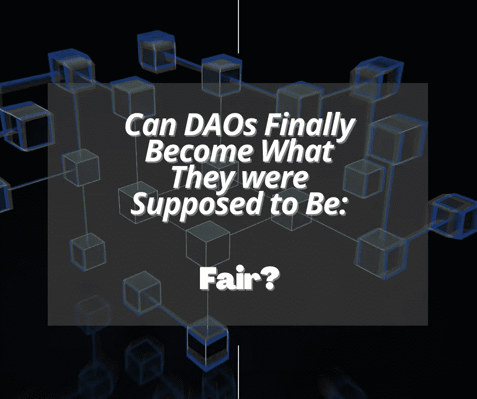

# DAOs 的替代路线:非正统的投票系统如何改变权力动态

> 原文：<https://medium.com/coinmonks/the-alternative-route-for-daos-how-an-unorthodox-voting-system-can-shift-power-dynamics-1c8a277542b0?source=collection_archive---------9----------------------->

本文由[灭霸·察格卡多斯](https://medium.com/u/484d0abcf878?source=post_page-----1c8a277542b0--------------------------------)和[马可·皮西奥利](https://medium.com/u/f2d54b63881e?source=post_page-----1c8a277542b0--------------------------------)撰写

D 非中心化自治组织(Dao)的创建是为了提供一个新的、民主化的(**希望是**)透明的投票结构。

DAOs 的结构目标是促进业务、项目和在线/离线社区中的流程。

这种便利为这些团体中的任何成员提供了通过在区块链上投票来表决组织决策的机会。

Dao 当前投票共识产生的主要问题是投票权分配不均。

来自每个 DAO 的治理令牌的持有者可以隐藏和控制投票结果。

大量的投票权来自拥有大量治理令牌的加密钱包，这可能会影响组织内的决策过程。

“问题出在哪里？”，你可能会问？

对 Dao 的投票机制有很大的负面情绪。

Dao 应该分散权力，给每个人一个“声音”去做这件事。

但是数据却不是这么说的！

来自[chain analysis](https://blog.chainalysis.com/reports/web3-daos-2022/)的精彩分析显示，在几个主要 Dao 中，不到 1%的持有人拥有 90%的投票权。

很疯狂，对吧？

对于那些追随 DAO 并理解 DAO 治理从根本上是如何被操纵的人来说，这并不疯狂。

我认为一小部分持有人，例如 1%，可以赢得其余 99%的投票结果。

这对 DAO 治理有着重要的意义。

在这种情况下，小股东受到了阻挠，他们觉得自己的投票对每次提案过程的贡献实际上是无用的。

治理瓶颈也延伸到了其他要考虑的指标。

一个是用户必须持有 0.1%到 1%来创建一个提案，另一个是用户必须持有 1%到 4%来传递它。

不难理解这些投票机制是多么的不公平和不民主。

所以，现在，你可能想知道，是这样吗？

没有比我们现有的更好的解决办法了吗？

**当然不是！**

谢天谢地，我们有更好的解决方案来解决这些问题。

我们应该感谢以太坊的策划者，不是别人，正是维塔利克·布特林，还有佐伊·希齐格和 e·格伦·韦勒。

在他们名为“[为公共产品](https://arxiv.org/pdf/1809.06421.pdf)融资的灵活设计”的开创性论文中，他们提出了一个特殊的设计，因为它将受**二次融资**启发的概念应用于为公共产品融资。

二次投资是另一种解决方案！

# 二次融资及其作为投票吸气机制的优越性

问 uadratic funding 有一些特殊的功能，这使得它成为启动集体决策系统的一种更好的方法。

作为一种投票概念，二次拨款鼓励选民在各种需要关注的热点问题上分配和投票，而不是将选民的预算集中在一个问题上。

与二次资助类似，**二次投票** ( **QV** )鼓励个人通过“买入”值得捐赠的项目来贡献自己的一票。

Weyl 提议允许个人通过“支付”他们“买入”的选票的平方来购买选票。

他认为，在大规模人口的标准假设下,**二次投票**会导致关于公共产品的近似最优决策。

**QV** 机制改进了存在缺陷的现有投票机制。

它允许在要投票和资助的一系列决策中有更大的灵活性。

这是通过消除个人(在我们的案例中是持有者)拥有完整信息的假设，并通过满足每个参与投票者参与投票过程的激励来实现的。

# 简化二次投票背后的数学

让我们实际看看如何成为一个更好的处理道治理的方式。

假设我们有 3 个提议:

*   提议 1
*   提议 2
*   提议 3

社区成员可以通过“燃烧”尽可能多的代币来投票，以支持他们最喜欢的提案。

在投票开始时，治理令牌的供应量为 1，000，000，我们将使用该值作为计算投票结果和获胜提案的参考:

*   提案 1 = 200 个代币 x 5 个投票者= 1000 个代币
*   提议 2 = 5000 个代币 x 1 个投票者= 5000 个代币
*   提案 3 = 50 个代币 x 20 个投票者= 1000 个代币

如果我们应用 **1 token** = **1 vote** 的方法，就很容易掌握获胜的提案会是什么。

这显然是第二点，你可以理解这种方法是如何偏向大股东的。

# 二次投票如何能改变剧本，产生一个优化的反鲸投票系统？

好吧，是这样的:

对于每个提议，我们将每个贡献的平方根相加，然后将结果相乘。

让我们将公式应用于每份提案:

为了更好地理解这些数字代表什么，我们将把它们转换成百分比( **%** )。

我们现在如何将这些值转换成百分比( **%** )？

我们将获得每个建议的第一步结果，我们将把这个数字除以所有建议的第一步结果的总和，最后我们将这个值乘以供应值(1，000，000):

为了得到最终的百分比，我们做一个简单的百分比计算:

获奖方案是**号** **3** ！

如果你一直遵循计算的路线，这显示了微小的贡献是多么的强大。

我们可以看到，它们比令牌的绝对数量更重要。

出于同样的原因，它们对于**分散决策和投票权**(尽可能可行)变得至关重要。

# 关于 DAOs 和二次投票的进一步考虑

在每一个需要变革的历史转折点，都有变革解决方案、实用工具和创新能力的加速和需求。

2008 年金融灾难后，分散化的框架产生了深远的影响，为区块链技术以及随后的 Dao 提供了温床。

全球各地的一些个人和社区都在寻求替代技术途径，在一些缺乏自主性甚至不存在自主性的领域加强自主性和主权。

众所周知，去中心化仍然面临许多挑战。

围绕以下几个方面存在持续的问题:

*   高效的治理和决策
*   任务的成功协调
*   吸引合适的人才
*   在现实生活中的适用性
*   筹集资本

**有一件事仍然是真的，尽管……**

源自旧技术基础设施的局限性正在被展现出巨大前景的革命性解决方案所取代。

我们坚信它们对未来的后代有着巨大的潜力。

Dao 就是这样一个例子。

它们提供了一个应用创新业务运营结构的平台，这种结构只受博弈论和想象力的限制。

这些结构可以改变整个行业，打破现状，建立新的模式。

同样，二次投票将 Dao 的颠覆性更进一步。

作为一种投票方式，它反映了集体决策时人们偏好的强烈程度。

多数人的暴政和那些“钱包鼓鼓”的人的利益大大减轻了。

当然，二次投票法还有很大的改进空间。

围绕 **QV** 的持续实验可以揭示其机制的可能弱点，创造新的模型设计并建立意识。

如果我们能向大众展示这样的投票系统是多么的有益，Dao 的运作会更加公平和民主…

只有到那时，我们才能谈论道是由一群志同道合、有着相同使命的人共同拥有的！

> 交易新手？试试[密码交易机器人](/coinmonks/crypto-trading-bot-c2ffce8acb2a)或者[复制交易](/coinmonks/top-10-crypto-copy-trading-platforms-for-beginners-d0c37c7d698c)