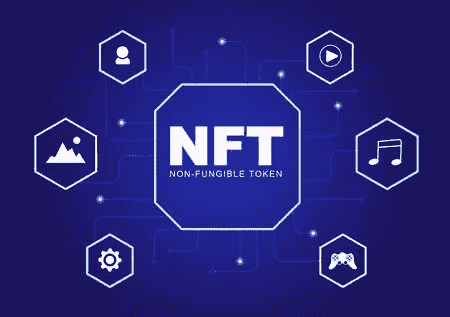

# 神奇的区块链和 NFTs 的发展

> 原文：<https://medium.com/coinmonks/the-amazing-blockchain-and-the-nfts-evolution-ecbf797e71f1?source=collection_archive---------52----------------------->

stocklib

牛顿项目已经引入了下一级的不可替换令牌(NFT ),称为加密可变令牌。(EVT)。

正如任何好的研究一样，首要问题之一是，它解决了什么？答案是很多！

您知道解锁内容或获得版税的能力不是 NFTs 的基本功能吗？这些必要的能力需要…