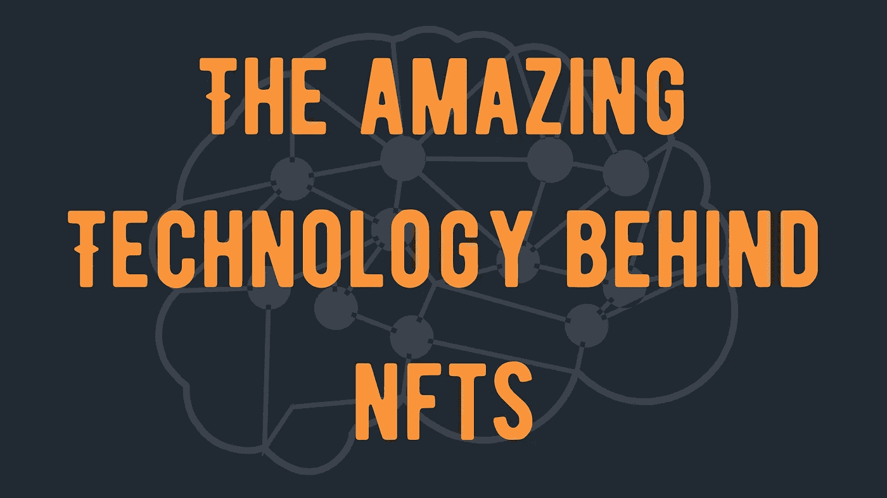
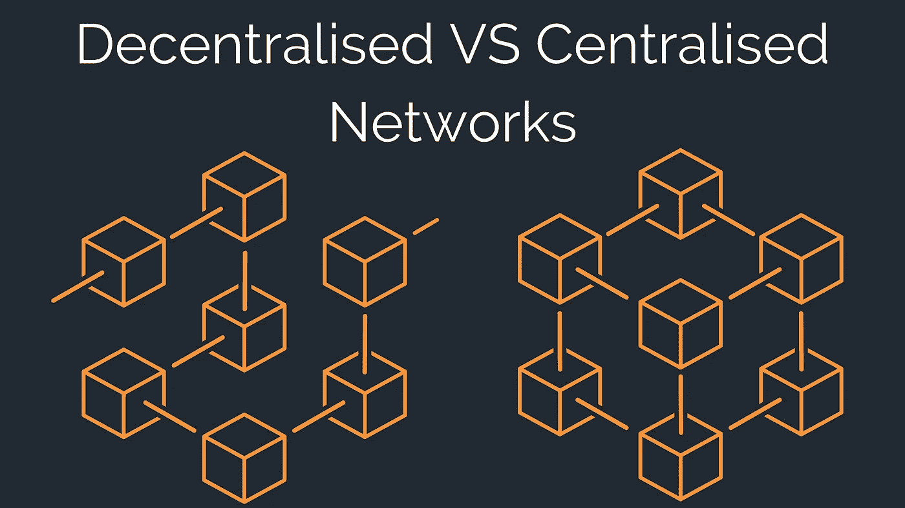

# NFTs 背后的惊人技术以及它对 Web 3 的重要性

> 原文：<https://medium.com/coinmonks/the-amazing-technology-behind-nfts-and-why-this-is-important-to-web-3-c495388fc31?source=collection_archive---------28----------------------->

当人们说他们对*技术*感兴趣时，他们是什么意思？为什么这如此重要，这与 web 3 有什么关系？虽然 NFT 理工一开始可能有点棘手，但它实际上比你想象的要简单。

只需要一点点时间和病人就能理解这个复杂的行业。考虑到这一点，这里有一个 NFTs 背后的主要技术的快速总结，以及它如何有利于 web 3 的开发。

让我们从什么是 NFT 开始。

简而言之，NFT 只是一种你可以拥有的数字资产，比如一张图片或一篇文章。这些资产必须被存放在某个地方，所以它被保存在一个叫做**区块链**的平台上。

不过，从技术上讲，区块链并不是一个平台。它实际上是一个数字账本，记录了围绕这些数字资产的所有数据，例如资产何时出售以及出售给了谁。这与记录一段时间内所有销售额的公司分类账非常相似。

现在我们对区块链有了更好的理解，让我们拿一个放大镜仔细看看这些数据是如何存储的。

NFT 由一种叫做**的智能合约**支持。智能合约对 web 3 非常重要，并且在过去几年里一直在发展。智能联系人的使用使用户能够改进商业模式并产生新的商业形式。

*例如，Bacon 协议使用以太坊区块链上的智能合约来为抵押贷款提供资金。拥有符合公司标准的房屋的人可以使用 NFT 作为抵押来借钱，用户可以贷款并从协议中赚取利息。*

这表明 NFTs 背后的技术实际上为 web 3s 的未来铺平了道路。

# 什么是智能合同？

NFT 使用智能合约作为资产买卖双方之间的数字销售协议。

智能合同允许卖方设定销售的规则和条款，例如他们希望从二次销售中获得的任何版税。当有人买下这件 NFT 时，合同会确保这些条款和条件得到满足，然后在区块链上记录这次销售。它还会在事后执行任何条款，而无需通过中间人。

这意味着智能合约一旦进入区块链，就完全去中心化了。

智能合同是一个由 if 和 when 语句组成的程序，当满足合同的一个条件时，该程序将被激活。当一台 NFT 被出售时，交易数据被压缩并编码成一个叫做“块”的东西。该块还包含 NFTs 唯一可识别号码和与之相关的智能合同。然后将该块附加到区块链上的前一个块，并且现在可以跟踪 NFTs 唯一可识别号。例如，如果你想追踪以太坊区块链上的 NFT，你需要做的就是前往 [etherscan.io](https://etherscan.io/) 并搜索钱包地址、区块、令牌、交易或 [ENS](https://blockworks.co/what-is-the-ethereum-name-service-ens/) 。

这种存储数据的方法比以前的 web 2 方法更安全，因为块一旦被添加到区块链中就不能被更改(*不编辑链上所有以前的块*)。这些数据也存储在多个系统中，这意味着任何异常数据都会被快速识别出来。

智能合约可以做一系列事情，包括:

*   转移资产所有权
*   验证资产所有权
*   确保资产质量(例如，一个铸造的 NFT 不能被进一步分割出售)
*   管理版税支付
*   提供识别信息(如钱包地址)
*   链接到其他数字资产

与普遍的看法相反，非功能性钱包实际上并不存在你的钱包里。它们存储在区块链上，并附有智能合同，以验证您的钱包是所有者。你可以在这里了解更多关于 NFT 存放的地方[。](https://cyberscrilla.com/where-are-nfts-stored/)

智能合约在 NFT 科技中的使用是用户对其潜力如此感兴趣的部分原因。它们提供了一种在买卖时完全诚实的方法，给数字世界带来了新的信任动力。

这种去中心化的想法也是 web 3s 议程的一个主要组成部分。网络去中心化是 NFT 社区的一个大话题，随着我们今天的进步，这一点可能会实现。

# 什么是 dApps？

DApps 是“**去中心化应用**”的缩写，指的是用于构建 web 3 的程序。这些包括区块链，分散的互相通信的服务器网络(*节点*)，或者两者的混合。

All communication goes through the same block in a centralised network, whereas no block controls all the information in a decentralised network

Web 2 建立在集中式平台上，如社交媒体、购物网站或流媒体服务。这意味着所有的用户信息都要经过同一个服务器，由所有者选择如何重新分发。所有者还控制所述服务器，并且如果所述服务器离线，那么平台也将离线。

在分散式网络中，没有单一实体控制平台，因此也没有单一服务器对其负责。相反，多个服务器运行网络并维护信息流。这意味着一个分散的网络是非常难以攻击的，如关闭或欺骗。

DApps 运行在一个分散的网络上，让用户更容易接受控制的想法。事实上，当我们也看 DAOs 时，我们可以了解更多关于 dApps 的信息。

# 什么是刀？

DAO 代表“**去中心化的自治组织**”，指的是由没有中央权威的社区管理的实体。每个社区成员都对组织做出贡献，并通过各种活动帮助维护组织，例如对项目的未来进行投票。DAO 使用**区块链协议**和**智能合同**来执行组织的规则和条例。

通常，您通过购买令牌(NFT)来获得 DAO 的成员资格。这个令牌将赋予您在社区中的投票权，并允许您与其他成员一起投票来决定 DAO 的规则和条例。用于购买这个令牌的钱将被发送给开发人员，并允许他们对社区提出的决定进行工作。

在开发过程中，开发人员控制着项目。然而，一旦项目启动，智能合同落实到位，该组织应该自主运行。开发人员将拥有与其他社区成员同等的权力，创造一个完美的公平竞争环境。这也称为自底向上结构。

# 为什么道结构的好处？

Dao 在区块链使用智能合约，因此他们的行为完全透明。由于他们不是控制组织的单一实体，权力被放在用户手中。由于组织是如此透明，用户也更有可能信任组织，并在使用它时感到舒适。

用户是对一个组织来说最重要的人，但有时这一概念可能会在集中式组织中丢失。做决定时，个人利益很容易妨碍集体利益。然而，如果集体而不是个人负责决策，人们的价值观就会成为组织的前沿，使其成为一个更令人愉快的平台。

这种程度的开放性、社区性和参与性阻止了用户以损害道的方式行事，并积极鼓励对社区的责任感。

Dao 也比集中式平台或应用安全得多。当条件满足时，它们运行预先制定的智能合约来执行订单。一旦这些合同被开发者添加到区块链中，这些规则就不能改变。这个组织确实是分散的。

# DAO 结构有什么问题？

使用 DAO 结构的一个问题是他们依赖于新技术，而不是很多人都有经验。智能合约一旦加入区块链就无法更改，因此它们必须无懈可击，以避免漏洞、[bug 和黑客](https://www.gemini.com/cryptopedia/the-dao-hack-makerdao#section-the-dao-hack)。如果合同存在漏洞，整个系统都可能被摧毁。那些希望构建一个 DAO 的人需要一个不会犯这种错误的有丰富经验的程序员。

对道的另一个担心是它是去中心化的。一旦项目启动，没有人能够控制这个组织。同样，这意味着智能合同必须是可靠的，以避免被利用。但这也意味着，如果该组织造成伤害，没有人负责。例如，如果敏感材料在一个集中的系统中被释放，主机负责将其从平台上移除，但是在一个分散的系统中，这个责任落在谁的身上呢？

还有一个挑战是如何让社区团结起来。当结果只依赖于少数人时，传统组织可以共享信息并更快地做出决策。但是，一刀是靠*几个*不同时区的人投票来做决定的。

由于时差、资源、优先事项、语言和激励因素，与这样的群体分享信息也很棘手，这使得团结更加困难，决策时间也更长。

# NFT 科技将我们带向何方？

[阿马拉定律](https://www.rationaloptimist.com/blog/amaras-law/)指的是新技术首次推向市场时所经历的周期。法律规定，新技术会遇到大量的炒作，投资者会高估它的潜力。随着时间的推移，这种炒作将会随着现实的不足而消退，人们会声称这项技术只是在其用途变得明显和主流之前的一种时尚。

Will NFT technology follow Amara’s law?

如果是这种情况，NFT 很可能接近炒作阶段的尾声。在过去的几年里，人们涌入 NFT 空间，希望通过转换一些 JPEGs 图片来赚点钱。虽然这仍然是可能的，但在这样一个饱和的市场中发现一个[有价值的 NFT 项目](/@bikerbabesnft/what-makes-a-good-nft-project-and-what-to-look-out-for-before-buying-7c2a314543fe)变得越来越困难。

如果我们现在正进入阿马拉定律的缓慢和怀疑阶段，投资 NFT 技术的可能性可能才刚刚开始。现在是创新者利用技术创造新事物的最佳时机，并开始朝着让技术成为主流的最终目标努力。例如，一些人推测，公司可以通过 NFTs 来分配他们的[股票，允许他们直接与股东互动，并保持对股票分配的更好控制。](https://juno.finance/blog/nft-stocks-explainer)

事实上，对于无法上市的小企业来说，这已经成为可能。年轻的企业可以选择创造和出售一系列的非技术资产来换取公司的一部分。这不仅为组织的雄心筹集了资金，而且还允许他们直接与利益相关者接触，并调整他们的商业模式以适应他们。

**这就是为什么社区在 NFT 如此重要的原因。**能够与你的客户直接对话，找出他们需要解决的问题，这有助于你了解你的市场，建立稳固的业务。与此同时，股东的资产在增值，企业的活动完全透明，促进了一种可信赖的关系，否则不可能实现。

尽管技术上仍有缺陷，[NFT 将会继续存在](/@bikerbabesnft/are-nfts-dead-in-2022-68c53313d45b)，明年的进步将会是你关注的焦点。

那么，为什么人们对技术的 NFTs 感兴趣呢？答案很简单。

NFT 技术在开发 web 3 中发挥着巨大的作用，并有可能改变多个行业，包括体育、游戏和音乐行业。那些着眼于 NFT 技术的人是着眼于未来的。也许你会发现下一件大事。

虽然这是一个巨大的壮举，但应对这一挑战的最佳方式是尽可能多地了解 NFT 和 web 3 技术。幸运的是，我们正致力于此，并将定期发布更新供您阅读。有很多东西要学。

你猜怎么着？我们推出了我们自己的 NFT 项目，观众可以控制。有这么大的增长空间，谁知道可能性会在哪里结束？我们的任务包括完成一个社区选择的项目，捐赠给受人喜爱的慈善机构 NABB 和赠品(*包括一辆经典摩托车*)！你可以查看我们的[路线图](/@bikerbabesnft/our-roadmap-174517084e34)并加入我们的[不和谐](https://discord.gg/4Nc9EwJPUZ)成为旅程的一部分。我们也在 Medium、 [Twitter](https://twitter.com/bikerbabes_nft) 、 [Instagram](https://www.instagram.com/bikerbabesnft/) 或 [YouTube](https://www.youtube.com/channel/UCcdIV4hUJSPmxYgHPUi8Xpg) 上。没有加入的义务，但请随意开始对话并了解我们。

如果您有任何问题或疑问，您也可以直接联系我们，我们将很乐意帮助您。