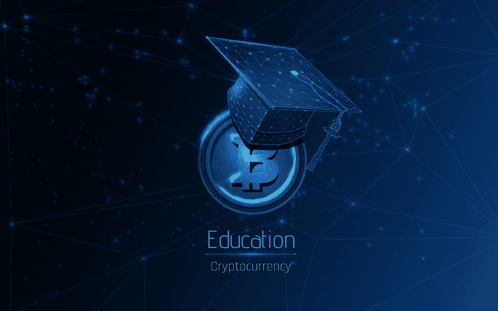

# 大使运动会

> 原文：<https://medium.com/coinmonks/the-ambassador-games-3bd7bc5295de?source=collection_archive---------2----------------------->

## 社区扩展第一步:分享智慧。

## 介绍

*如果你读到这里，你就是聪明的*。

好消息！我们已经在熊里呆了 9 个月了，你还没有打包行李或者丢失行李。看起来你知道自己在做什么。现在，我们需要像你这样的投资者:牛市来了，我们必须做好准备！

当熊冬眠，新的 anons 冲向田野，DeltaPrime 想要张开双臂欢迎它们。此外，我们希望防止他们犯可避免的投资错误，这可能会让他们离开我们的 web3 生态系统。这头牛需要坚持，为了实现这一点，我们必须专注于我们在开始时都在寻找的一个关键要素:

> 教育。

如果你认为教育你的“投资对手”会降低你的回报，我们现在就修正这个观点:不会。DeltaPrime 不是一个封闭的生态系统。您的退货并非来自其他 DeltaPrime 用户。相反，我们表现得像一个群体，与外界的 DeFi 系统进行交流和互动。我们的借款人受教育程度越高，他们的回报就越高；他们愿意支付给储户的利息就越多；DeltaPrime 用于增长的资金就越多。这一切都始于教育:帮助你的包，你就帮助了你自己。

# **大使运动会**

为了激励这种合作，我们将举办大使运动会。合作的竞赛。从 9 月 20 日开始，社区将通过合作竞争获得两个头衔中的一个:群体力量大使和群体成长大使，这两个头衔对 DeltaPrime 的成功扩张都至关重要。

每一轮持续 7 天，每周都有新的获胜者。

## **目标**

团队力量大使将是上周围绕 DeltaPrime 创建了最佳质量教育内容的人。从最广泛的意义上阅读“DeltaPrime 教育内容”。这可能是一条关于如何管理交叉保证金投资组合的 Twitter 帖子，一篇关于资本高效借贷好处的文章，或者基于(潜在)DeltaPrime 整合的策略。关于更长的，远非独家的想法列表，请看本文末尾的灵感列表。

“群体成长大使”是指前一周制作了最热门的 DeltaPrime twitter 内容的人。这是通过拍摄快照时的评论数量来计算的。内容可以是教育性的，但也可以是一个迷因、观点、一般线索或完全不同的东西。把话传出去！作为对 DeltaPrime 所有 og 的感谢，将根据您的最高 Discord 角色增加一个奖金百分比。百分比显示在本文的奖金部分，并自动计算。

## **奖品**

除了更强大的生态系统的长期奖励之外，大使游戏还将为选定的包大使提供即时奖励。根据获奖类别，获奖者将获得“实力大使”或“增长大使”的角色。这些角色将在未来的竞技 DeltaPrime 游戏中提供好处，类似于之前在这个游戏中提供好处的角色。

此外，我们还有价值$AVAX 的 250 美元的每周奖金池。每位大使 125 美元。如果有人有最好质量的教育内容，以及提交的最多评论，他们将获得$AVAX 中的全部 250 美元。

最后，族群力量大使的内容将被放在我们 delta prime:[https://docs.deltaprime.io/community/community-teachings.](https://docs.deltaprime.io/community/community-teachings)社区教导区的“名人墙”上，这一页将成为社区知识的宝库。

## **规则**

1.  将您的推文/文章提交到[T5 本频道 ](https://discord.gg/4efkpywuN9)
2.  包装增长大使:在你的推文中提到@DeltaPrimeDefi
3.  如果你赢得了“实力大使”和“成长大使”,奖金将会翻倍。
4.  为了增加不同获奖者的数量，被选中的大使将在一周内没有资格参加比赛。
5.  快照将在宣布前一个获胜者 7 天后的随机时间拍摄。
6.  不允许机器人。如果你用机器人夸大你的数字，你的提交将被取消资格。
7.  编辑:抄袭也一样。让创造力流动起来，因为我们喜欢阅读你的个人想法。

每轮比赛将持续 7 天。由于这个游戏是实验性的，比赛的总长度取决于它的成功。决赛将在比赛结束前宣布。

## **OG-奖金**

OG-奖金将永久计入提交的分数，作为对早期 DeltaPrime 支持者的感谢。将使用快照中的最高角色。

**+12% —主要掠食者🐺**(贸易竞争第一)
**+10% —原创大使🐺**(知道什么时候加入)
**+8%—Deltas；阿尔法战士🐺**(活跃不和谐)
**+6% —早期狼🐺**(加入交易竞争)
**+4% —贝塔🐺**(活跃不和谐)
**+2% —小熊🐺**(让不和谐活跃起来)

## **灵感**

作为结论，我想分享一个潜在主题的非排他性列表。选择其中一个主题不会增加或减少你赢得大使奖的机会。归根结底，这完全是关于制作内容的质量。然而，我希望这能激发你写作的创造力。快乐分享！

*   什么是杠杆，如何利用杠杆管理风险？
*   什么是 delta 中性策略(的例子)？
*   交叉保证金与独立投资组合:利弊
*   主账户||超额抵押||基于身份的贷款。
*   DeltaPrime 与其他贷款协议有何不同
*   DeltaPrime，潜在策略(如果现在整合，还有它们的回报)
*   在交易中做空和做多。
*   如何对冲风险？
*   在 DeFi 中引入资本效率。
*   Prime 账户是如何运作的？
*   什么是部分清算？
*   使用 DeltaPrime 一个月的心得。