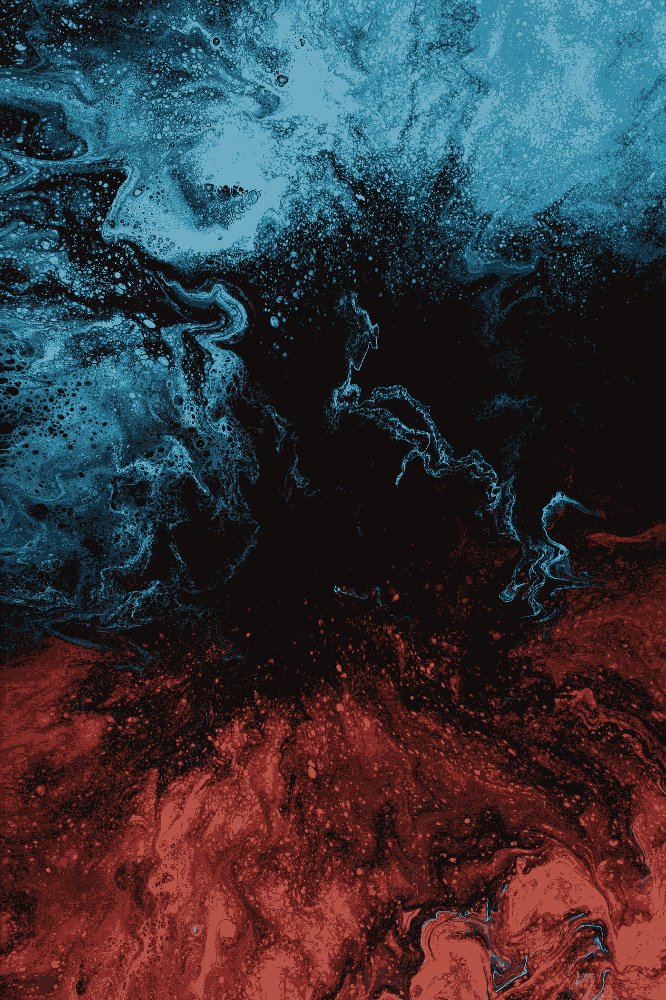

# 数据的艺术

> 原文：<https://medium.com/coinmonks/the-art-of-data-fa3263a1d58e?source=collection_archive---------34----------------------->

## NFT 是如何革新元宇宙的

Photo by [Pawel Czerwinski](https://unsplash.com/@pawel_czerwinski?utm_source=medium&utm_medium=referral) on [Unsplash](https://unsplash.com?utm_source=medium&utm_medium=referral)

随着世界进入数字体验的新时代，非功能性技术正在改变我们与信息互动的方式。

它们让人们能够以前所未有的方式“存储”和共享数据。这对企业意味着什么？

而对于用户来说又意味着什么？在本文中，我们将探讨非功能性测试是如何…