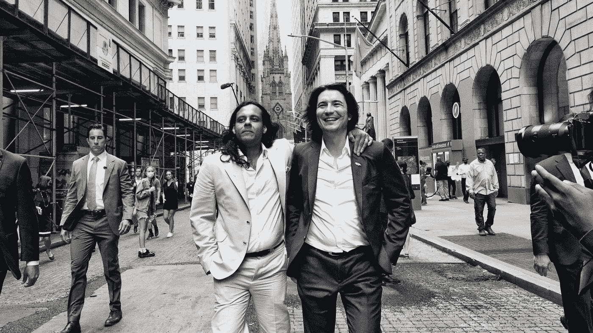
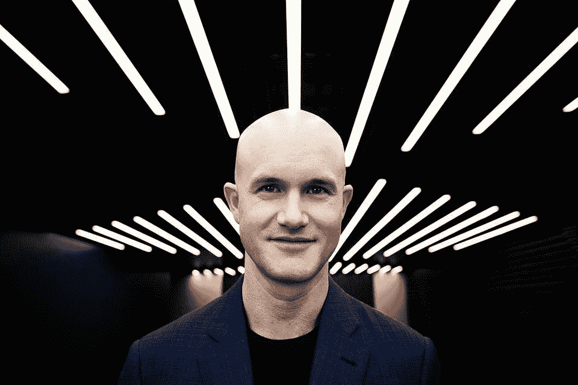
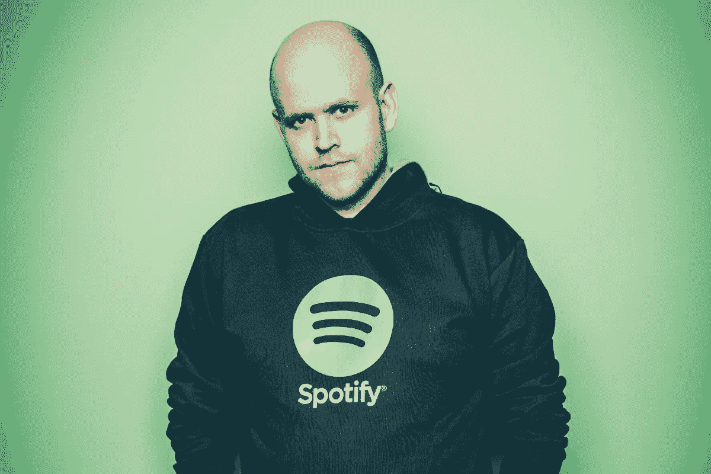

# 自 2018 年以来进行 IPO 的科技创始人平均身价为 9.18 亿美元。

> 原文：<https://medium.com/coinmonks/the-average-tech-founder-who-ipo-since-2018-is-worth-918m-4ae781e790a3?source=collection_archive---------19----------------------->

Combined, both of the founders of Robinhood had 17% of the company worth $5B.

我们都认为创始人每个月都会赚很多钱。

比如在美钞里游泳。

炫耀兰博基尼，在超级游艇上举办晚宴。

住在纽约豪华的顶层公寓里，只乘坐商务舱或头等舱。

嗯…

那也许部分是真的。

我遇到了一个疯狂的列表，列出了所有创始人以及他们的股票价值，当时他们的初创公司获得了巨大的发薪日，并自 2018 年以来首次公开募股。

这真的很鼓舞人心。

奇怪的是也很有激励性。

简而言之，如果你是一家成功上市的初创公司的创始人或联合创始人，你会拥有超乎想象的财富。

即使你不拥有大多数股份，你也至少有 8 位数。

创始人在公司 IPO 时拥有的最低金额约为 2000 万美元。

这就是来自 Ping Identity 的 Andre Durand，他只拥有他所创建的公司的 2%的股份。

We would be smiling too if we had $15B.

最高的是比特币基地公司的首席执行官布莱恩·阿姆斯壮，他拥有 20%的股份，身价 150 亿美元。

是的，毫无疑问是在 G6 上飞行。

平均而言，每位创始人在首次公开募股时获得 9.18 亿美元。

风投和其他利益相关者也获得了回报。

啊，难怪大家都想创业。

最终目标(至少是其中之一)是上市并成为银行。

不管你怎么想，这是一种改变生活的财富，我们大多数人都没有。

当你开始的时候，公平没有什么意义。

这里或那里的几个百分比实际上对任何事情都没有显著影响。

Daniel Elk had 28% of Spotify worth nearly $6.5B when it IPO-ed.

这就是为什么他们总是说股权对于创始人就像保险对于生命一样重要。

你永远不知道你是否需要它，但是当你需要的时候，它通常很重要。

这就是为什么随着你的公司成长，你开始筹资，了解你的资本表是至关重要的。

从例子中可以看出，对于像比特币基地这样 860 亿美元的公司来说，即使只是 1%的股权差异也是非常大的。

只是提醒所有年轻的创业者。

但不要把这理解错了，像吸血鬼一样追逐你的股权。

要公正，要坚定，要谨慎，只能这样。

为 Blossom Street Ventures 的研究提供巨大支持。

点击这里查看:[https://blossomstreetventures . medium . com/founder-paydays-at-IPO-e 625 AC 076d 43](https://blossomstreetventures.medium.com/founder-paydays-at-ipo-e625ac076d43)

-

你想创业吗？

-

#创业#商业#创业#成长#成功#社交媒体#文化#网络 3 #战略#黑客#创始人#首次公开募股#股票#首次公开募股#创始人# coinbase # eth # btc #密码#黑客#钱包

> 交易新手？试试[密码交易机器人](/coinmonks/crypto-trading-bot-c2ffce8acb2a)或者[复制交易](/coinmonks/top-10-crypto-copy-trading-platforms-for-beginners-d0c37c7d698c)