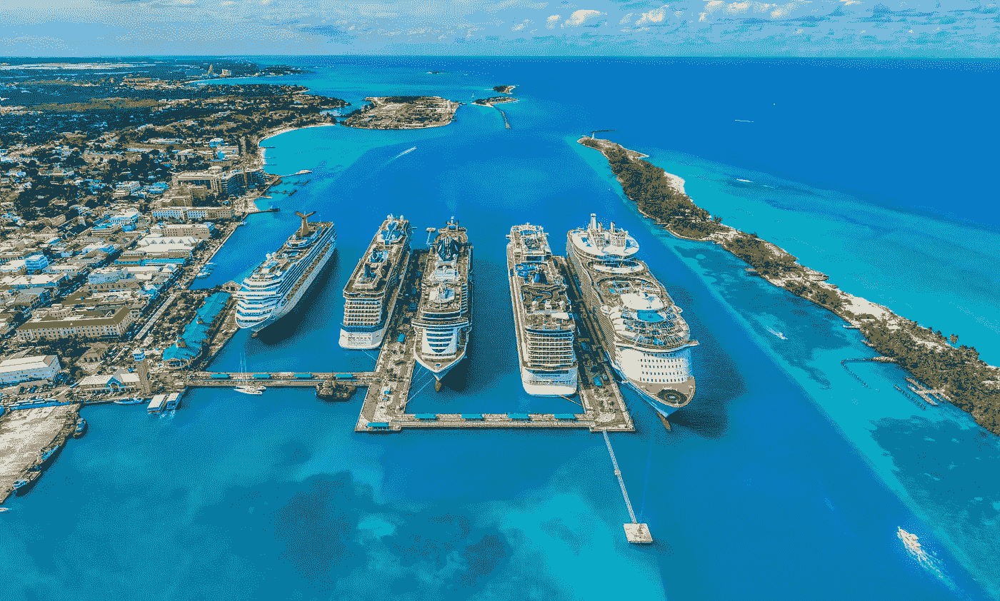

# 巴哈马炫耀的不仅仅是它的海滩:它将自己定位为贸易公司的加密中心。

> 原文：<https://medium.com/coinmonks/the-bahamas-flaunt-more-than-just-its-beaches-its-positioning-itself-as-a-crypto-hub-for-trading-a545b45bbc8e?source=collection_archive---------39----------------------->

巴哈马群岛中央银行处于监管加密货币交易的最前沿，实施了智能监管，允许该部门的合法运营商随着增长和创新而蓬勃发展。

## 智能灵活的法规

巴哈马总理菲利普·戴维斯在 2022 年 5 月举行的巴哈马加密会议期间发表了几次公开声明。他似乎为国家的进步感到自豪。

> 总理菲利普·戴维斯说:“巴哈马将自己定位为加密货币行业的首要目的地，拥有有利于创新和业务发展的监管环境。”。

巴哈马还积极与金融行动特别工作组(FATF)等国际组织合作，确保巴哈马始终处于打击洗钱和资助恐怖主义的前沿。

巴哈马还建立了一个名为巴哈马国际证券交易所(BISX)的经济特区，专为希望在该国开展业务的贸易公司设计。

巴哈马总理菲利普·戴维斯(Philip Davis)表示:“BISX 为寻求高效、经济的司法管辖区的贸易公司提供了一个独特的机会。

## 沙元是第一个

巴哈马人可以使用 2020 年由中央银行发行的数字货币[巴哈马沙币](https://www.sanddollar.bs)获得数字资产。

巴哈马是第一个推出 CBDC 的国家，据 T2 大西洋理事会称，10 个国家已经推出了 CBDC，另外 15 个国家正在进行试点项目。

## FTX 和萨斯奎汉纳:他们是潮流的引领者吗？

到目前为止，巴哈马的努力得到了回报，因为贸易巨头 [Susquehanna 国际集团](https://www.coindesk.com/business/2022/07/22/trading-firm-susquehanna-plots-bahamas-crypto-expansion-sources/)计划扩大其在巴哈马的业务。2021 年 9 月，FTX 交易所将总部从香港迁至巴哈马。

> “我们的愿景是将巴哈马群岛转变为加勒比地区领先的数字资产中心，”总理菲利普·戴维斯说。

## 前瞻性政策

巴哈马长期以来一直是一个受欢迎的旅游目的地，似乎该国正在寻求成为加密货币监管的全球领导者，从而为自己的帽子再添一根羽毛。由于前瞻性的政策允许该领域的增长和创新，其他国家可能会效仿巴哈马的做法。

在区块链和加密货币方面，您的组织是否需要帮助来保持领先地位？在这里了解更多关于我的加密写作服务！

> 交易新手？试试[密码交易机器人](/coinmonks/crypto-trading-bot-c2ffce8acb2a)或者[复制交易](/coinmonks/top-10-crypto-copy-trading-platforms-for-beginners-d0c37c7d698c)