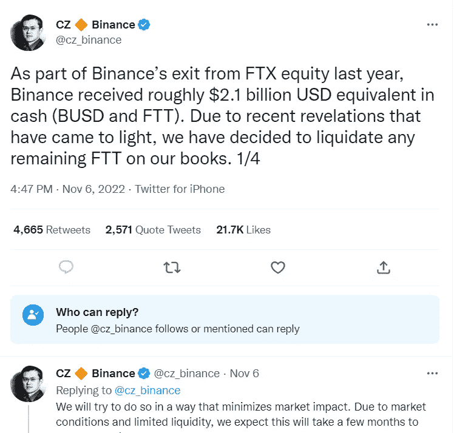
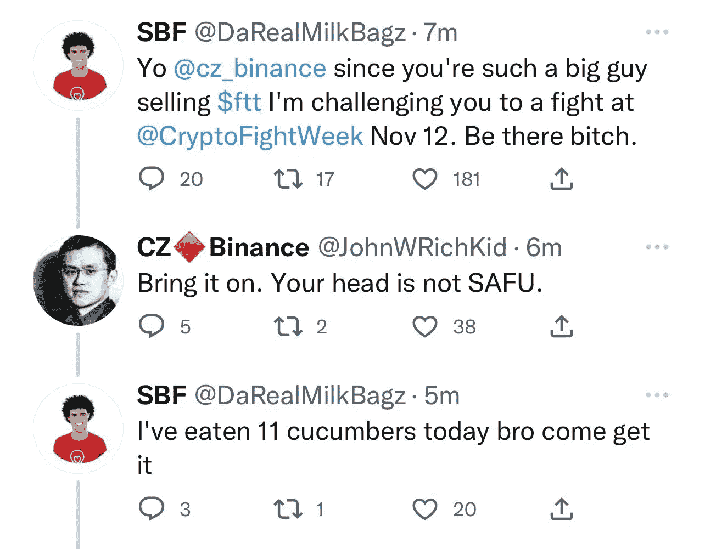
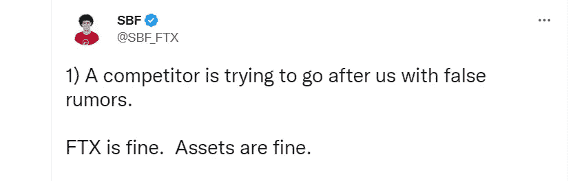
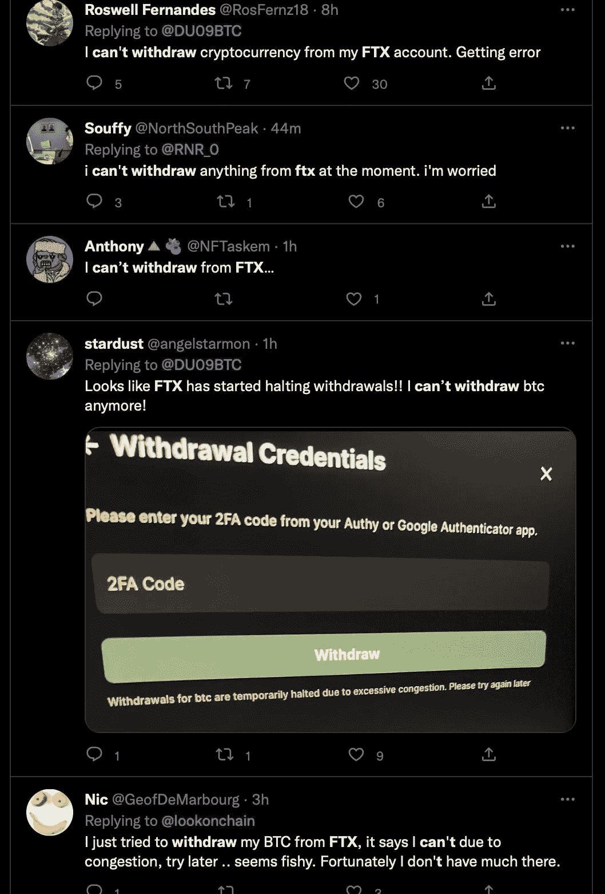

# 阿拉米达的银行家

> 原文：<https://medium.com/coinmonks/the-bankmen-of-alameda-a28e3441cc94?source=collection_archive---------38----------------------->

如果说赵昌鹏从卢娜号失事中学到了什么，那就是在泰坦尼克号完全沉没之前离开它。阿拉米达是否有 30 亿美元或只有 6k 美元的流动资金；这位币安特技演员没有冒险。他放走了那些 FTT 代币。这只是 10%的下降和大量的推文；其中大多数的标题都比我为这篇文章做的标题好。

如果我继续出版这样的书，我可能会出版一个完整的秘密童话系列。读起来像龟兔赛跑的故事。

仍然是阿拉米达研究，FTX 和萨姆的超级粉丝。我是说，他们为这个地方做了很多。至少，他们带来了很多好泵。但不要相信我的判断力，我曾经是卢娜和权先生的“超级粉丝”。

好吧，以防万一你还没有得到消息；据传，FTX 交易所的 FTT 代币正在耗尽流动性。a 报告的 1:2 资产流动性比率。价值 60 亿美元的 FTT 代币和 30 亿美元的流动资金。

不清楚赵先生是否在考虑以每股 22 美元的价格出售他在 FTT 的股份。看起来交易所的人决心利用市场，而不是坐在谈判桌上。如果谣言是真的，那么 FTX 可能需要一些救助。具有讽刺意味的是，山姆不久前给了 Celsius 一些救助资金。

你可以感觉到整个密码阿拉米达。广受欢迎的 USDT 调查报告写满了“研究”小组。反正和币安一样，但前者是一个更突出的人物。

不过，流动性不足不会扼杀一个项目。你可能只是经历了延迟取款，也许是一些失败的取款请求和冻结资金。这样的故事在 crypto 中并不新鲜。项目倒闭是一个正常的冬天故事，但当他们由福布斯“30 岁以下 30 岁以下”投资者领导时，感觉就不一样了。

我很乐意看到银行家们脱颖而出。看到加密项目购买体育中心的冠名权，赞助异国情调的超级碗广告，与 A 级篮球队进行促销交易，这很有趣。这个特别的项目做到了所有这些，这是一个值得骄傲的时刻，只是没有以投资者和交易者为代价，他们在交易所保留了他们的 rekt 投资组合的剩余物。

我看到一些关于延迟提款的报道，没什么大不了的，这些说法甚至没有得到证实，但如果这种情况成为事实，几十亿美元的救助可能会有所帮助。保罗和他的团队是一个很好的起点。

一连串的讽刺和一些双关语。你可能需要一杯咖啡来调节情绪。但是当你在等了几天你的撤退到来之后听到这些故事时，咖啡的味道很糟糕。顺便说一句，不用担心，索拉纳刚刚与谷歌云达成协议；他们和西塔实验室的交易一样。

如果索拉纳像西塔一样到达一个新的 ATH，那么 FTX 可能就不用申请破产了。无论发生什么，只要记得留下一个关注，一个掌声，一个提示，或者任何你觉得可能让我想再写的东西。

[跟进加密货币脚本](https://linktr.ee/cryptoscripts)通过全面的文章和重要提示了解加密领域的最新动态。
[雇佣自由撰稿人](https://www.upwork.com/services/product/comprehensive-seo-optimized-contents-for-your-project-1514476886622093312?ref=project_share&tier=0)

> 交易新手？尝试[加密交易机器人](/coinmonks/crypto-trading-bot-c2ffce8acb2a)或[复制交易](/coinmonks/top-10-crypto-copy-trading-platforms-for-beginners-d0c37c7d698c)