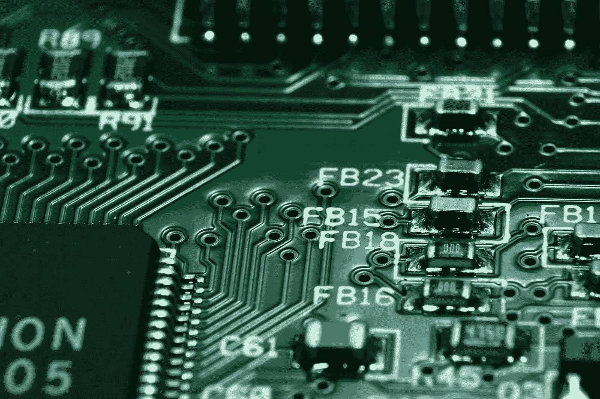

# 未来之战将在半导体行业展开

> 原文：<https://medium.com/coinmonks/the-battle-for-the-future-will-be-in-the-semiconductor-industry-8162d7806997?source=collection_archive---------23----------------------->

作者:[克里斯托弗·h·卢，医学博士](https://www.drchrisloomdphd.com/book-online)

Photo by [Pixabay](https://www.pexels.com/photo/green-computer-circuit-board-159220/)

第二次世界大战后，[美国](https://amzn.to/3Uicumw)成为世界超级大国，这是一系列偶然事件帮助该国利用战后繁荣的结果。

英国和欧洲在战争中损失惨重。