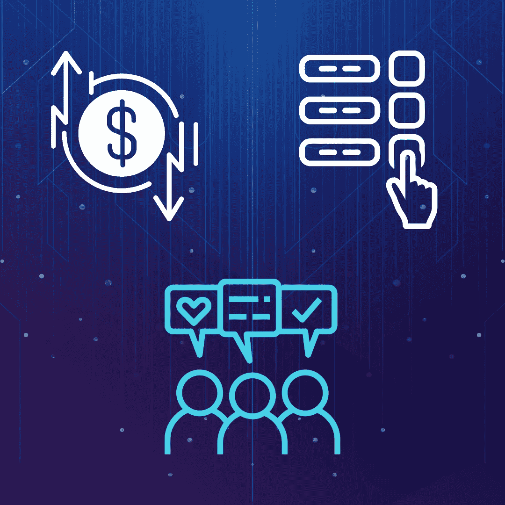

# 分散金融初学者指南

> 原文：<https://medium.com/coinmonks/the-beginners-guide-to-decentralised-finance-or-defi-d7cb01935fa3?source=collection_archive---------52----------------------->

短语“去中心化金融”(缩写为“DeFi”)指的是区块链或加密货币中旨在削弱金融中间人的广泛金融应用。DeFi 受到区块链的影响，该技术支撑着虚拟货币[比特币](https://bitcoin.org/en/)。它使多方能够各自保留一份交易历史的副本，防止单一、集中的来源控制它。这一点很重要，因为人工看门人和集中式系统可能会限制交易的复杂性和速度，同时限制用户对其资金的直接控制权。DeFi 脱颖而出，因为它将[区块链](/@orbis86/how-blockchain-technology-can-revive-the-global-economy-af2338d363dd)的应用从简单的资产转移扩展到了更复杂的金融用例。

由于比特币和类似的数字原生资产的交易中没有中间人，它们不同于由 Visa 和 PayPal 运营的更成熟的数字支付系统。当你在咖啡馆用信用卡支付咖啡时，一家金融机构站在你和公司之间，控制着交易，拥有停止或暂停交易的权力，并将其记入自己的账本。这些机构不再是加密货币的问题。大企业监管贷款和抵押贷款、保险、众包筹资、衍生品、博彩等金融应用。直接购买并不是他们监控的唯一一种交易。分散融资的主要好处之一是消除了所有交易中的中介。事实上，DeFi 的概念在成为广为人知的分散金融之前，经常被称为“开放金融”。

# **基于以太坊的软件**

大多数去中心化的金融应用程序都是使用全球第二大加密货币平台[以太坊](https://ethereum.org/en/)构建的，它与比特币平台的不同之处在于，它使得创建超越简单交易的去中心化应用程序变得更加简单。甚至以太坊的设计师 Vitalik Buterin 在 2013 年的第一份以太坊白皮书中也认识到了这些更棘手的金融用例。这是由于以太坊的智能合约平台具有更大的灵活性，允许在满足特定标准时自动执行交易。Solidity 是一种以太坊编程语言，专门为开发和实现这种智能合约而创建。

例如，让我们想象一个用户请求在星期二把钱转给一个朋友，条件是(例如)weather.com 预测最高温度为华氏 90 度。这些规定很容易成为智能合同的一部分。以太坊上运行着大量的 DeFi 应用程序，这里只分析了其中的一些，它们的核心是智能合约。这些应用可能会受益于以太坊 2.0，这是一种网络升级，可以解决以太坊的可扩展性困难。

最受欢迎的 DeFi 软件类别包括:

*   **分散交易所(dex):**这些是允许用户将一种货币兑换成另一种货币的在线市场，比如用乙醚兑换戴，或者用美元兑换比特币。一种受欢迎的交易形式是 dex，它将用户直接联系起来，这样他们就可以相互交易密码，而不必将他们的钱委托给中间人。
*   **Stablecoins:** 这是一种加密货币，它将其价值与非加密货币资产(如美元或欧元)挂钩，以控制定价。
*   **借贷门户:**这些平台利用智能合约取代银行等中介，监督和管理[借贷](/@orbis86/the-basics-of-crypto-lending-and-borrowing-58c38ea73524)。
*   **“包装的”比特币(WBTC):** 这些定义了一种将比特币转移到以太坊网络的方法，以便它可以立即在以太坊的 DeFi 系统中使用。WBTCs 使消费者能够通过上述分散式贷款网络获得比特币贷款的利息。
*   **预测市场:**这些市场是对即将到来的事件(包括选举)的结果进行押注的市场。DeFi 版本旨在提供与传统市场相同的功能，但没有中间商。

除了这些应用程序，围绕它们还出现了许多 DeFi 创意:

*   **高产养殖:**这是有经验、有能力承担风险的交易者的一个选择。用户搜索不同的 DeFi 代币，寻找赚取更高回报的机会。
*   **流动性挖掘:**这是一种 DeFi 应用向消费者提供免费代币以换取使用其平台的情况。这也是迄今为止出现的最受欢迎的高产农业类型。
*   **可组合性:**由于它们的开源性质，DeFi 应用程序允许任何人访问支持它们的代码。因此，它也可以用来创建全新的应用程序。
*   **金钱乐高:** DeFi 应用程序类似于乐高，这是一种儿童玩具积木，可以连接在一起制作建筑物、汽车和其他物体，以进一步简化“可组合性”的概念。DeFi 应用程序可以以类似于“金钱乐高”的方式组合在一起，以创造新的金融产品。

# **DeFi 借贷**

一种颇受欢迎的将加密货币买家和卖家联系起来的去中心化金融方法是借贷市场。[知名平台 Compound](https://compound.finance/) ，让用户用加密货币贷款，或者借出自己的。放贷的用户可以从利息中获利。利率是通过使用算法的复合来建立的，因此如果对加密货币贷款有更多的需求，它也会自动导致利率上升。DeFi 中的贷款是基于抵押品的。因此，为了获得贷款，借款人必须提供抵押品，通常是支撑以太坊的加密货币以太。因此，与典型的非 DeFi 贷款不同，客户不需要提供他们的身份或相关的信用评分来申请贷款。

# **Stablecoins**

这些是 DeFi 的另一种变体。与传统货币相比，加密货币经常出现更大的价格波动，例如，对于那些想知道一周后他们的钱的估值的人来说，这并不理想。稳定货币将加密货币与法定货币(如美元)联系起来，以控制价格。顾名思义，稳定货币试图创造价格“稳定”。

值得注意的稳定因素包括:

*   美元硬币(USDC)
*   币安美元(BUSD)
*   戴(傣)
*   系绳(USDT)

# **预测市场**

这些是以太坊上仍然活跃的最早的 DeFi 应用程序之一，用户可以在那里对事件的结果进行下注。参与者的主要目标是赚钱，但有时预测市场比投票等更传统的技术更准确。Intrade 和 PredictIt 是两个集中的预测市场，在这一领域有着良好的记录。鉴于预测市场通常不被政府认可，并且在集中运作时经常被关闭，DeFi 拥有增加对它们兴趣的潜力。

世界各地越来越多的用户正敏锐地意识到，与传统银行架构的不公平和官僚监管相比，去中心化金融带来了破坏性和公平的好处。因此，在未来的几年里，DeFi 有朝一日可以有效地取代传统的金融系统，迎来一个更加透明和公平的明天！

> 交易新手？试试[加密交易机器人](/coinmonks/crypto-trading-bot-c2ffce8acb2a)或者[复制交易](/coinmonks/top-10-crypto-copy-trading-platforms-for-beginners-d0c37c7d698c)