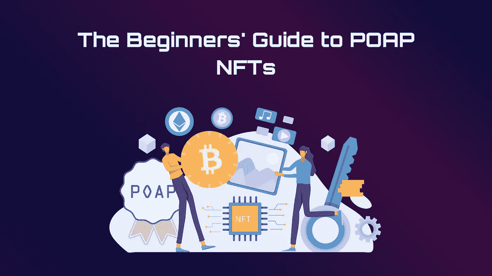
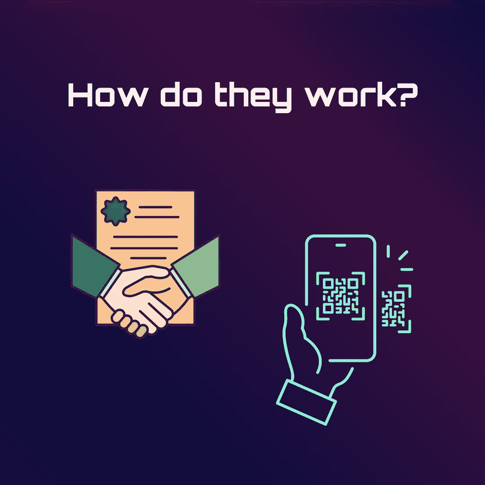
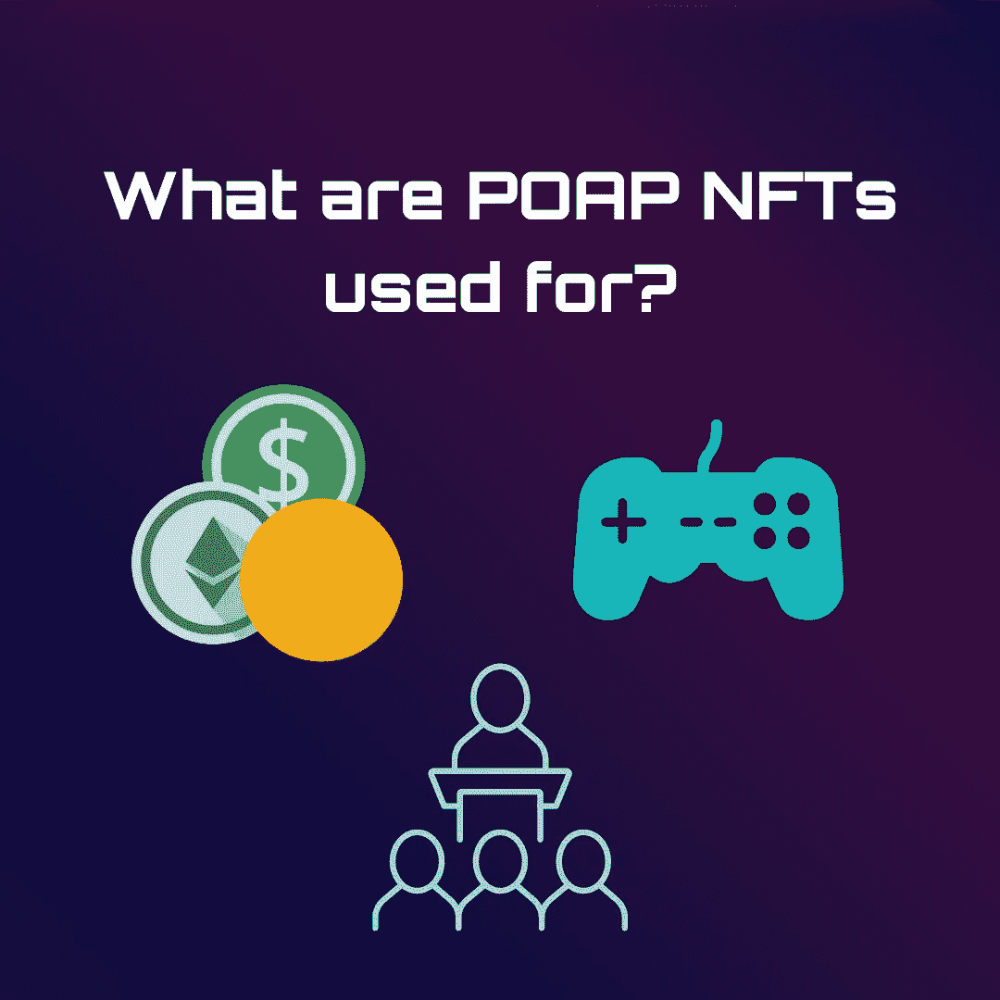
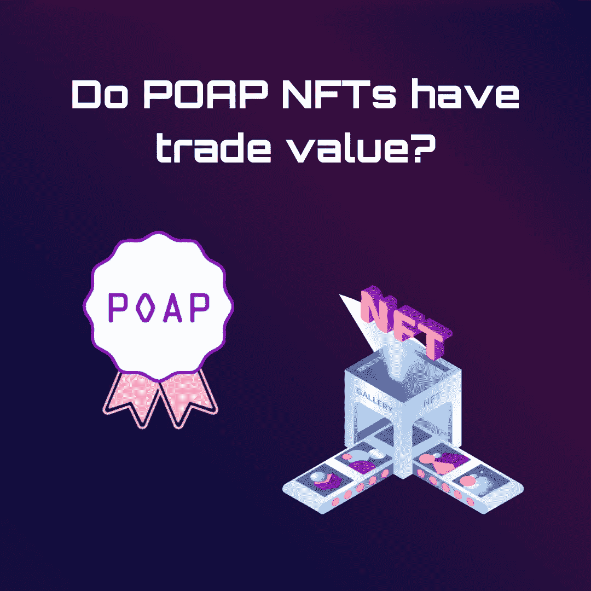
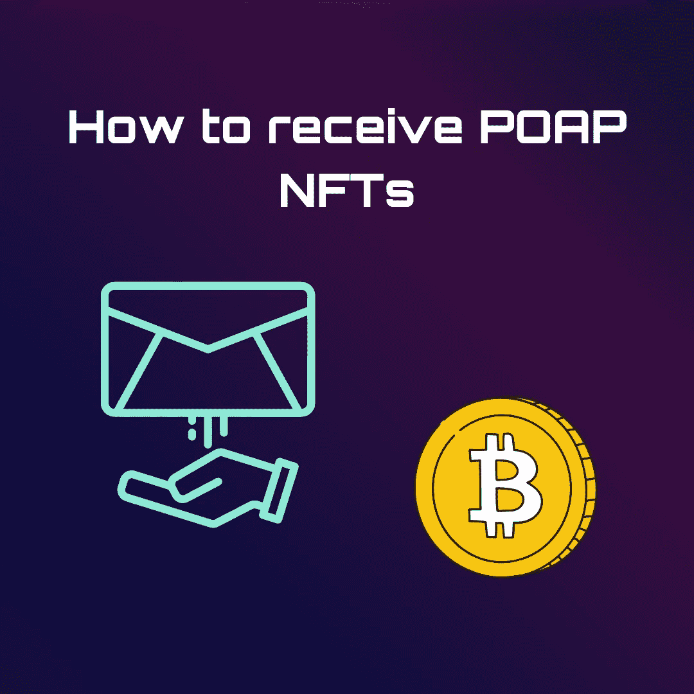

# POAP 国家森林公园初学者指南

> 原文：<https://medium.com/coinmonks/the-beginners-guide-to-poap-nfts-d8afe8fb57f4?source=collection_archive---------14----------------------->

在过去的几年里，非金融信托变得非常受欢迎，越来越多的人将其视为一种有前途的投资选择。然而，POAP 非正规医疗服务的概念在区块链社区之外并不太为人所知。

我们大多数人都在生活中的某个时候收集了一件独特的纪念品，可能是一次旅行的纪念品，一张自己最喜欢的乐队的音乐会门票，或者是一个参加特定会议的徽章。这些纪念品通常代表我们最珍贵的生活经历，在区块链世界，POAP(出席证明协议) [NFTs](/@orbis86/the-beginners-guide-to-nfts-fe66dc769dd2?source=user_profile---------31----------------------------) 充当这些纪念品的数字副本。

POAP NFT 首次在全球最大的 web 3 # BUIDLathon eth Denver 上亮相。POAPs 是在区块链以太坊上创建的 ERC-721 令牌，使用智能合约来确认和记录活动出席情况。“保留记忆的生态系统”这个短语经常被用来描述 POAP 国家森林公园。随着时间的推移，人们可以积累一个 POAPs 文件夹，作为他们现实世界和网络体验的基于[区块链](/@orbis86/how-blockchain-technology-can-revive-the-global-economy-af2338d363dd?source=user_profile---------20----------------------------)的记录。

POAP NFT 是存档和保存你的生活时刻的下一个阶段。他们不一定有耀眼的设计或创下的价格记录。事实上，活动组织者经常免费提供 POAP 国家森林公园。需要注意的是，某项赛事的所有非功能性交通工具并不都是 POAP 非功能性交通工具。它们必须源自 POAP 的官方智能合同，才能被视为 POAP，并且还包含图片以及日期和时间的特定元数据。

# 它们是如何工作的？

出席证明协议是开发 POAP NFT 的第一步。几个[智能契约](https://ethereum.org/en/developers/docs/smart-contracts/)组成了这个协议。每个 POAP NFT 还必须满足以下三个标准:

*   必须使用授权的 POAP 智能合同创建。
*   必须包括特定日期或时间范围内的信息，最长可持续一年。
*   必须包含与该场合相关的图像。

下一个阶段是分发，当活动组织者准备 POAP NFTs 时，通常使用客人可以轻松扫描和下载的 QR 码。参与者还可以通过活动组织者的电子邮件接收下载文件。POAP NFT 现在使用 Gnosis 链，一个更便宜更快速的侧链，以避免与以太坊主网相关的昂贵交易费用。尽管如此，灵知和以太坊继续合作。如果收藏者希望迁移到以太坊主网，他们只需要支付[煤气费](/@orbis86/what-are-gas-fees-and-how-are-they-calculated-b98db12ff33c?source=user_profile---------15----------------------------)。

# **POAP NFT 是做什么用的？**

POAP NFTs 可用于验证任何事件的出席情况，无论是加密或非加密、虚拟还是物理事件。以下是 POAP NFTs 的一些应用:

1.  **会议
    通常，它们只是普通的徽章，你可以把它放在钱包里，作为一个场合的提醒。**
2.  在传统的视频游戏中，赢得一场 boss 战，达到设定的小时数，或者参加一场重要的活动，玩家可以获得装饰性的小饰品或徽章。许多[区块链奥运会](https://www.forbes.com/sites/theyec/2022/08/02/3-things-you-need-to-know-about-blockchain-gaming/)采用 POAP NFT 的原因也是为了庆祝重大成就或事件。
3.  **加密货币团体** 社区越来越多地使用 POAP NFT 作为奖励和激励最积极参与的成员的方式。例如，在涉及 [DAO 项目提案](https://aragon.org/how-to/structure-dao-proposals-and-build-proposal-processes)时，拥有较高 POAP 数的特定社群中的持有人拥有更多投票权等特定利益。
4.  **超越加密** 但是 POAP NFT 不仅仅局限于加密货币领域。它们可能会在婚礼上作为充满感情的礼物送给客人，或者作为音乐会观众的回忆，等等。

除了作为纪念品和纪念品，POAP NFTs 还可以作为区块链的简历。雇主可以选择 POAP 简历来检查和确认候选人的工作经历，因为这些数据是不可逆的，并且在区块链上很容易核实。

# POAP 的非关税壁垒有贸易价值吗？

虽然出售 POAP NFT 是可能的，但这不是他们的主要目的。大多数时候，POAP 的 NFT 都有情感价值。它们旨在展现收藏者的独特体验。如果你对交易 POAP NFT 感兴趣，你可以试试 NFT 市场。虽然理论上 POAP NFT 可以出售，但不能保证你会盈利。由于大多数 POAP 的非关税壁垒通常是免费发放的，它们没有任何经济价值。

每个人拥有 POAP NFT 的动机都是独一无二的和个人的。许多 POAPs 帮助他们在安全的网络上记录他们生活中的事件，标记他们取得的重大事件或成就。随着受欢迎程度的提高，POAP 国家森林公园可能会成为主要主流活动的理想纪念品。它们起源的事件或里程碑也可能导致价格更高的 POAP NFT 的出现。例如，在一个重要的加密会议上分发的独特的 POAP·NFT 可能在十年后变得非常有价值，就像知名乐队的真实音乐会票根成为非常受欢迎的收藏品一样。

# **如何接收 POAP NFTs**

当你参加一个秘密活动，你通常会得到一个 POAP NFT。活动组织者将以 URL 或 QR 码的形式提供申领代码。若要检索您的 POAP，请扫描代码或将 URL 键入您的计算机浏览器。POAP 的 NFT 是用来存放在以太坊钱包里的。使用索赔代码后，您可以通过使用您的电子邮件地址注册来保护它。之后，连接你的电子邮件地址到钱包开始铸造 POAP NFTs。

# **结论**

POAP 国家森林论坛目前正处于初期阶段。它们的应用也不为大多数人所熟知。虽然 POAPs 不像在市场上购买和交易的传统 NFT 那样有价值，但它们为活动策划人提供了一种在重大活动中发放数字奖励的简单方法，并帮助个人和团体记录重大成就。随着越来越多的活动策划人尝试使用它们，POAP NFTs 的用例也将进一步发展，超越收集现场体验和验证出席率。

> 交易新手？尝试[加密交易机器人](/coinmonks/crypto-trading-bot-c2ffce8acb2a)或[复制交易](/coinmonks/top-10-crypto-copy-trading-platforms-for-beginners-d0c37c7d698c)