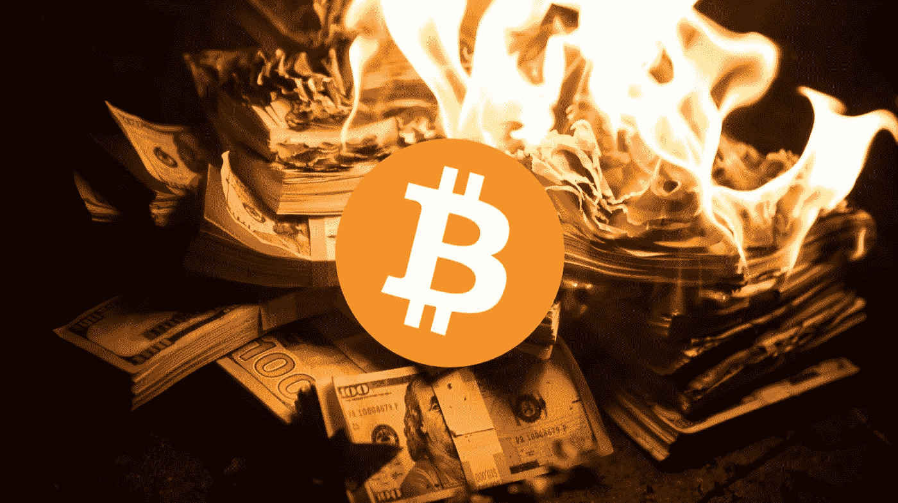

# 在过去的两年里，我在 Crypto 做过的最好和最糟糕的决定

> 原文：<https://medium.com/coinmonks/the-best-and-worst-decisions-ive-made-in-crypto-the-last-2-years-c3da5aeecde0?source=collection_archive---------4----------------------->

在过去的几个月里，比特币和加密市场的价格感觉就像是在坐过山车。不停地上下移动，但从不停留太久。就在事情变得乐观的时候，价格地毯从我们脚下被拉了出来。导致市场进入恐慌状态。但是当所有的希望都破灭的时候，也就是…