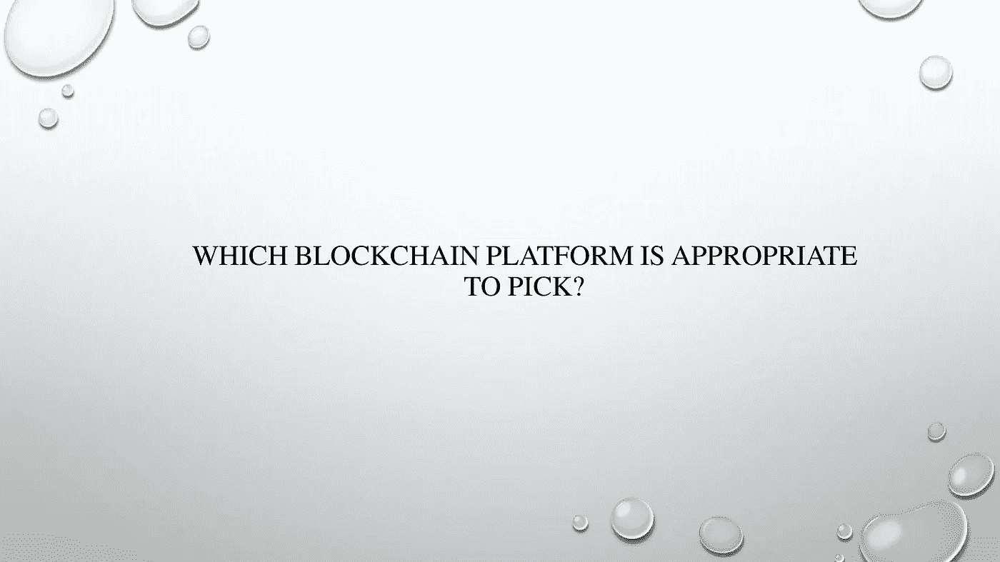

# 满足您需求的最佳区块链

> 原文：<https://medium.com/coinmonks/the-best-blockchain-for-your-needs-f07307edd949?source=collection_archive---------22----------------------->

B 锁链平台从脚本语言开始，这些脚本语言足够复杂和灵活，可以构建和处理各种 Web3 操作，包括但不限于 NFTs、交易开始和执行以及智能合约形成。事实上，智能合约被认为是以太坊(Ethereum)平台的第一个非加密货币用途。

区块链平台作为一种优化供应链、增加可追溯性、简化贸易和加强金融交易的手段，正越来越受欢迎。这种兴趣很大程度上源于围绕比特币的周期性上涨，比特币依赖于早期的区块链基础设施，该基础设施存在能源利用和速度方面的困难。

已经创建了最近的区块链技术来帮助克服这些限制，并为不同的商业用途和应用提供实用价值。

# **区块链平台**

**以太坊**

以太坊是一个基于区块链的平台，面向所有 Web3 的事物，包括 NFTs、分散式银行、分散式社交网络和加密货币赌注。它也有自己的令牌(ETH)。开源技术的开发者网站提供了一系列学习 Web3 工具的课程，如区块链和智能合同。

以太坊社区正在从当前的工作证明(PoW)共识方法过渡到更节能的利益证明(PoS)。这一举动使得第二个新形式的区块链被创造出来，被称为灯塔链，它被整合到现存的主要以太坊区块链中。

**总账架构**

yperledger Fabric 是一套帮助开发区块链应用程序的工具。它是从底层开始设计的，考虑到了企业分布式分类帐应用程序，并得到了 Linux 基金会的支持。它拥有多样化的组件生态系统，可以集成到模块化设计中。它在封闭的区块链实现中表现良好，提高了安全性和速度。

它还提供了一个开放的智能契约范例，可以适应各种数据格式，包括帐户和未用交易输出(UTXO)模型。

Hyperledger Fabric 还可以通过在需要知道的基础上分离渠道中的交易或促进私有数据集合中的私有数据的交换来提高数据隐私性。根据其支持者的说法，它还可以实现低终结性和确认延迟的高速交易。

**IBM 区块链**

IBM Blockchain 是一个私有的、去中心化的区块链网络，已经被证明是最受不太厌恶风险的企业客户欢迎的。

IBM Blockchain 开发人员工具是为多功能、功能性和适应性而创建的。IBM 还投资开发了一个用户友好的界面，使配置、测试和快速部署智能合同等重要流程变得更加容易。

**总账锯齿**

Hyperledger Sawtooth 采用了一种被称为运行时间证明的新型共识技术，该技术可与基于硬件的安全解决方案结合使用，以允许程序代码的“安全环境”在安全区域(即计算机内存的安全区域)中运行。

**科达**

Corda 为金融交易和智能合同提供了极具吸引力的解决方案，具有良好的安全性，因此 R3 联盟在金融行业拥有相当多的追随者。

**泰佐斯**

Tezos 是一个成熟的平台，允许去中心化的应用程序、智能合同和独特的金融工具，如 NFTs，可以被视为现代版的数字资产交易卡。该平台具有动态可升级协议以及模块化软件客户端，使其能够适应新的用途。

Tezos 社区一直在快速改进该平台，最近的改进增强了性能并扩展了智能合约的大小限制。它还创造了一些工具来帮助将非功能性交易纳入商业供应链的过程实现自动化。

**EOSIO**

根据其支持者的说法，它采用了一种基于 PoS 的复杂共识过程，优于以太坊等早期技术。它还包含对治理特性的支持，允许用户对平台更新进行投票。

**恒星**

Stellar 使用 Stellar Consensus 协议，据说该协议可以缩短在公共区块链系统上处理和完成交易的时间。它还采用了安全方法来防止不良或可疑方参与金融交易。一些公司已经采用它进行全球贸易和跨境货币交易。

**议会法定人数**

Quorum 是金融服务公司摩根大通创建的以太坊的一个分支。它利用以太坊区块链技术的基础工作，并将其重新打包到一个对银行友好的环境中。它已经过优化，便于银行和保险公司等组织之间在专用网络上进行高速交易。

**雪崩**

据其网站称，Avalanche 自称是业内最快的智能合约平台，允许客户快速廉价地构建去中心化的应用程序，以最少的基础设施快速扩展，并推出定制的私人和公共区块链。它还非常节能，具有 CPU 最佳效率。

**币安智能链**

币安智能链是币安的子公司，也经营加密货币和加密交易平台。据该网站称，该框架非常适合开发游戏和分散式金融应用，并为刚到区块链的开发者提供了教程。

**卡尔达诺**

Cardano 是一个面向变革者、发明家和远见者的区块链平台，为大多数人和少数人提供将潜能变为现实所需的工具和技术，并实现积极的全球变革。

Cardano 是第一个基于同行评审研究的区块链平台，采用循证方法实施。它集成了尖端技术，以前所未有的安全性和可持续性支持分散的应用程序、系统和社区。它是区块链的利益攸关平台。

**chain analysis KYT**

chain analysis KYT(了解您的交易)整合了市场领先的区块链智能、用户友好的用户界面和实时 API。它有助于企业减少手动操作，保持法规遵从性，并与 DeFi 等创新技术进行适当的交互。

**克莱恩**

KLAYTN 是一个公共的开源区块链，面向那些主要想在元宇宙开发、工作或玩耍的人。KLAY 是网络上所有平台交易和其他区块链应用程序的主要使用令牌。它还用于支付和交换所有在 KLAYTN 生态系统内运行的应用程序。

**多链**

多链区块链是一个开源的区块链平台，旨在构建可以在企业内部或企业之间工作的区块链应用程序。这种区块链技术是私有的，并且可以被企业用于金融交易。借助 MultiChain，组织可以快速开发和部署分散的应用程序。

**波尔卡多**

一种加密货币和区块链平台被称为 Polkadot。它旨在使区块链能够在没有可靠的第三方帮助的情况下相互通信和交易。

一个蓬勃发展的副链生态系统，或定制的区块链，由波尔卡多特汇集和保护。Polkadot 应用和服务支持安全的跨链通信，为真正可互操作的分散式网络奠定了基础。

**涟漪**

Ripple 使用自己的加密货币 XRP，基于区块链数字支付网络和协议。Ripple 采用了一种共识机制，利用银行拥有的一系列服务器来确认交易，而不是在区块链上挖掘。

比特币交易消耗更多的能量，需要长得多的时间来确认，交易成本更高，而 ripple 交易使用的能量要少得多，完成速度更快，交易成本也低得多。

按市值计算，Ripple (XRP)是区块链估值最高的资产之一。

尽管银行应该主要使用 Ripple 支付系统，但个人投资者也可以预测 XRP 的价格。

索拉纳

一个名为 Solana 的区块链平台旨在运行可扩展的、分散的应用程序。与以太坊等竞争对手区块链相比，Solana 可以在一秒钟内处理如此多的交易，而且交易费用也较低。

Solana 是一个高性能的区块链，帮助来自世界各地的开发人员构建可立即扩展的加密应用程序。

**创刀**

Tron 是一个分散的区块链数字平台，有自己的货币 Tronix 或 TRX。Tron 基金会是一家总部位于新加坡的非营利组织，于 2017 年成立 Tron。它的使命将是主持一个全球流行的娱乐网络，以合理的价格交换数字内容。雄心勃勃的 TRON 项目的目标是为一个完全去中心化的互联网创造基础。

**XDC 网**

XDC 网络中有两种不同类型的网络状态:公有网络和私有网络。所有用户都可以清楚地访问的网络区域被称为公共状态。零售用户可以通过打开钱包或账户自由购买、出售或交易 XDC 代币。

因为 XDC 网络是完全以太坊虚拟机(EVM)可互操作的，它可以吸引相当数量的以太坊开发者，并支持在以太坊上开发的各种 Dapps，以便在 XDC 上迁移。

> 交易新手？尝试[加密交易机器人](/coinmonks/crypto-trading-bot-c2ffce8acb2a)或[复制交易](/coinmonks/top-10-crypto-copy-trading-platforms-for-beginners-d0c37c7d698c)