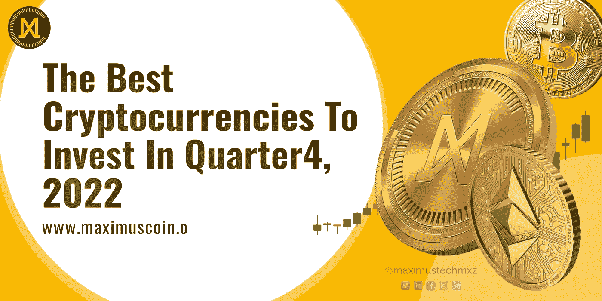

# 2022 年第四季度最佳投资加密货币

> 原文：<https://medium.com/coinmonks/the-best-cryptocurrencies-to-invest-in-quarter-4-2022-38467dfe875a?source=collection_archive---------5----------------------->

The best cryptocurrencies to invest in Q 4, 2022

加密货币本质上是数字货币的一种。虽然你可以数字化管理和交换你的传统货币(如美元)，但这并不等同于拥有加密货币。加密货币之所以引人注目，是因为它们是基于政府的货币体系的去中心化和更加民主的替代品。

随着时间的推移，加密货币的热潮只增不减。在今天的博客中，我们将了解这种加密热潮是怎么回事，以及 2022 年第四季度投资的最佳加密货币是什么。

## **什么是加密货币？**

正如我们上面所讨论的，这是一种使用加密的数字货币形式，区块链安全技术被称为“加密货币”加密货币使用一种去中心化的技术来避免对中央权威的需求。

加密货币是一种无形货币，只以数字形式存在，就像代币一样。因为每种加密货币的供应量都是有限的，企业或政府无法创造更多。

如今，比特币或其他替代货币等加密货币可以在比特币基地等交易所买卖，也可以用来买卖股票和其他投资，支付日常开支。

## **加密货币的意义是什么？**

以下是加密货币的一些重要意义

1.  **贬值降低**

政府货币当局可能会在经济危机期间发行货币，这可能会使货币贬值并产生意想不到的影响(如通货膨胀)。大多数加密货币都有预先确定的金额。在每一个单位被消耗后，没有新的单位可以产生，因为没有一个集中的组织来这样做。

2.**消除银行参与**

当你转移传统货币时，银行收取作为中间人的费用。区块链网络的参与者本身就扮演着中间人的角色，他们的服务只能得到适度的报酬。除此之外，任何拥有智能手机的人都可以使用 cryptos 进行支付，而无需开立银行账户。

3.**投资增加**

澄清人们对加密市场的信心至关重要，特别是在创造重大投资和制定长期政策时。但是，您应该意识到，客户也在为现有技术的内在价值付费，而不仅仅是为特定的业务或标准价值付费。

4.**缓和规则**

防止将中国对加密货币的严厉立场作为国际法的通用模式。萨尔瓦多是第一个采用比特币作为法定货币的国家，所以尽管有这些奇怪的异常现象，整个全球系统似乎都在上升。这一点以及其他令人鼓舞的发展，帮助加密货币在传统上对新进入者怀有敌意的行业中脱颖而出。

5.**对企业和客户的优势**

目前，P2P 交易和安全的支付方式创造了加密货币，这是零售部门非常受欢迎的选择。尽管价格波动，许多大企业正在接受比特币甚至替代比特币支付，因为安全的交易基础设施已经到位。消费者将很快能够访问尖端的加密相关服务，因此预计未来的采用只会增加。

6.**程序员的避风港**

专家们正在不断改进加密货币的挖掘，他们也在规划更新的策略，以逐渐消耗更少的能量。此外，每天都有新的加密货币参与者出现，他们具有更高的交易率、更好的软件开发安排以及更快地创建区块的能力。

## **这种加密热潮是什么？**

2011 年，当第一批竞争的加密货币(如 Namecoin 和 Litecoin)开始出现时，比特币在占据绝对主导地位几年后，不再是唯一存在的加密货币。越来越多的网站开始接受加密货币，促使这种格式越来越受欢迎。

该系统得到了像埃隆·马斯克、格温妮丝·帕特洛和比尔·盖茨这样的知名人士的支持，并发展成为获得贷款困难时期(如疫情)的可行替代品。这也有助于你投资组合的多样化。

到 2021 年 1 月，有超过 4000 种不同的加密货币可用。他们中的许多人仍然没有比特币受欢迎。由于交易量较低，它们最终大多被支持者和投资者购买。

截至 2022 年 3 月，有超过 8000 种不同的加密货币可用。2013 年，一个比特币价值 1000 美元，这促使一些交易员和投资者调查加密货币。因为需求量大，价值跌了。此后价格略有波动，但 2021 年单个比特币接近 45000 美元。

世界上拥有最多加密货币用户的最大国家是印度，拥有超过 1 亿的用户。

阿联酋和迪拜正在推动区块链在中东的发展。

此外，马来西亚证券委员会现在已经允许交易所运营商在那里开展业务。

## 加密货币有什么样的未来？

2013 年，一个比特币价值 1000 美元，这鼓励了众多投资者和交易者关注加密货币。因为需求量大，价值跌了。从那以后，价格一直在波动。

虽然一些人认为这是长期资金，但许多人担心开采加密货币对环境的影响。这些担忧导致一些企业，如特斯拉，停止接受比特币。然而，在一个不受政府控制的市场进行交易的前景总体上让许多投资者感到兴奋。

这些意义表明，加密货币在未来可能是一项非常有利可图的投资。[据一些专家预测，未来比特币甚至可能达到 30 万美元的价值。](https://www.forbes.com/sites/robertfarrington/2021/02/01/theres-more-to-cryptocurrency-than-bitcoin/?sh=2a6825eab6dc)

## **2022 年第四季度投资什么加密货币最好？**

以下是 2022 年你应该考虑投资的 5 种最佳加密货币:

1.  [马克西姆斯币](https://maximuscoin.io/):

*   altcoin Maximus Coin 是分散加密行业的一次革命。
*   Maximus Coin 正计划创建一系列区块链支持的分散化产品，如分散化云存储、名为 [Uniqspot](https://www.uniqspot.io/) 的 NFT 市场、非托管移动钱包等等。因此，这是一项值得考虑的长期加密投资。
*   它可以用于支持项目开发，实现分散服务的支付，实现网络上的无摩擦交易，等等。
*   Maximus 硬币将用于类似的目的，包括赌注，赠品，推荐奖励，以及更多使其成为 2022 年有前途的公用事业令牌。

2.玉米粉饼:

*   TAMA 的测试预售在 25 天内筹集了 200 万美元，并迅速成为加密货币社区中讨论最多的预售活动。Tamadoge 的预售筹集了 900 多万美元。这一成功归因于多种因素。
*   首先，非加密玩家喜欢 Play 2 Earn，因为它结合了 Tamadoge 宠物和元宇宙。
*   因此，随着 Tamadoge 专注于非正式和非加密游戏玩家，令牌的供应正在上升。
*   最初的交易所上市公告提供了该项目的受欢迎程度和前景的证据。
*   根据 LBANK 和 Pancakeswap 之前的声明，预售结束后，TAMA 将在它们的交易所上市。

3.巴特尔无限公司:

*   在短短几周内，IBAT——战斗无限的本地硬币——的预售筹集了 16500 BNB，或 200 万美元。它被认为是 9 月份购买的最佳替代硬币之一。
*   该生态系统已在 LBANK、PancakeSwap、CoinMarketCap 和 CoinGecko 上成功上市，并允许玩家参与各种元宇宙集成游戏，创建和销售他们自己的原创艺术品，以及探索元宇宙。
*   由于 PancakeSwap 的正式推出，价格增加了五倍，从 0.0015 美元增加到 0.011 美元。这增加了对 IBAT 的需求，并使其成为今年表现最好的硬币标识之一。
*   根据最近的营销举措，战斗无限正在尽一切努力取代 Axie Infinity 成为最受欢迎的 P2E 游戏。该项目被广泛认为是 Axie Infinity 的继任者。

4.LBLOCK:

*   在 CEX 上市后，Lucky Block 的价格飙升了 50%。8 月，该平台的原生令牌 LBLOCK 在两个最大的交易所平台 MEXC 和 Uniswap 上市。
*   Lucky Block 对其系统进行了大量更改，导致需求增加和价格上涨。
*   2022 年 7 月，幸运街区首次发布了令牌的 V2 迭代。这个版本是专为 CEXs 设计的，没有交易费，也没有累积奖金池奖励。
*   幸运街区宣布计划建造一座桥梁连接两个代币并平衡它们的平价。
*   这个顶级的比赛和奖励平台打算引入新的 NFT 比赛平台，NFT 持有者可以参加比赛，赢得以下一些奖品，包括国际足联世界杯的贵宾票、一栋房子、一辆 BAYC NFT 和 100 万美元的比特币。
*   自从进行营销投资和与知名体育明星合作以来，Lucky Block 也发展了自己的社区。

5.雪崩:

*   AVX 令牌通过跨三个链而不是一个链处理事务，采用了一种新的可伸缩性方法。
*   Avalanche 是以太坊的最佳替代方案之一，因为它提高了交易速度、可伸缩性和低汽油费。
*   随着越来越多的加密货币投资者转向雪崩，这种代币的需求上升。

6.索拉纳:

*   Solana 从一开始就被认为是以太坊网络最强有力的竞争对手，因为它的交易速度非常快。
*   由于 DAO 和 NFT 市场活动的增加，GameFi 互动的加强，以及 DeFi 市场份额的下降，Solana 也在 GameFi 和 DAO 领域进行扩张。
*   由于 Solana 的网络更新和中断修复，增强了事务处理和可靠性，所以出现了这种情况。

**结论**

尽管许多人会对加密货币在未来几个月和几年对交易者的潜在价值做出合理的估计，但现实是这种投资仍然是非常新的和投机性的。没有人真正知道，不管某个专家相信或声称什么。长期的财富发展需要对市场有透彻的了解，并且只投资那些投资者愿意经历起起落落的基金。

> *免责声明:以上提供的信息不是投资建议。它仅用于教育目的。*
> 
> *通过使用本信息，您同意该信息不构成任何投资或财务指示。在做出任何投资决定之前，一定要进行自己的研究。*

在[推特](https://twitter.com/maximustechmxz)上关注我们

加入 t.me/maximustechmxz[的马克西穆斯社区](http://t.me/maximustechmxz)

> 交易新手？尝试[加密交易机器人](/coinmonks/crypto-trading-bot-c2ffce8acb2a)或[复制交易](/coinmonks/top-10-crypto-copy-trading-platforms-for-beginners-d0c37c7d698c)