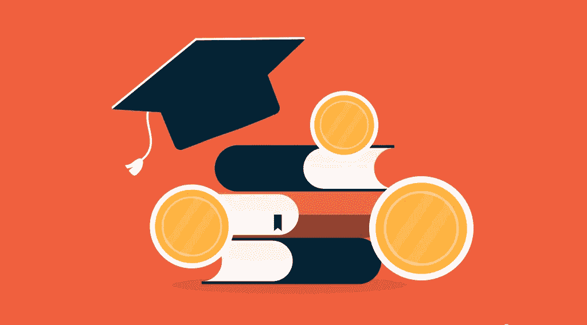

# 最好的学习赚钱的加密平台

> 原文：<https://medium.com/coinmonks/the-best-learn-to-earn-crypto-platforms-9a7e40d1d153?source=collection_archive---------2----------------------->

随着加密世界的不断发展，我们在做自己最喜欢的事情的同时，了解了赚取加密货币的新方法。这就是像 Stepn 和 [Play-to-Earn 这样的移动挣钱项目和像分散土地和沙盒这样的游戏挣钱项目](https://stealthex.io/blog/2022/05/26/the-best-play-to-earn-crypto-games/)是如何出现的。加密项目经常全神贯注于不同的方式来推广自己，所以他们不断想出惊人的方式来娱乐加密爱好者。你不必总是购买密码、挖掘加密货币或将你的实际辛苦赚来的现金投资于某样东西，然而，为了获得代币，你需要将你的注意力投入到一个特定的项目中。密码行业中的一个新领域叫做“学会学习”,它基本上是对学习密码的奖励。

所以，如果你问自己‘我能通过学习获得密码吗？答案是:‘当然，你可以！’这里有两个动机:平台背后的公司和加密货币背后的人。学习平台，通常是一个交流平台，希望你在他们的平台上学习。这将使你更有可能在知道什么是什么的时候与他们接触。他们竞相为自己的平台带来流量。

通过学习加密，你甚至可以赚一些钱，特别是如果你考虑到加密货币是高度不稳定的，这就是你在这个过程中将要赚的钱。你要怎么做才能得到密码？嗯，作为一项规则，该平台会建议你首先观看视频或阅读文章，然后参加测验，如果你合格，你将获得一定数量的加密资产。

# 通过学习加密来获得加密

一些著名的加密实体提供这种激励，包括一些大型的集中交易所。提供学习赚取加密程序的最著名平台包括:

*   比特币基地
*   共同市场资本
*   蛋糕 DeFi
*   币安
*   元学术
*   Phemex
*   库科恩

让我们来看看其中的一些程序。

# 比特币基地学会赚钱

通过比特币基地·欧恩，您可以观看动画视频或阅读文章，了解:

*   您将在每个主题中查看一个关于您选择的加密货币的简短剪辑(或动画视频)。
*   然后你可以做一个快速测验或作业来评估你的理解程度。
*   通过测验后，每个模块你都会在你的比特币基地帐户中收到大约 3 到 6 美元的加密金。

自然，回报不会让你变得富有，但这是一个相对较低的时间投资，即使是一个密码新手也可以轻松完成这项工作。要参加该计划，您必须首先创建一个比特币基地帐户，然后就可以开始了！

# 学习赚钱

CoinMarketCap 是最受欢迎的追踪加密货币价格的网站。这是一个巨大的信息和数据来源，当然，它的所有者为网站访问者提供了许多机会。

你需要做什么来获得 CoinMarketCap 上的加密？嗯，很简单:

*   创建一个 CoinMarketCap 帐户。
*   访问网站，点击【学习】观看视频。
*   观看视频后完成测试。
*   提供您的币安钱包的地址。
*   当你赢得硬币时，它们将被添加到你的币安钱包中。

然而，你可以面对一些限制，而学习赚取 CoinMarketCap 加密。例如，该计划基于先到先得的原则。结果，候选人将仅接收代币，直到预定分发量用尽。除了小测验，你可能还要做一些活动。最后，CoinMarketCap 只允许来自所列国家的人参与，所以请确保您的国家在列表中。

# 蛋糕不能学着去挣

目前，Cake DeFi 提供两种类型的加密，其中一种是 DeFiChain，另一种是比特币。该平台实际上给了其用户一个学习和赚取比特币的机会！您将完成视频以赚取各种加密货币，就像前面的示例一样。现在有两个视频可以用 DFI 代币或 BTC 的形式换取 5 美元。然而，他们将很快发布另一个课程，允许客户以以太坊的形式获得奖励，请不要错过。

# 币安学会赚钱

2022 年 6 月，币安推出了另一轮“币安学习和收获”(Learn & Earn)，用户可以获得区块链的知识，并通过完成课程和测验获得高达 10 美元的加密。所有 KYC 认证的用户都可以在令牌用完之前阅读文章、观看视频并完成测验。合格用户通常会收到来自不太知名项目的令牌，具体取决于他们完成的课程或测验。每门课程只能完成一次，每位用户每完成一门课程最多可获得一次奖励。

为了参加该计划，您需要:

*   登录您的币安帐户，访问币安学院的[学习和收获]登录页面。
*   选择一门课程，然后单击[开始课程]。按照说明学习并完成测验。如果你通过测验，你将得到一张代金券作为奖励。
*   您需要完成币安帐户的身份验证，才有资格获得奖励。

# 元学术学会学习

Metacademy 由谢利·帕尔默(Shelly Palmer)创立，他是一名在密码圈内知名的顾问，因在 2021 年写了一本关于密码技术和分散金融(DeFi)的畅销书而闻名。帕尔默说，完成该网站 14 个模块的用户很快就能获得 NFT 认证。当您完成每个部分时，您将获得徽章和 NFT 奖励，您可以用它们兑换现实世界的价值。Metacademy 旨在帮助用户将新的 web 3“engage to earn”范例应用到他们自己的项目中。所有你需要参加的计划是在官方 Metacademy 网站上注册，并开始一段进入加密世界的旅程！

# Phemex 学会赚钱

另一个曾经为学习发放奖金的平台是 Phemex。这个过程很像其他学习赚钱的计划:你通过观看短片、完成测验和接收密码来学习基本的加密概念。现在，奖金已经暂停，但是，你仍然可以继续学习加密。

# KuCoin 学会赚钱

库币也有一个新的学习和赚取功能。每项作业都是有时间限制的，所以你浏览一篇文章或看一段视频，计时器会倒计时大约 20-30 秒，你会得到 USDT 代币作为报酬。库币上有一些币安没有的代币。然而，它们的退出成本较高，而且它们并不总是有 ERC20 替代品。那么，你需要做些什么才能在 KuCoin 上赚到钱呢？

奖励中心还有两个额外的选项卡:存款 USDT 以获得一份欢迎礼物，并在您达到特定硬币对的特定阈值时赢得奖金。一旦您使用在线浏览器或移动应用程序完成活动，您的奖励将直接发送到您的 KuCoin 钱包。

# 勇敢的奖励

勇敢奖励是目前为止最容易获得免费加密的方法。只需使用打开了勇敢奖励的勇敢网络浏览器。除了是一个支持 Tor 的优秀浏览器之外，Brave 还为你提供了一个在浏览网页时赚钱的机会。你基本上可以在网上冲浪，学习你想学的东西，同时还能获得密码。多酷啊。您可以开始使用奖励来添加免费的基本注意力令牌(bat ),而无需做任何特殊的事情，如课程或游戏。

# 如何安全的学习和赚取 Crypto？

这里有一些建议可以帮助你通过学习和赚取项目赚更多的钱。首先，随时留意交易所或网站的公告和相关区域，确保你不会错过任何截止日期。当新的机会出现时，一些网站或交易所可以向您发送电子邮件——确保订阅他们的邮件列表以接收最新消息。总是仔细挑选学习和赚钱的项目。不要相信未知的项目或网站，而是依靠可靠的来源。保护您的敏感信息并保持警惕。

# 结果

随着加密行业的不断发展，越来越多的新机会出现，每个人都有适合自己的东西:学习者、游戏玩家或专业人士。选择您的娱乐方式赚取密码，并开始您的教育之旅！

# 在哪里以及如何购买学习赚取密码？

如果你正在寻找购买加密货币的最佳平台，而不必观看任何视频或参加测验，请查看 [StealthEX](https://stealthex.io/) 。这个交易所支持 450 多种加密货币，你甚至可以在不提供任何个人数据的情况下获得加密。

只需前往[stealth x](https://stealthex.io/?from=btc&to=xch)交易所，按照以下简单步骤操作:

*   选择兑换的货币对和金额。例如，BTC 到瑞士联邦理工学院的硬币。
*   按下“开始交换”按钮。
*   提供硬币将被转移到的收件人地址。
*   移动你的加密货币进行交易。
*   接受你的硬币！

非常欢迎您访问 StealthEX 交易所，看看它有多快多方便。

在[媒体](https://stealthex-io.medium.com/)、[推特](https://twitter.com/Stealthex_io)、[电报](https://t.me/StealthEX)、 [YouTube](https://www.youtube.com/channel/UCeES_XBesX76ge7xf1meuSw) 和 [Reddit](https://www.reddit.com/user/Stealthex_io) 上关注我们，获取 [StealthEX.io](https://stealthex.io/) 更新和关于加密世界的最新消息。对于所有请求，请通过 support@stealthex.io 向我们发送消息

*此处表达的观点和意见仅代表作者个人。每一次投资和交易都有风险。做决定时，你应该进行自己的研究。*

*还有，阅读* [*本文*](https://www.publish0x.com/stealthex/the-best-learn-to-earn-crypto-platforms-xjrmnwd) *以及更多关于*[*StealthEX blog at publish 0x*](https://www.publish0x.com/stealthex)*。*

*原载于 2022 年 7 月 15 日*[*https://stealthex . io*](https://stealthex.io/blog/the-best-learn-to-earn-crypto-platforms/)*。*

> 交易新手？尝试[加密交易机器人](/coinmonks/crypto-trading-bot-c2ffce8acb2a)或[复制交易](/coinmonks/top-10-crypto-copy-trading-platforms-for-beginners-d0c37c7d698c)