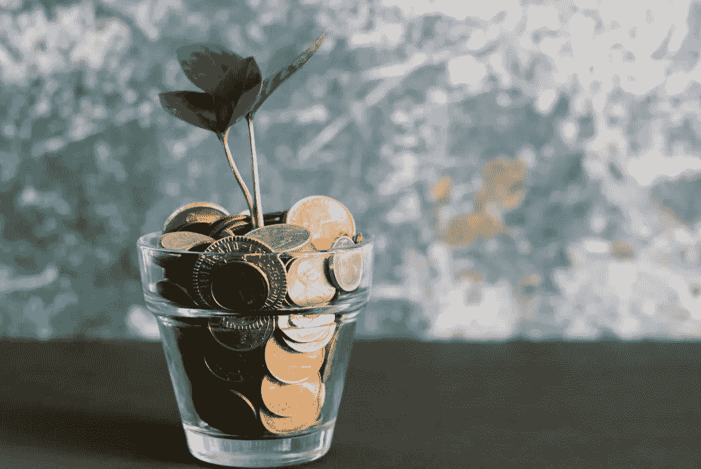

# 累积备用硬币的最佳地点——通过使用流动筹码+低注额筹码来利用您的收益

> 原文：<https://medium.com/coinmonks/the-best-places-to-stack-your-altcoins-leveraging-your-gains-by-using-liquid-staking-lps-3cab5f1e1c23?source=collection_archive---------2----------------------->

是的，这是一个熊市，但这并不意味着当我们等待走出熊市时，你不应该使用你的代币。如果你不熟悉我的博客，这基本上是我在熊市早期写的一篇文章的延续。许多高年利率并没有持续很长时间，我认为现在最好更新…