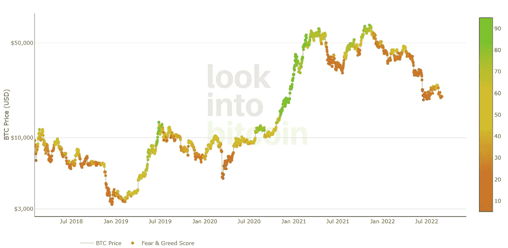

# 加密中平均成本的最佳方法？我分析了 4 种方法。

> 原文：<https://medium.com/coinmonks/the-best-way-to-dollar-cost-average-in-crypto-i-analysed-4-methods-6c22fb3a6dc7?source=collection_archive---------2----------------------->

一种方法大大优于所有其他方法。

Photo by [Yibei](https://unsplash.com/@yibei?utm_source=medium&utm_medium=referral) on [Unsplash](https://unsplash.com?utm_source=medium&utm_medium=referral)

To dollar cost average (DCA)是一种非常简单的策略，可以低成本积累加密货币，并获得巨大的投资收益。在本指南中，我将比较 4 种方法，让你以低廉的价格抢到一些硬币。

他们在这里:

1.  **每月固定一天购买**
2.  **当月度价格以负数收盘时买入**
3.  **当比特币恐惧和贪婪指数达到一定水平时买入**
4.  **MVRV Z-score 进入绿带时买入**

但首先，快速解释一下什么是平均美元成本。简单来说，DCA 就是在预定义的时间，将相同金额的资金投入到相同的加密货币或令牌中。

在下文中，我向你展示了购买比特币时进行 DCA 的 4 种方法。我还举例计算了在相同的时间框架内，他们每一个人可以获得多少利润。

## **1。每月固定一天购买**

这是最直接的 DCA 方式。它非常容易实现——只需在每个月的同一天花固定的钱购买比特币或任何其他加密货币。

[这里的](https://cryptohead.com/dca-crypto-calculator/?crypto=bitcoin&fiat=USD&qty=10&frequency=weekly&start=2014-01-01&finish=2022-09-03)是一个很好的网站，可以帮助你在选择这种美元成本平均法时计算你的回报。

**时间:**2017 年 9 月 1 日—2022 年 8 月 1 日(5 年)
**购买:**60 x 100 美元
**出售:** 1
**总投资:**
**6000 美元出售价值:**
**14115 美元投资回报率:** 135%

这种方法的优点在于简单。然而，它需要几千美元的投资。除此之外，它几乎是火了就忘了，因为你不必关注价格水平。你只要不断买入，直到卖出的那一刻。5 年 135%的投资回报率也不错。

## **2。当月度价格以负数收盘时买入**

*Source: tradingview.com*

或者，你也可以累计比特币价格为负数的每个月——这意味着你在红色月份后的第一天以固定价格购买 BTC。像这样，你在价格相对较低时买入。

**时间:**2017 年 9 月 1 日—2022 年 9 月 1 日(5 年)
**购买:**31 x 100 美元
**出售:** 1
**总投资:**
3100 美元**出售价值:**
6828 美元**投资回报率:** 120%

这种方法也很简单，需要相对较少的总投资。120%的 ROI 也不错。

## **3。当比特币恐惧和贪婪指数达到低位时买入**

*Bitcoin fear and greed index (source:* [*https://www.lookintobitcoin.com/charts/bitcoin-fear-and-greed-index/*](https://www.lookintobitcoin.com/charts/bitcoin-fear-and-greed-index/)*)*

比特币恐惧和贪婪指数是一个非常好的工具——不仅可以了解总体市场情绪，还可以知道何时买入和卖出。那是因为它符合那句名言‘当别人有恐惧时贪婪，当别人贪婪时恐惧’。

当这一指标跌至 25 或更低时，市场情绪处于极度恐惧之中。如果它达到 75 或更高，那么它表明极度贪婪。

在这个例子中，当恐惧和贪婪指数等于或低于 15 时，你买入 BTC，当恐惧和贪婪指数达到 75 或更高时，你卖出所有的股票。你会赚多少钱？

**时间:【2018 年 2 月 1 日—2019 年 5 月 11 日(1 年 3 个月)
**购买:**34 x 100 美元
**销售:** 1
**总投资:**
**3400 美元销售价值:**
**5486 美元**投资回报率:** 61%

**时间:**2019 年 5 月 12 日—2020 年 7 月 28 日(1 年 2 个月)
**购买:**43 x 100 美元
**出售:** 1
**总投资:**
4300 美元**出售价值:**
7034 美元**投资回报率:** 63%

**时间:**2020 年 7 月 29 日—2021 年 8 月 14 日(1 年)
**购买:**11 x 100 美元
**出售:** 1
**总投资:**
**1100 美元卖出价值:**
**1494 美元投资回报率:** 36%

这种 DCA 方法多年来的表现还可以，但不是很好。此外，与其他方法相比，所需的总投资要高得多。但是，这种方法的优点是时间框架不是很长，加上你可以重新投资你的利润，在这种情况下，你将获得复合收益，这将高于我计算的。

## 4.当 MVRV Z-Score 进入绿带时买入

*MVRV Z-Score (Source:* [*https://www.lookintobitcoin.com/charts/mvrv-zscore/*](https://www.lookintobitcoin.com/charts/mvrv-zscore/)*)*

MVRV Z-Score 有助于您识别比特币的市场价值何时高于或低于实现价值太多。基于此，你可以将你的 DCA 策略设定如下:在 Z 分割线位于绿色波段内的每一天进行累积，在 Z 分割线进入红色波段时卖出你持有的所有股票。

你可以在这里找到这个自由指示器。

**时间:【2017 年 9 月 1 日—2021 年 2 月 19 日(3 年 5 个月)
**购买:**140 x 100 美元
**出售:** 1
**总投资:**
**14000 美元出售价值:**
**204862 美元投资回报率:**1363%**

如果您严格遵循该模型的示例规范，您将总共投资 14，000 美元，但同时，您也将获得超过 1，300%的巨大投资回报。

## 评估 4 个模型

很明显，在 4 个模型中，MVRV Z 分数似乎代表了研究期间的最佳美元成本平均法。

令人惊讶的是，在过去的 5 年里，不管价格如何，在固定的时间买入 BTC 被证明是第二好的做法。如果你想在更短的时间内获得投资利润，那么跟随贪婪和恐惧指数是更好的策略。

*(本文计算的所有收益仅代表近似收益。投资回报率会因具体的买卖价格而异。)*

*免责声明:本文仅代表作者个人观点，仅供参考，不应视为理财建议。*

> 交易新手？试试[加密交易机器人](/coinmonks/crypto-trading-bot-c2ffce8acb2a)或[复制交易](/coinmonks/top-10-crypto-copy-trading-platforms-for-beginners-d0c37c7d698c)