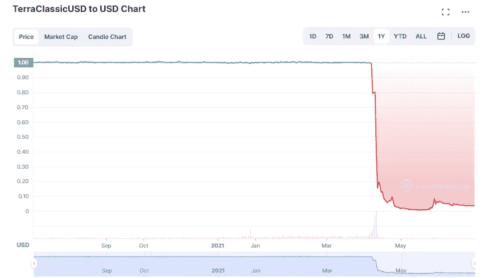
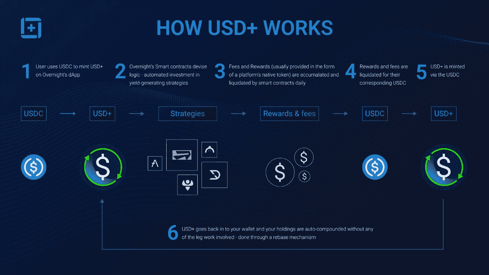
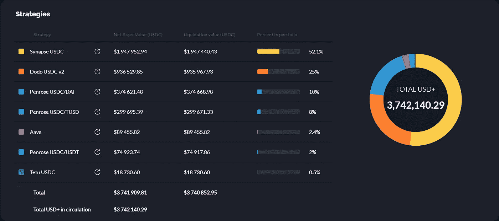
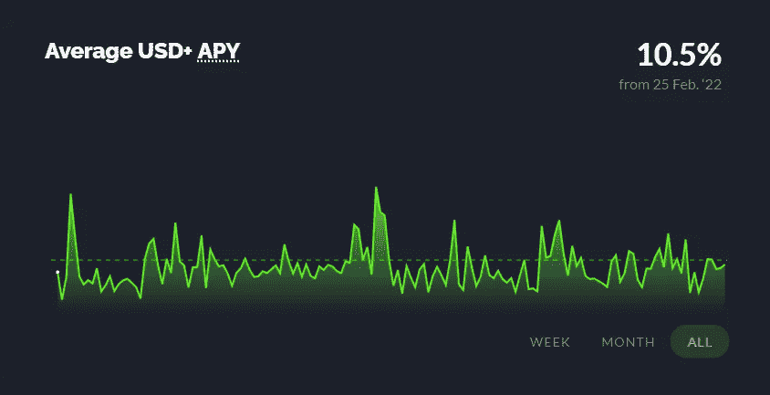

# 现在，在一枚安全稳定的硬币上赚取高达 10% APY 的最佳方式！

> 原文：<https://medium.com/coinmonks/the-best-way-to-earn-up-to-10-apy-on-a-safe-stable-coin-now-c565fe5d67f7?source=collection_archive---------26----------------------->

在 Terra Luna 和 UST 惨败后，许多人不再相信安全和稳定的硬币可以用在同一个句子中。然而，在这篇文章中，我将谈论隔夜融资，一种即使在熊市中也能从有安全保障的稳定货币中获得稳定收益的新方法！请继续阅读，了解更多关于这个项目的信息，看看为什么它与 UST 和主播是完全不同的动物。

# 什么是稳定币？

稳定的硬币是一种加密货币，旨在随着时间的推移保持其价值，而不是比特币和其他代币经历的大幅价格波动。稳定的硬币不是为了让它们的主人通过价值暴涨而变得富有，而是为了提供效用。他们通过两种方式实现这一点:首先，让加密货币所有者在交易时无需考虑波动性；第二，为他们的资产提供一个安全港，免受加密货币市场剧烈波动的影响，而无需他们将资产转换为法定货币。

# stablecoins 如何保持稳定？

通常，稳定的货币与另一种货币挂钩；例如，UST 和 Tether 都打算与美元挂钩。他们有三种方法来固定汇率。许多最大的加密货币，包括 Tether，都保留了现金储备或现金等价物资产，其价值原则上与使用中的稳定货币的总体市场价值相对应。这意味着，用户向 Tether 支付的 1 美元代币将会存在 Tether 的银行账户中。其他人，如 MakerDAO 的戴，持有数字资产储备而不是法定货币，但“过度抵押”——持有超过其稳定货币面值的储备——以弥补其波动性。然而，TerraUSD 选择了第三个选项，充当算法稳定币。

# 什么是算法稳定币？

算法稳定币是一种由算法支持的货币形式，它调节稳定币的供应以维持其价值。为了避免最终由一个中央集权的资产发行者(比如美国政府)来支持货币，货币应该完全去中心化。Stablecoins 和其他加密货币一样，在区块链运行，是由社区而不是银行或政府运行的数字公共账本。算法 stablecoins 就是围绕这个现实建立的。区块链能够存储“智能合约”——在满足特定条件时自动执行的代码。作为对稳定币供求变化的反应，算法可以被配置成自动生产更多的稳定币或摧毁当前的单位。当稳定的硬币交易超过其固定值时，更多的代币被生产出来，价格下降。当稳定的硬币低于挂钩价时，更多的代币从流通中消失，从而提高了价格。

# UST 怎么样了？

一枚由市场决定价值的姊妹币 Luna 与 TerraUSD 相连。在 UST 持有 1 美元的人将总是得到 1 美元的回报，因为 1 UST 被设定为等于 1 美元的卢娜，即使在 UST 的交换中卢娜的数量会波动。为了将 UST 的价值维持在 1 美元左右，这给了交易员套利的动机。当 Anchor——一个在 terra 生态系统中流行的协议——将其价格从 20%降至 18%时，UST 价格开始螺旋式下降。利率下降后，更多的 UST 储户从锚定货币中提取存款，引发了一波交易浪潮，导致 UST 偏离了 1 美元盯住美元的汇率制度。这促使更多的 UST 投资者试图撤回他们的钱，创造了网络版的银行挤兑。然而，鉴于离开 UST 的主要方式之一是通过 Luna，由于投资者信心下降和市场普遍下跌，Luna 已经贬值，这只是使问题变得更糟。由于 UST-卢娜交换系统，UST 的大量撤资导致卢娜的供应量显著增加，进一步使其价值降到历史高点的一小部分。数百万美元的价值瞬间化为乌有，许多人失去了大部分投资组合。

The chart for UST after the crash, a good example of why you DONT want your coins to depeg so easily

# 有什么方法可以在稳定的债券上获得安全的收益？

The logo for USD+

进入隔夜融资，他们的稳定兑换美元+。美元+可以通过兑换 USDC(美元硬币)来铸造，这很重要，因为这意味着美元+是由 USDC 支持和绑定的。USDC 是一枚实际上由美元支持的硬币。与上面提到的 Tether 类似，USDC 在受监管的金库中保存现金储备，这意味着每购买 1 美元的 USDC，就有 1 美元的实物货币存储在其中一个受监管的金库中。这意味着，与 UST 等算法稳定币相比，稳定币更难脱离 1 美元，更难偏离 1 美元。算法稳定币的价值基本上是基于月神，而月神除了仙尘和彩虹之外，基本上没有任何支撑。

一旦你拥有了 UST+，你就可以开始了。智能合约在后台执行自动投资策略，无需您付出任何努力，每天都会产生自动计入您的代币余额的收益。

How USD+ Works

# 盈利策略有多安全？

Live view of the current strategies overnight finance is currently using

非常安全，一些策略可以在上面的图片中看到。隔夜融资将自己描述为“相当于货币市场基金的 DeFi，具有高度保守和流动性的[DeFi]投资组合，产生 1-5 个基点的收益率。每天和每天的利润分配”。他们投资策略的三个原则是:

1.  *风险超过回报*:选择资产及其目标权重，应允许避免日常投资范围内的损失，而不是产生非凡的收益(意思是:降低风险，获得合理和可持续的收益)
2.  *投资章程*:资产类别、特定工具及其在投资组合中的权重是预先确定和公开的，隔夜协议旨在遵循代码级别的投资章程
3.  *控制股东*:随着市场条件的发展和新机会的出现，包括新协议的出现，投资章程可能会有一些修改。在这种情况下，USD+持有人会提前得到通知，留出充足的时间赎回其持有的资产，以防他们对修改感到不舒服

虽然隔夜投资进入了一个广泛的资产类别，但它可以归纳为 3 个主要类别:

1.  现金持有量(通常是主流稳定资本)
2.  将硬币存款纳入贷款协议
3.  稳定到稳定的流动性池

总的来说，我会考虑这些风险相当低的投资，但仍然能够为用户带来持续的利润。

The average APY since conception has been approximately 10.5%

不相信我？上图显示了该项目自构思以来的 APY。尽管经历了熊市和 Terra 发生的一切，但自 2022 年 2 月以来，该项目的 APY 回报率约为 10.5%。我确实预计随着更多人的加入和 TVL 的增加，这个 APY 会降低，但就目前而言，我认为这是让你的钱闲置的一个很好的选择。美元+可以很容易地转换回 USDC，这意味着你可以随时轻松地取出你的钱！这是一个伟大的方式，仍然产生一些收益，你的基金，并坚持这个熊市。

# 结论

因此，在这篇文章中，我们讨论了隔夜融资，以及为什么在我看来，这是目前赚取稳定收益的最佳方式。也就是说，该项目目前处于测试阶段，所以对本文中涉及的所有内容都要持保留态度。所有这些都不是投资建议，你应该在把数千美元投入到花哨的互联网货币项目之前做好自己的研究，不，真的，拜托 DYOR。你可以在 https://overnight.fi/的[找到项目主页](https://overnight.fi/)

*感谢您的阅读，请👏并分享出来帮助别人找到。在 twitter 上关注我的新内容和免费 TA @*[*Greg*_ trades _](https://twitter.com/greg_trades_)

回头见。😃

> 交易新手？尝试[加密交易机器人](/coinmonks/crypto-trading-bot-c2ffce8acb2a)或[复制交易](/coinmonks/top-10-crypto-copy-trading-platforms-for-beginners-d0c37c7d698c)