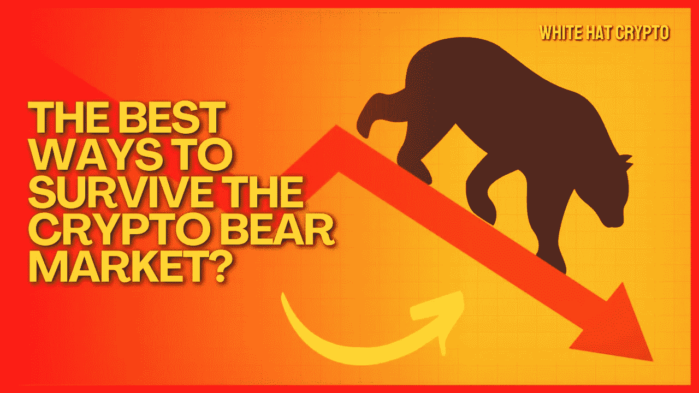

# 在加密熊市中生存的最佳方法？

> 原文：<https://medium.com/coinmonks/the-best-ways-to-survive-the-crypto-bear-market-588a6d275c7e?source=collection_archive---------20----------------------->

显然，在熊市中生存几乎是不可能的！不过还是让我分享一下冰哥生存指南的秘籍吧！

除了所有负面情绪，甚至每个密码专家都会提醒你，熊市是为建筑商准备的。如果你不是一个建设者，你可能会感到被排斥。

别担心。冰哥[向](https://decrypt.co/107396/brother-bings-guide-to-surviving-the-crypto-bear-market)展示了一份指南，与你分享利用市场不波动时期的独特建议。

在这篇文章中，我将为你回顾生存指南的所有关键步骤。

# **选择正确的信息:**

加密是一个随时随地提供来自任何人的全部信息的行业。这些信息有时可以提供有用的见解。但是，大多数情况下，这只是人们用不必要的观点冒充官方事实。

在牛市中，人们根据“信息”进行交易、投资和交换。投资者 FOMO 进入一个项目的启动，除了通过 Twitter 听取报告外，没有进行任何尽职调查。

在听说可能的空投后，用户蜂拥进入一个新的协议。开发人员参加协议的黑客马拉松，希望获得资助并进入下一个链。

我们被信息轰炸和迷惑，以至于很难区分内容和模因。这就是为什么只选择正确的信息是至关重要的。

这一战略应包括以下步骤:

1.  离开过去六个月中你没有加入的所有聊天群(Telegram、Twitter、Discord、Signal)。
2.  不追随那些你知道有害的影响者，只会促进他们的利益。
3.  取消订阅你在过去六个月内没有读过的时事通讯。
4.  你不必一直掌握所有的事情，所以限制你的 Twitter 活动。
5.  把一直打算看但还没看的文章拿出来。

# DYOR:

每次牛市都会产生新一代的思想领袖和影响者。他们喜欢在没有代币之前没人关心的专业领域创造流行词汇、迷因和框架。

随着这些影响者的权力增长，他们的声音开始有分量，他们的声明开始自我实现。

例如，由于一些主要的影响者，音乐 NFTs 获得了流行和讨论。他们说音乐行业将会被这个新的创意指令彻底颠覆。但到目前为止，我们所看到的都是音乐 NFT 风险投资公司，它们的代币先是上涨，然后跌至零，流动性很小，使用率也很低。

帮你自己一个忙，现在市场已经平静下来了，不要自动同意那些拥有大量追随者的有影响力的人。相反，要敢于面对他们。把这当成一次智力练习，看看你最终会怎样。

# 关注你的部落:

正如一句中国谚语所说，“困难时期产生真正的友谊”。“如果你想发展一个由同事、朋友、导师和老师组成的圈子，你必须确保他们与你同甘共苦。

同样，那些在下跌的市场中继续工作和学习的人将会长期呆在这个行业。在心里记下这几个人，并让他们加入你的部落。

一代又一代的个人在加密货币领域中起起落落。当许多受欢迎的人的意识形态未能随市场发展时，他们就变得无关紧要了。拥有正确的社区对保持相关性至关重要。

这篇文章中提供的内容不是赞助的，据我所知是正确的。这篇文章不是金融建议，我们不对针对这篇文章采取的任何行动负责！

请随时查看我们的社交平台，了解每日加密更新，或通过以下渠道联系我们:

[YouTube](https://www.youtube.com/channel/UCjfinzatswbVaRd89zn5kJQ/featured)

[推特](https://twitter.com/whitehatcrypto)

[Instagram](https://instagram.com/white.hatcrypto?igshid=YmMyMTA2M2Y=)

[Gmail](http://cryptowhitehat@gmail.com/)

信息来源:[孔](https://decrypt.co/author/shuyao)，解密

> 加入 Coinmonks [电报频道](https://t.me/coincodecap)和 [Youtube 频道](https://www.youtube.com/c/coinmonks/videos)了解加密交易和投资

# 另外，阅读

*   [block fi vs Celsius](/coinmonks/blockfi-vs-celsius-vs-hodlnaut-8a1cc8c26630)|[Hodlnaut 点评](/coinmonks/hodlnaut-review-best-way-to-hodl-is-to-earn-interest-on-your-bitcoin-6658a8c19edf) | [KuCoin 点评](https://coincodecap.com/kucoin-review)
*   [Bitsgap 审查](/coinmonks/bitsgap-review-a-crypto-trading-bot-that-makes-easy-money-a5d88a336df2) | [Quadency 审查](/coinmonks/quadency-review-a-crypto-trading-automation-platform-3068eaa374e1) | [Bitbns 审查](/coinmonks/bitbns-review-38256a07e161)
*   [密码本交易平台](/coinmonks/top-10-crypto-copy-trading-platforms-for-beginners-d0c37c7d698c) | [Coinmama 审核](/coinmonks/coinmama-review-ace5641bde6e)
*   [印度加密交易所](/coinmonks/bitcoin-exchange-in-india-7f1fe79715c9) | [比特币储蓄账户](/coinmonks/bitcoin-savings-account-e65b13f92451)
*   [OKEx vs KuCoin](https://coincodecap.com/okex-kucoin) | [摄氏替代品](https://coincodecap.com/celsius-alternatives) | [如何购买 VeChain](https://coincodecap.com/buy-vechain)