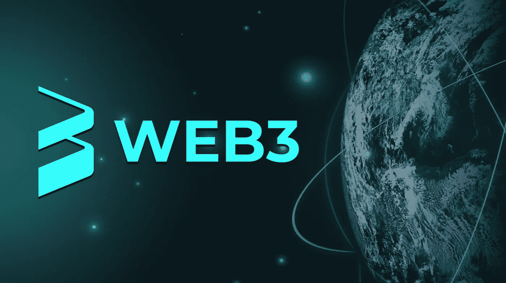

# 你感兴趣的最佳 Web3 工作

> 原文：<https://medium.com/coinmonks/the-best-web3-jobs-for-your-interest-895499bccce5?source=collection_archive---------39----------------------->

从一个独立的完全成熟的专业领域过渡到 Web3 是非常容易实现的，特别是如果你知道最适合你的热情的特定 Web3 职业以及你在之前的利基市场中做什么。

现在由你来选择最符合你愿望的 Web3 职业，并从我将在今天的文章中列出的 Web3 职业列表中选择。让我们开始吧。

**1。文案**

这种类型的作家专门为广告和其他营销材料制作晶莹剔透的副本。

**2。UGC 内容开发者**

用户生成内容(UGC)方面的专家被称为 UGC 内容创建者。这个职位相当于一个制作播客、问题投票、博客等的内容创作者。

**3。不和谐音主持人**

顾名思义，不和谐版主负责监管不和谐频道，删除攻击性评论，邀请、禁止和暂停违反服务器政策的用户。此外，Discord 版主有权控制他们正在操作的服务器的许多功能。

**4。平面设计师**

这种专业开发原始想法，偶尔为项目绘图。

**5。阿尔法呼叫方**

一个专门在 NFT 和 Defi 集团的出入口打电话的人被称为“阿尔法呼叫员”为了在这些职位上发挥作用，他或她需要有积极的市场情绪和识别新要素的能力。

**6。智能合同作者**

这个人创建可以相互通信的智能合同，然后将它们部署到客户首选的加密货币网络。

**7。社区经理**

社区经理负责创建和维护项目的离线和在线社区。

**8。社交媒体经理**

此人通过将社交媒体内容战略付诸行动来管理公司的公共关系工作。

**9。合伙企业经理**

这些人促进项目中潜在投资者和商业伙伴之间的交流。

10。项目经理

这些人负责执行项目管理和帮助项目发展的相关任务。

11。技术作家

这位作家是一位专业人士，他撰写各种文章，包括白皮书、论文、营销电子邮件和竞选电子邮件。新项目和正在进行的项目。

这些是你不需要简历就能轻松加入的 Web3 工作，取决于你的经验程度。

我们已经到了这篇精彩文章的结尾。我相信你喜欢这篇文章，所以我建议你在这个平台上与我们的内容保持联系；如果你喜欢，也可以分享给你的朋友。如果你的个人需求或业务需要这种类型的内容，请随时通过电子邮件联系我:地址:[amaprosperjr@gmail.com](mailto:amaprosperjr@gmail.com)。下期帖子再见！

> 交易新手？试试[密码交易机器人](/coinmonks/crypto-trading-bot-c2ffce8acb2a)或者[复制交易](/coinmonks/top-10-crypto-copy-trading-platforms-for-beginners-d0c37c7d698c)