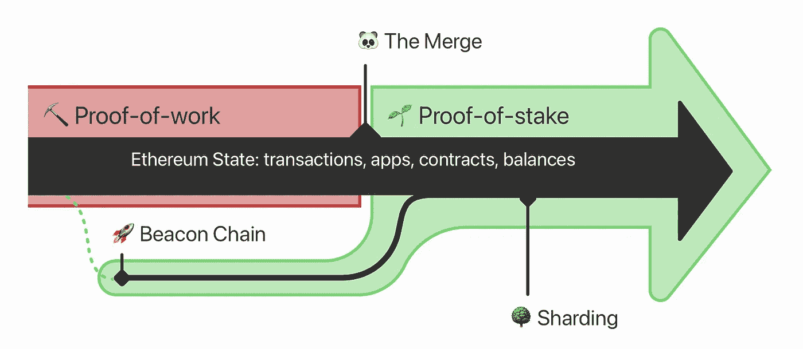

# 大合并:以太坊 2.0

> 原文：<https://medium.com/coinmonks/the-big-merge-ethereum-2-0-892e3dab90ae?source=collection_archive---------28----------------------->

日期定在 2022 年 9 月 15 日。以太坊将从工作证明转变为利益证明系统。以太坊 2.0 交易将更便宜、更安全、更环保，这是对最受欢迎的区块链的三大批评。有工作证明的区块是由采矿产生的。然而，有了这个新系统，“验证者”将接管这个角色，他们的工作是验证每一笔交易。

合并不会以任何方式影响最终用户。不需要做任何改变，钱包里的乙醚量将保持不变。然而，如果你在我们接近以太坊主网的合并时持有以太，你应该对试图在这个过渡期间利用用户的骗局保持高度警惕。不要为了“升级到 ETH2”而将您的 ETH 发送到任何地方没有“ETH2”令牌，您也不需要再做什么来确保您的资金安全。

另一方面，开发人员和那些已经创建了 Dapps 或与以太坊区块链交互的分散式应用程序的人将不得不做一些最小的更改。关于这些变化的更多信息，请查看[这篇博文](https://blog.ethereum.org/2021/11/29/how-the-merge-impacts-app-layer)。

受这种变化影响很深的一个领域是 NFTs。以太坊网络上的铸造和交易费用极其昂贵，并且需要大量的能源，这阻碍了许多人购买和出售非金融交易，并且可以说限制了富人的交易。随着以太坊 2.0 的推出，预计这将为更多的人进入 NFT 空间打开大门。

以太坊的合并被认为是加密产业历史上最重大的升级事件。很多事情都取决于从工作证明到利益证明的成功转变，这很可能会显著影响比特币(BTC)和以太网(ETH)的价格。

尚不清楚加密市场将如何应对合并乐观主义者认为，如果合并成功，将把市场从当前的加密寒冬中拉出来。其他人认为合并被夸大了，将会导致更严重的衰退。我们很快就会知道了。

> 交易新手？试试[密码交易机器人](/coinmonks/crypto-trading-bot-c2ffce8acb2a)或[复制交易](/coinmonks/top-10-crypto-copy-trading-platforms-for-beginners-d0c37c7d698c)