# 从 ETH 到 ETH2 的大合并

> 原文：<https://medium.com/coinmonks/the-big-merge-from-eth-to-eth2-f932c56fa510?source=collection_archive---------13----------------------->

经过多次推迟后，合并的确切日期似乎终于到来了。

ETH 从工作证明(Pow)到利益证明(PoS)的迁移，也称为“合并”，预计将于 2022 年 9 月 19 日结束。这个新的日期已经得到了以太坊开发商 Tim Beiko 的确认。Tim 在 [PoS 实施人员电话会议](https://www.youtube.com/watch?v=yBEPzzeo1a4)上做出了 9 月份的估计，但是时间表可能会有变化。

合并事件将以太坊主网活动转移到信标链。预计合并不会降低以太坊高昂的燃气费，但会对网络的能源使用产生显著的直接影响。

**我们认为“合并”可能是 ETH 价格上涨的重要催化剂，并可能在 ETH 生态系统中产生其他替代产品。**ETH 从工作证明(Pow)到利益证明(PoS)的迁移，也称为“合并”，预计将于 2022 年 8 月至 10 月间完成。

合并将导致:

**1)增加打桩产量**

**2)以太坊(Dapps)上的开发活动增加**

**3)降低碳足迹**

**4)ETH 供应减少**

再加上第 2 层(L2)解决方案，以太坊燃气费也应该大幅下降，吞吐量应该会增加。**因此，对 ETH 的需求将增加，供应将减少。自然，这种动态会推动 ETH 价格上涨。甚至可能相当大(2 倍或更多)。**

# 谁会受益？

*   持有 ETH 的投资者
*   更高的赌注收益率将推动赌注供应商的收入增长，如[利多](https://lido.fi/)、[阿夫](https://aave.com/)、[曲线](https://curve.fi/)等。
*   赌注者和验证者，因为他们将获得更高的年利率
*   使用率的增加应该会让 L2 的供应商受益，比如乐观派、仲裁一号、阿兹特克网络

# 以太坊 2.0 是什么？

以太坊的第一个版本于 2015 年上线。以太坊 2.0。ETH2(也称为 Serenity)是 ETH 的升级版。这两个版本之间的主要区别是 ETH 2.0 使用不同的机制、利益证明、分片和板载第 2 层解决方案。过渡到 ETH 2.0 是一项非常复杂的技术工作，需要时间和严格的测试。

ETH 2.0 是以太网从工作证明(PoW)到利益证明(PoS)共识机制的多阶段转变。就像 PoW 区块链依靠矿工来验证交易一样，PoS 共识机制依靠“利益相关者”通过运行节点来验证交易。

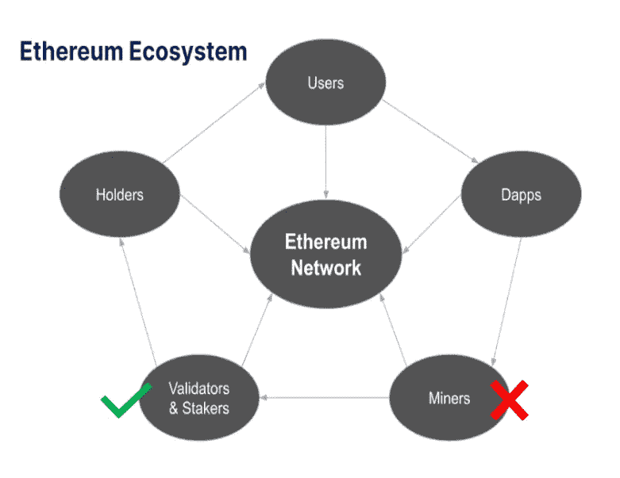

以太坊生态系统由持有者、用户、Dapps 和矿工组成，他们很快将被验证者和利益相关者取代。

以太坊生态系统开发人员最初引入了 Beacon Chain，这是一种协调机制，负责在链中创建新的块，确保它们的有效性，并奖励在合并完全实现之前保持网络安全的验证者。

网络负载将分布在 64 个独立的碎片上，这些碎片将同时处理信息，从而使整体事务处理速度更快、效率更高。

**All-in-all，ETH 2.0 将:**

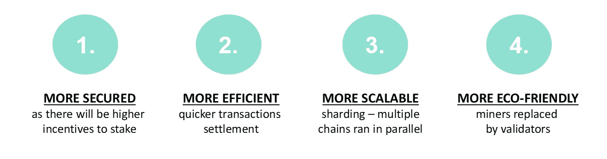

**根据 Glassnode 的数据，以太坊的 ETH 2.0 中的 ETH 总数创下了 12，789，829 ETH 的历史新高。这相当于流通供应量的 10.73%以上，按今天的价格计算约值 232 亿美元。这是以太坊相对于竞争对手的一大优势:庞大的用户群吸引了更多的 DeFi 开发者，产生了强大的飞轮效应。**

就利益相关者的数量而言，我们看到超过 **70，000 个独立存款人和 329，000 个验证人**，自 ETH 成立以来显著增加。

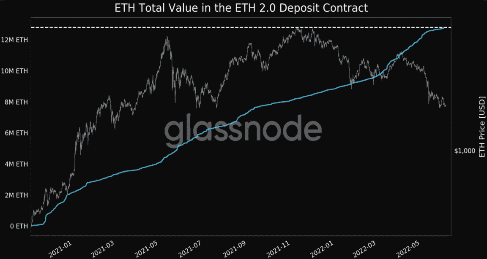

以太坊出了名的高电费和交易速度一直是用户和开发者的主要痛点。竞争的第 1 层协议(Solana、Fantom、NEAR、Cardano 等)也利用了这些协议。).

ETH 2.0 将缓解这些问题。尽管该网络的总天然气费用最近触及 10 个月低点，这是一个积极的趋势，但下降的原因与当前的熊市有关，以及 TVL 从 2021 年 12 月 1816 亿美元的历史高点降至 750 亿美元。这也可能与 NFT 销售额的普遍下降以及采用具有更低费用的竞争 PoS 区块链有关。

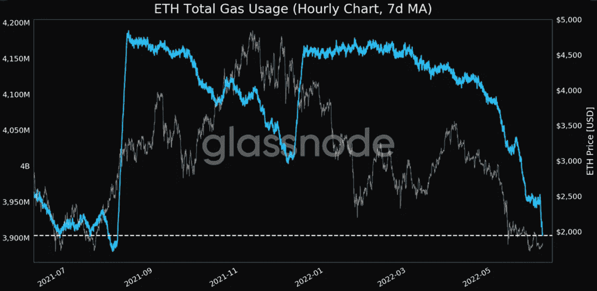

# 合并的影响

“合并”是指以太坊将从 PoW 迁移到 PoS 共识机制，并且信标链与工作证明链合并的点:

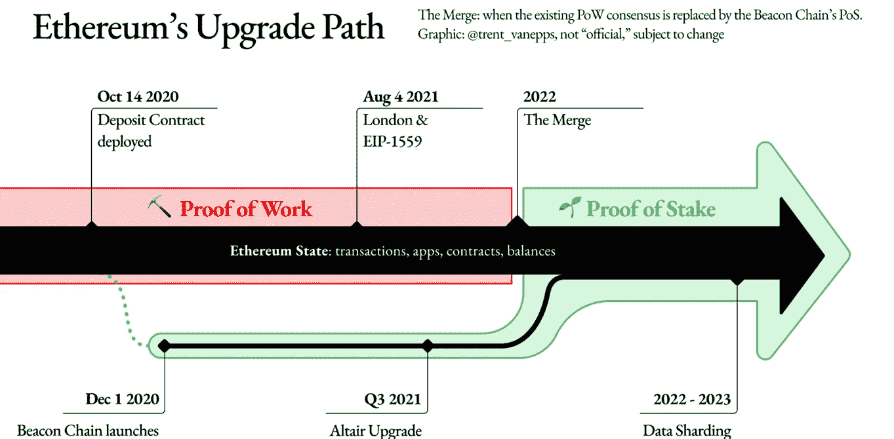

来源:以太坊基金会

# 注册订阅我们的时事通讯

获取每日交易思路，教育视频，平台更新。

在我们的[隐私政策](https://altfins.com/privacy-policy/)中，我们关心您的数据

**从瑞士联邦理工学院投资者的角度来看，合并的主要好处是:**

*   **由于更高的赌注收益率，增加了对 ETH 的需求，以及**
*   **减少(90%)ETH 的发放(减少供应增长)。**

合并本身不会降低天然气费用**、**，但不管 ETH 价格如何，它将有助于稳定天然气费用。然而，像[乐观](https://www.optimism.io/)、[仲裁一号](https://portal.arbitrum.one/)、[阿兹特克网络](https://aztec.network/)、 [Polygon Hermez](https://hermez.io/) 、 [zkSync](https://zksync.io/) 、 [Loopring](https://loopring.org/) 、 [Boba 网络](https://boba.network/)或 [Metis 网络](https://www.metis.io/)这样的第二层扩展解决方案激烈竞争，以降低以太坊上的 ETH 交易费用，根据交易类型，它们有望将燃气费用降低 5-20 倍:

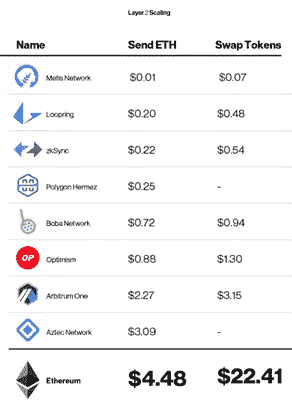

ETH 2.0 将使用更少的电力，并应获得环保标签。这可能会吸引更多机构投资者。此外，PoS 验证器机制通常应该有助于更多的 ETH 去中心化。 **ETH 打桩需求应该会大幅增长。ETH 打桩产量(APR)预计将翻倍，这将大幅增加对打桩和验证的需求。**

更高的押记年利率的主要原因是，现在矿工的费用将转移到押记者/验证者身上。IntoTheBlock 计算出当前的**年利率 3.8%将上升到 7.4%** 的费用奖励:

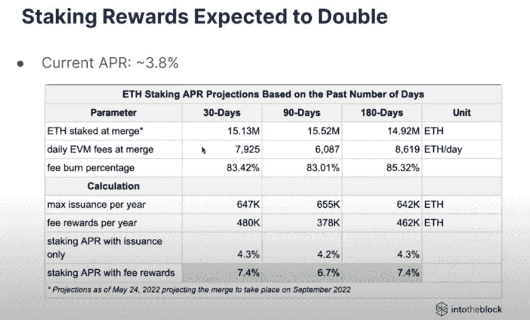

# ETH 供应减少，甚至可能导致通货紧缩

2021 年 7 月，作为伦敦硬分叉的一部分，以太坊改进提案(EIP) [1559](https://consensys.net/blog/quorum/what-is-eip-1559-how-will-it-change-ethereum/) 开始生效。它改变了以太坊的收费机制。以前，矿商获得的奖励是大宗奖励和交易处理费。现在，他们仍然获得整体奖励，但费用分成基本费用加小费。如果用户希望提高交易的优先级，他可以添加小费。然而，**基本费用(在 ETH 奖励中)被烧掉，减少了 ETH 供给**。

此外，在合并之后，当协议从 PoW 迁移到 PoS 时，挖掘器将停止工作，并被验证器取代。在 PoS 下，验证者将获得比矿工目前在 PoW 下少得多的奖金。换句话说，新的 ETH 发行将会下降。这也将显著降低 ETH 供应的增长。

**这两种效应结合在一起(基本费用消耗和整体奖励减少)，可能对 ETH 供应产生通缩效应:ETH 净发行=发行-消耗**

根据加密服务提供商 LuckyHash 的[研究](https://blockchain.news/analysis/ethereum-2.0-full-upgrade-will-prompt-a-1-percent-annual-deflation-rate)，合并可能导致 1%的年通缩率:“当质押数量超过 1 亿时，年发行率将稳定在 1.71%，即日均产量约为 5.600。如果到那时升级后的以太坊能够保持目前的燃烧量，每年可以实现 1%的放气。”

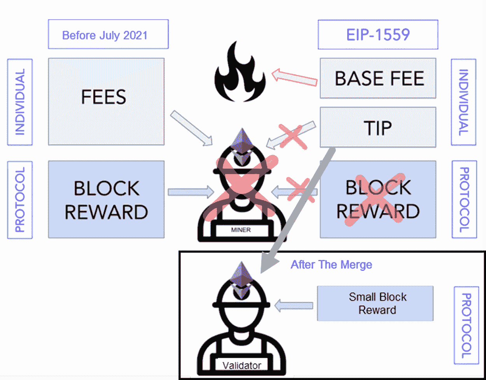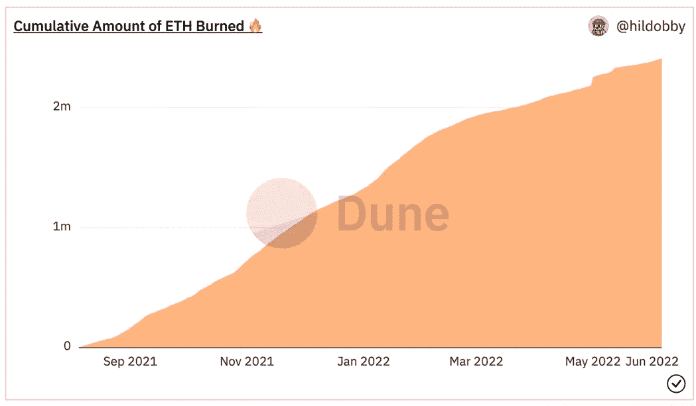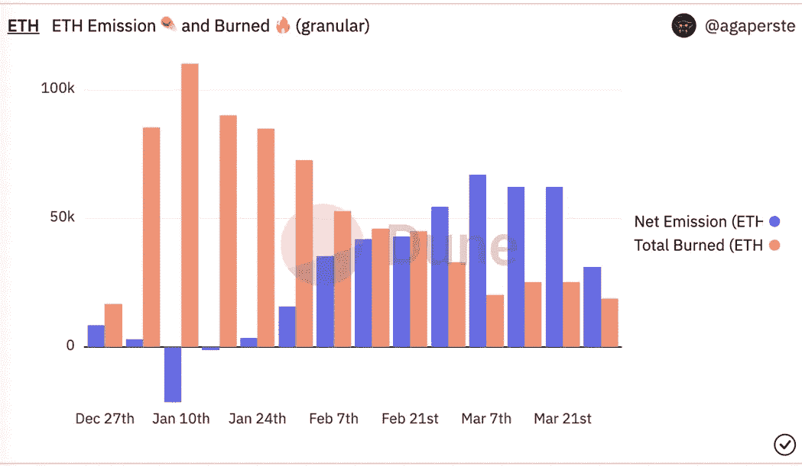

# 合并过程中，我该如何处理 ma ETH 控股公司？

你什么都不用做。你的 ETH 会自动转到 ETH 2.0。

然而，你甚至可以在合并之前入股 ETH，并获得 cca 3.8%的 APR 投资收益率。

为此，您可以使用:

*   **跑马圈地平台**如利多、Aave、Curve、向往金融或本齐。
*   集中式**密码交换**如北海巨妖。
*   **staked as-a-Service 公司**，如 Staked.us、Stakefish、比特币瑞士和 Figment。
*   **用最少 32 个 ETH** 自固定。

此外，当通过 **liquid staking** 提供商(如 LIDO)下注您的 ETH 时，您将获得 stETH，甚至可以在 ETH 合并事件之前在各种 DeFi 平台上使用。

# 摘要

下表很好地总结了 ETH 合并的影响。它还根据您在 ETH 生态系统中的身份提供了要遵循的关键指标:

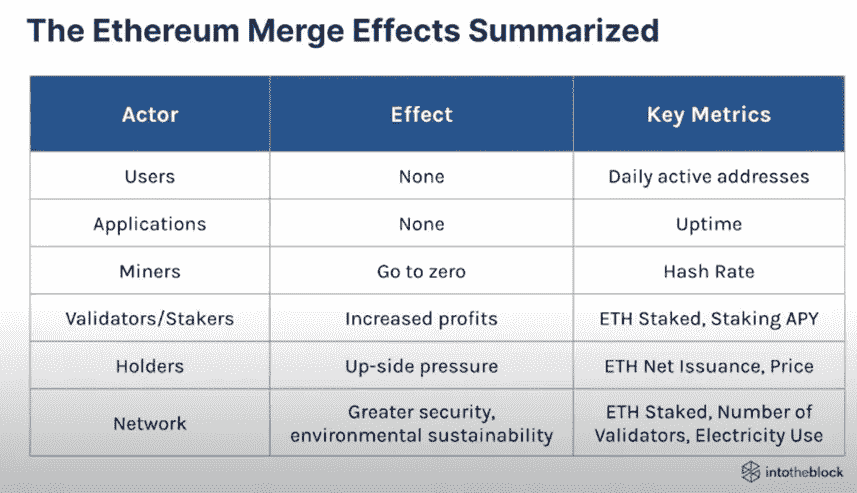

你喜欢这篇文章吗？给我们跟上！

> 交易新手？尝试[加密交易机器人](/coinmonks/crypto-trading-bot-c2ffce8acb2a)或[复制交易](/coinmonks/top-10-crypto-copy-trading-platforms-for-beginners-d0c37c7d698c)