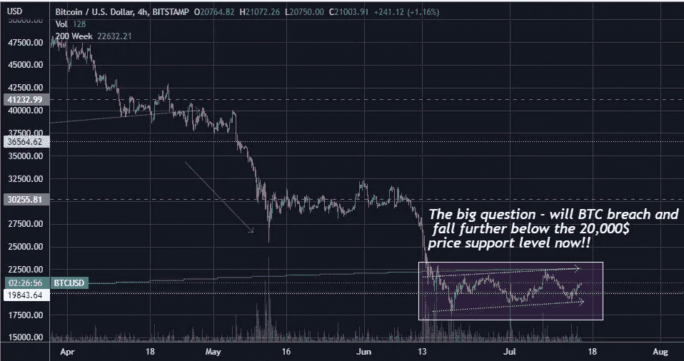
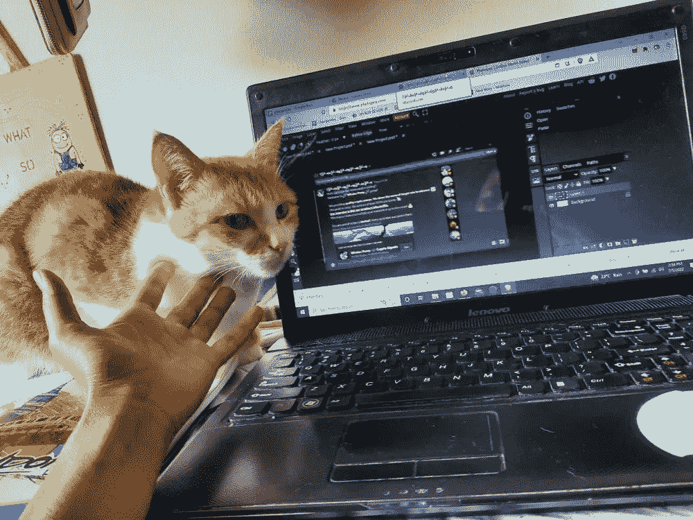
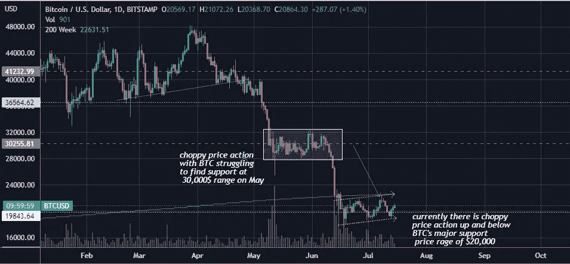
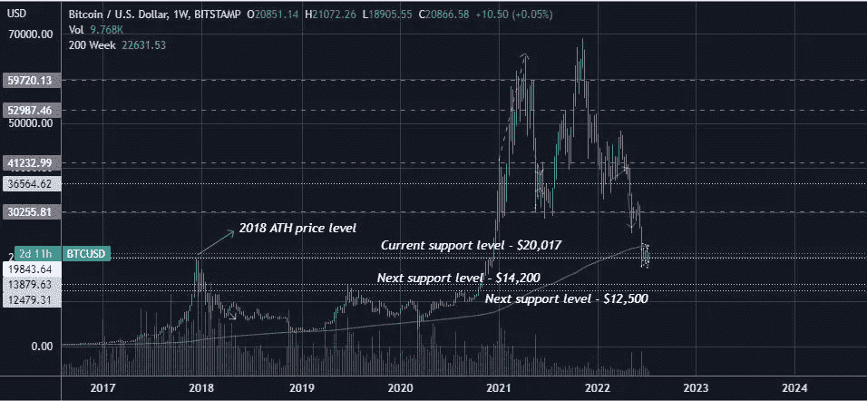
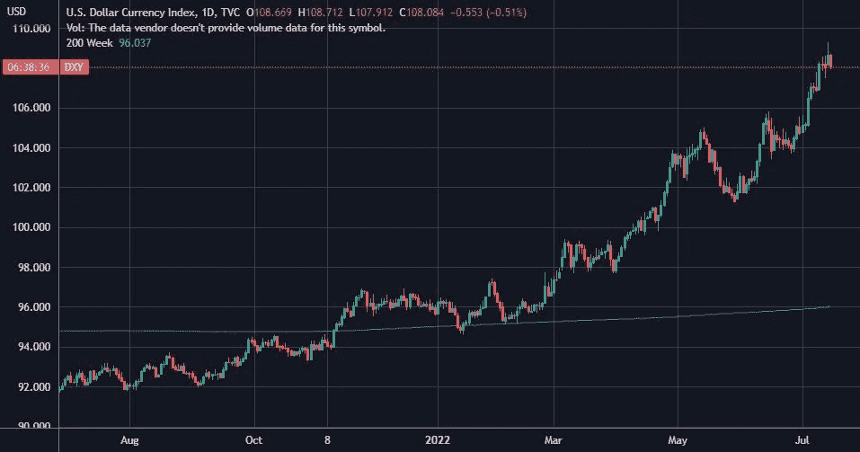
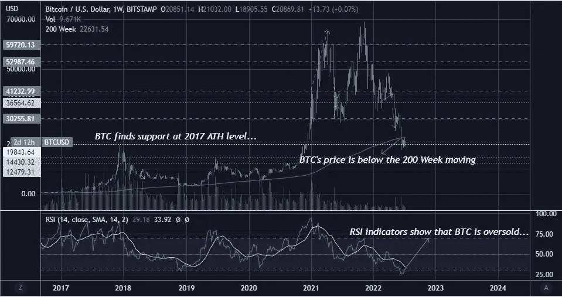

# 最大的问题是——BTC 现在会突破并进一步跌破 20，000 美元的价格支撑位吗？！

> 原文：<https://medium.com/coinmonks/the-big-question-will-btc-breach-and-fall-further-below-the-20-000-price-support-level-now-f781aa1078ee?source=collection_archive---------23----------------------->

[Trading view char](https://www.tradingview.com/x/1tk6saGw/)t

# BTC 正在努力保持对 2017 年 BTC 历史最高价格水平的支持！！

我刚刚注意到，BTC 价格正在努力寻找 2017 年历史最高价格水平(20，000 美元范围)的支撑！！！

2017 年对我来说是非常特殊的一年，因为我无意中经历了我的第一次 BTC 牛市，尽管我当时不是一个加密人。

当然，那一年也将 Garu 带入了我的生活，他发表了许多加密文章，并喜欢在我写加密文章的早期被称为比特币之心的比特币猫 Garu。

Cat Garuji aka BtcSolarCat

现在，突然出现在我脑海中的问题是，BTC 的价格会突破这个水平并进一步下跌吗，因为这个价格水平也给了我其他的记忆。

是的，在 2020 年 12 月，BTC 的价格突然飙升，突破了 2017 年 ATH 的范围，并进一步上涨。这是一个激动人心的时刻，就在几个月前的 2020 年 5 月，BTC 的价格甚至不到 10，000 美元，而在 2020 年 3 月的黑天鹅崩盘期间，BTC 的价格跌至 3，900 美元以下！！

# BTC 价格突破此支撑范围并进一步下跌的可能性

2020 年，虽然是充满巨大挑战的一年，但对我来说是重要的一年，因为我失去了我正在做的另一份低薪工作，成为了一名全职加密生物。

突然，其他人开始尊敬我，认为我是一个对密码有很好了解的人，一个有潜力通过积累的知识和见解在这个领域做得很好的人。

对 BTC 来说，这似乎是牛市的一年，对我来说，这是摇滚明星的一年。哈！！

无论如何……现在看来，BTC 很可能会进一步下跌，突破这个重要的价格支撑位，这让我很惊讶，但这似乎是最有可能的情况。

几个月前，我认为 BTC 在 30，000 美元水平找到了强有力的支持，但 BTC 的价格最终从 5 月 11 日开始努力将价格支持保持在该水平，随着价格在该价格水平上下波动，BTC 的价格最终从 6 月 10 日下跌到 20，000 美元的主要支持水平。

[Trading view chart](https://www.tradingview.com/x/1tk6saGw/)

现在，BTC 正在经历类似的价格波动，BTC 的价格经常在 20，000 美元的支持范围上下波动。

从这一价格水平的再次下跌应该会将 BTC 带到 14，000 美元和 12，500 美元的价格区间，这是 BTC 的主要价格支撑。

[Trading view chart](https://www.tradingview.com/x/1tk6saGw/)

# 影响比特币价格前景的宏观经济因素

## 量化宽松加通胀推动比特币价格在 2020 年上涨！！

什么的，我理解的原因，BTC 的价格可能还没有找到底部，是由于宏观经济的基本面。在 2020 年的疫情年期间，我们正处于美国经济(全球最大的经济体之一)货币供应过剩的时代，低廉的借款利率推动大投资者将资金投入不同的资产类别，包括比特币。

此外，美联储的超额印钞叙事和通货膨胀叙事，让大投资者把他们的钱放在比特币上，因为许多人宣布该资产是黄金 2.0，是对法定货币通货膨胀的对冲。

> 交易新手？试试[加密交易机器人](/coinmonks/crypto-trading-bot-c2ffce8acb2a)或者[复制交易](/coinmonks/top-10-crypto-copy-trading-platforms-for-beginners-d0c37c7d698c)

## 2022 年美联储量化紧缩政策导致 BTC 物价下跌

然而，今年情况发生了变化，美联储现在很难控制通货膨胀，这就是为什么我们都知道美联储最近提高了利率，使得借贷成本高昂。美联储的货币紧缩政策措施可能是比特币价格如此之低的原因，因为随着借贷成本越来越高，人们倾向于出售投资以换取现金和储蓄。

重点是用现金偿还所有贷款，并涌向避险资产，美元被视为避险资产，因为它是一种世界储备货币。

US Dollar Currency Index from [tradingview](https://www.tradingview.com/x/Ncgy6Oea/)

这就是 DXY 指数上涨的原因，可以看出，美元指数的价值正处于历史最高水平，人们通过将财富储存在美元中来对冲不确定性。

# 美国经济似乎已经进入衰退期

现在，美国的通货膨胀数字仍然很高，从[7 月 13 日 CPI 通货膨胀数据](https://cryptopotato.com/over-200-million-liquidated-on-bitcoin-turbulence-as-cpi-for-june-at-9-1/)达到 9.1%就可以明显看出，所以知识分子在谈论美联储可能会再次加息以控制通货膨胀。这就是为什么投资者不太有信心投资任何东西，而是希望持有现金和美元等强势世界货币。

此外，美国经济很可能正处于衰退阶段。今年第一季度的 GDP 增长数据已经显示 GDP 下降了-1.6%，第二季度的结果将于 7 月 28 日公布，如果 GDP 显示数值下降，那么美国经济将被正式认定为经历了技术性衰退。

在衰退时期，人们可以预期投资者会存钱，减少投资支出，因此，谁知道呢，BTC 的价格可能还会进一步下跌。

所以，这就是为什么我觉得 BTC 的价格很可能会突破这个非常重要和值得纪念的价格支撑位 20，000 美元！！

# BTC 的价格绝对处于超卖区

然而，在其他方面，BTC 的价格看起来超卖。其周线图 RSI 水平超卖，加上其价格低于 200 日周线平均水平，历史上在这些范围内，BTC 通常会上涨。

[Trading view](https://www.tradingview.com/x/4el5E2o6/)

你可以在[https://www.lookintobitcoin.com/charts/](https://www.lookintobitcoin.com/charts/)查看其他 BTC 数据科学图表，并研究其他指标，如
200 周移动平均热图、股票到流量模型、Puell 倍数、MVRV Z 值、RHODL 比率、恐惧和贪婪指数，它们都喊出了 BTC 现在处于超卖区域的信号。所以你有它，耸耸肩。

## 迷失的小隐鱼继续航行去捕捉隐波

自去年年底以来，我个人经历了一段非常艰难的时期，此外还有无数的加密挑战，因为我的[印度政府让印度居民很难进入加密空间](https://www.publish0x.com/investing-and-trading/brand-new-financial-year-starts-for-indian-investors-with-th-xjonlne)。在那之后，我因为[卢娜-UST 坠毁](https://www.publish0x.com/investing-and-trading/crypto-insights-from-my-failed-investment-journey-in-terra-a-xpzjqeg)有点崩溃，我觉得并且仍然觉得我不擅长这种会让我失败的加密技术，因为我现在什么都不知道！！

然而，我继续沿着这条密码之路走下去，也许有一天我可以作为一名密码作家体面地生活，谁知道呢？。毫无疑问，尽管我在密码领域屡战屡败，但我内心深处对密码的热情并未熄灭！！

***结束语加个人注释***

无论如何，谢谢大家阅读。我真的想在更宏观的层面上进行基本面分析——评估主要的股票指数、股票指数的加密性能、黄金和白银、石油等资产的商品资产走势，但这需要时间来深入研究，所以我只写了 BTC，但一般来说，当人们对宏观经济环境进行概述时，他们会全面评估大多数宏观经济部门，但我大多只是一个加密人员，所以在这方面落后了。

***大家好，周末快乐！！***

> 加入 Coinmonks [电报频道](https://t.me/coincodecap)和 [Youtube 频道](https://www.youtube.com/c/coinmonks/videos)了解加密交易和投资

# 另外，阅读

*   [币安 vs FTX](https://coincodecap.com/binance-vs-ftx) | [最佳(SOL)索拉纳钱包](https://coincodecap.com/solana-wallets)
*   [如何在 Uniswap 上交换加密？](https://coincodecap.com/swap-crypto-on-uniswap) | [A-Ads 审核](https://coincodecap.com/a-ads-review)
*   [加密货币储蓄账户](/coinmonks/cryptocurrency-savings-accounts-be3bc0feffbf) | [YoBit 评论](/coinmonks/yobit-review-175464162c62)
*   [Botsfolio vs nap bots vs Mudrex](/coinmonks/botsfolio-vs-napbots-vs-mudrex-c81344970c02)|[gate . io 交流回顾](/coinmonks/gate-io-exchange-review-61bf87b7078f)
*   [CoinFLEX 评论](https://coincodecap.com/coinflex-review) | [AEX 交易所评论](https://coincodecap.com/aex-exchange-review) | [UPbit 评论](https://coincodecap.com/upbit-review)