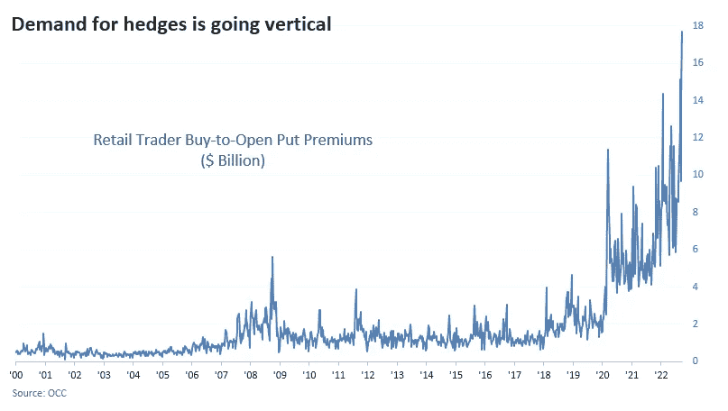
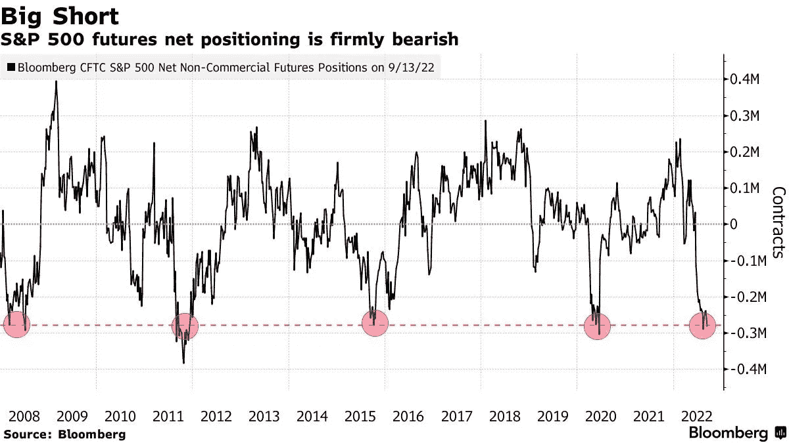
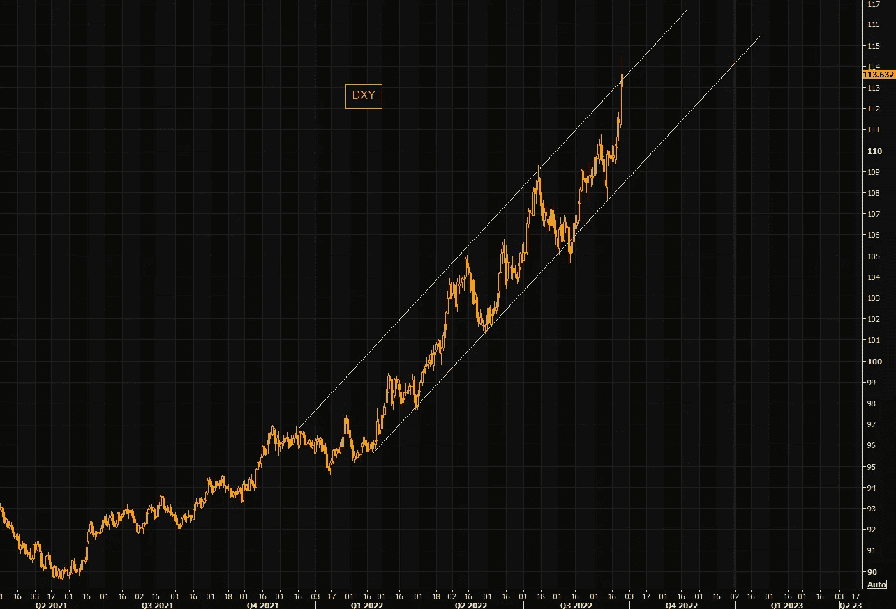
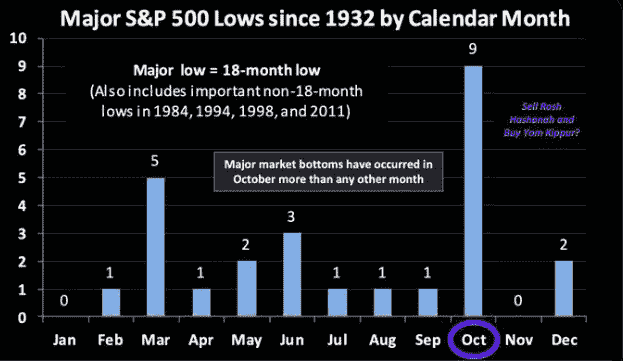
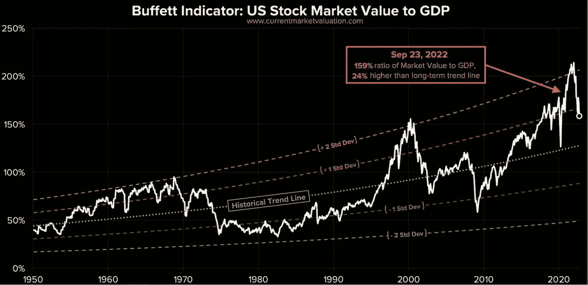
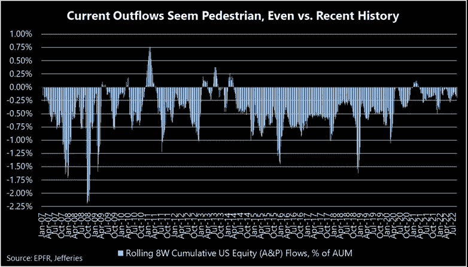
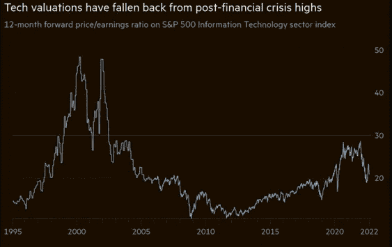

# 大空头，巴菲特指标被重新审视，科技股估值缩水

> 原文：<https://medium.com/coinmonks/the-big-short-the-buffet-indicator-revisited-tech-valuations-deflating-d8490bea517a?source=collection_archive---------31----------------------->

嘿，我是基兰！市场又将迎来新的一周，以下是需要注意的关键事件，以及来自投资银行的最有趣的宏观研究。我希望能在本周的[贸易挑战](http://www.traderseed.io/)中与你交谈，并且一如既往，如果你有任何问题，请在下面给我留言。

# 每周观察列表

随着市场在无序抛售(债券、英镑)的边缘徘徊，本周可能又是充满波动的一周。美国经济日历的亮点将是周五的个人收入和支出数据，其中包括美联储青睐的通胀指标(PCE)。英国最近宣布的减税措施使英镑跌至历史低点，吓坏了市场。BOE 官员将在周三和周四发表讲话，然后我们将在周五看到英国的 GDP 数据。系好安全带。

# 宏观视角

**恐惧是真实的。上周，散户投资者花费 180 亿美元购买看跌期权保护，创下纪录。杠杆交易者押注非常糟糕的事情会非常、非常快发生。**

**S & P 500 定位很短。** S & P500 空头持有价值 460 亿美元的指数期货净空头，创历史新高。这是一个反向投资者的问题，但是要注意，这个群体在 2008 年是对的。

**垂直美元——是时候休息了？美元指数(DXY)的走势已经走极端，但在 2022 年期间已经到位的趋势通道已经设法保持完整。在没有明显回调的情况下，还能涨多高？**

股票喜欢在十月触底。十月是去海底捕鱼的月份。时间不多了…

**巴菲特指标现在显示股票越来越接近“公允价值”。**很久以前，当它突破高于+2SD 的高估时，我们就看到了这一点。该指标仍比历史价值标准趋势线高出 24%，但现在高估了不到 1 sigma。

还没有投降。在我们看到一个有意义的底部之前，我们预计会看到大量的股票抛售。然而，迄今为止，资本外流一直非常低。

**科技估值。**泡沫正在缩小，我们已经远离了兴奋的高点。但绝对不是在地板上。科技股的估值还有更大的下调空间。

我希望你觉得这很有趣，很有用。我每周一写这份时事通讯，所以**一定要关注我**！像往常一样，把风险管理放在第一位，安全交易，保持敏捷。

祝你一周愉快！基兰

想交易本周的市场吗？ 100k 节目 **$75** 起！！点击这里查看新节目 [**！**](http://www.traderseed.io/)

[**查看节目**](http://www.traderseed.io/)

> 交易新手？尝试[加密交易机器人](/coinmonks/crypto-trading-bot-c2ffce8acb2a)或[复制交易](/coinmonks/top-10-crypto-copy-trading-platforms-for-beginners-d0c37c7d698c)