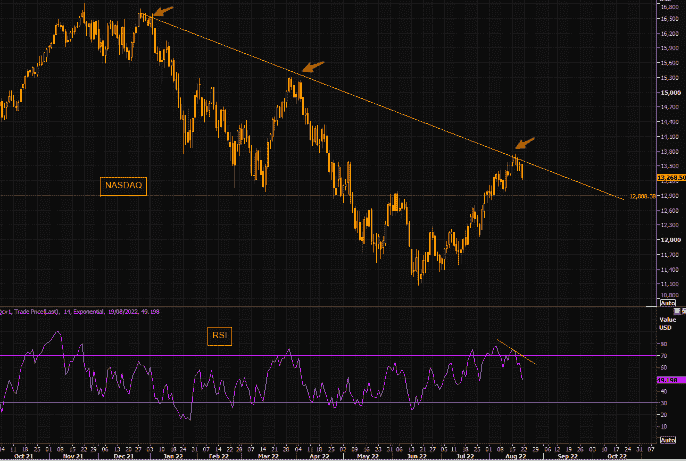
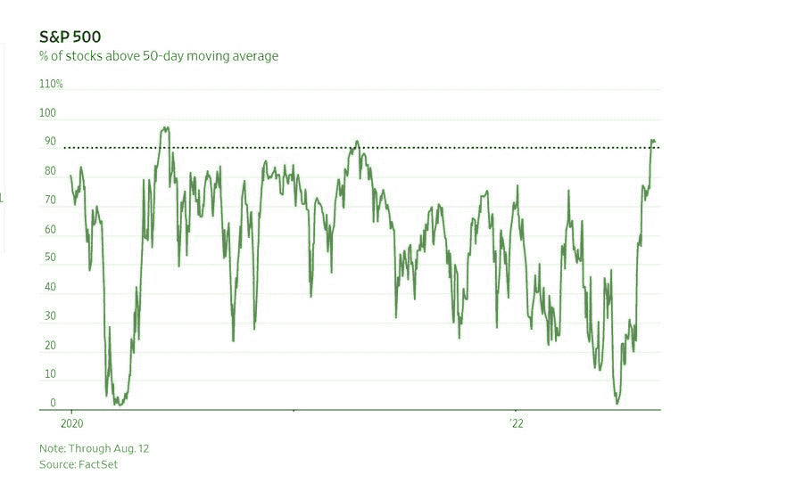
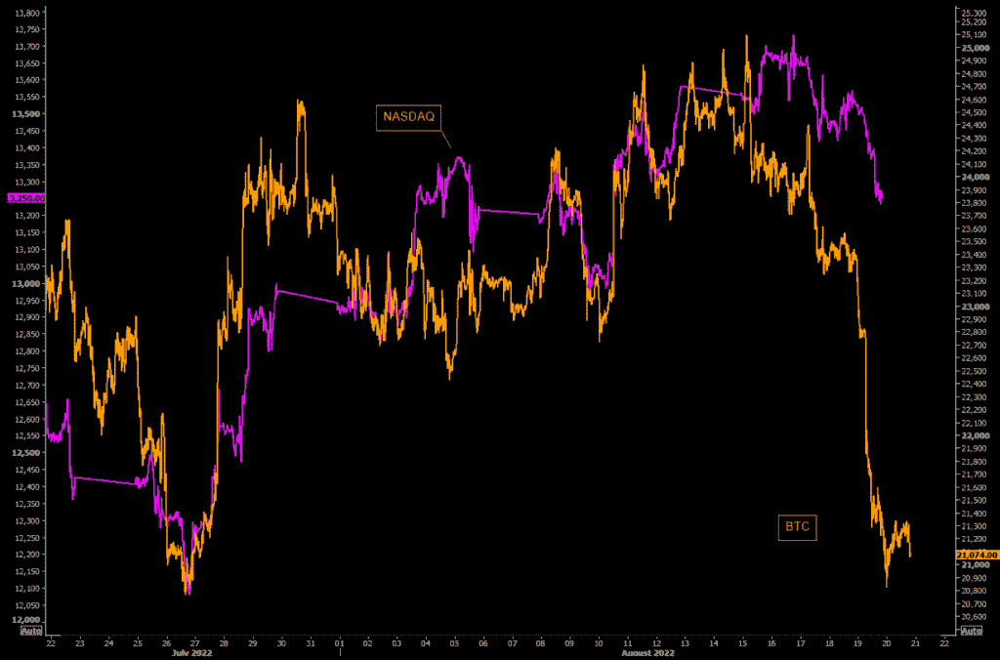
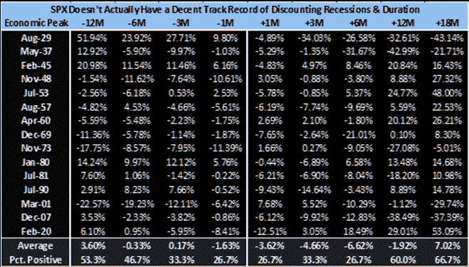
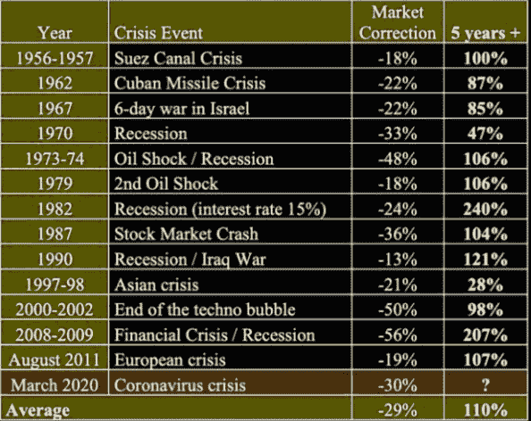
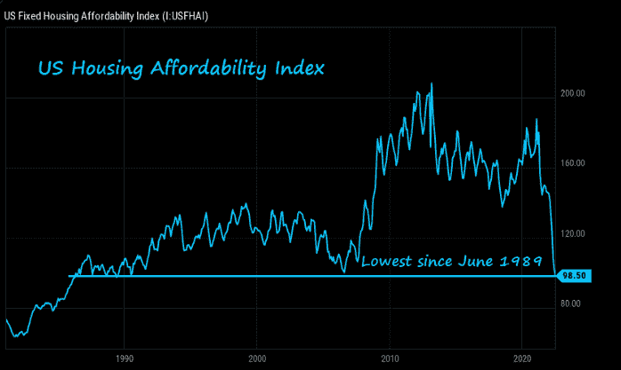
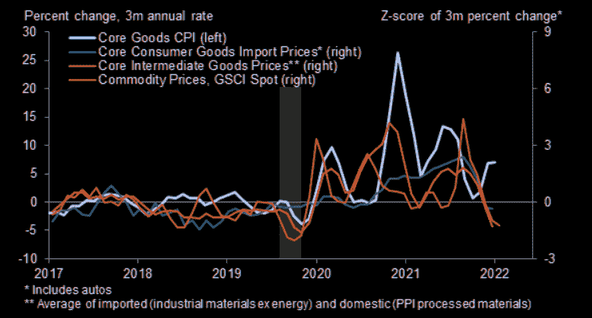

# 科技大逆转，比特币领跌，美国房价暴跌

> 原文：<https://medium.com/coinmonks/the-big-tech-reversal-bitcoin-leading-the-way-lower-us-housing-affordability-collapses-a58229b5095e?source=collection_archive---------56----------------------->

嘿，我是基兰！市场又将迎来新的一周，以下是需要注意的关键事件，以及来自投资银行的最有趣的宏观研究。我希望能在本周的[贸易挑战](http://www.traderseed.io)中与你交谈，并且一如既往，如果你有任何问题，请在下面给我留言。

# 每周观察列表

本周，值得关注的关键事件将是周五在杰克逊霍尔举行的美联储会议，鲍威尔主席将在会上发表讲话，可能会对未来的利率路径提供见解。美联储政策制定者重申，抗击通胀仍有一段路要走，打消了通胀见顶和所谓“转向鸽派”的预期，这一说法帮助提振了股市。

未来一周的经济日历还包括周四公布的 7 月份个人收入和支出数据，其中包括个人消费支出价格指数，这是美联储首选的通胀指标。

# 宏观视角

每个人都在做多，正好赶上反转。就在所有人都在做多的时候，科技股出现了 5 个月来最大的资金流入。市场做市场最擅长的事情。挫败人群并造成最大的痛苦。

这里的库存很大。高于 50 天移动平均线的股票百分比> 90%。这是不可持续的。

BTC 和纳斯达克进一步分化。如果加密仍然是市场总体心理的一个很好的指标，那么你应该密切关注加密专业公司的最新价格行动。这些天来，BTC 与纳斯达克的相关性不那么完美，但 BTC 股市本周末大幅下跌。

衰退前后的表现。结论:不确定。有很多方法可以应对衰退。例如，我们已经多次强劲反弹进入衰退，并且仍然在衰退中抛售股票(也就是说，滑入衰退并不意味着你可以在价格中反映复苏)。

购买危机。撇开经济衰退不谈，在危机期间买入会带来不错的回报……如果你能准确把握危机抛售的底部。

美国住房负担能力崩溃。美国住房负担能力处于 33 年来的最低水平，低于 2006 年 7 月的低点，当时是上一次房地产泡沫的顶峰。当时，美国房价随后下跌 25%，至 2011 年 12 月的低点。这是美国(因此也是全球)经济的主要支柱。

快速通货紧缩。终于有好消息了。大宗商品和进口商品价格正以 2020 年初以来的最快速度下跌。

我希望你觉得这很有趣，很有用。像往常一样，把风险管理放在第一位，安全交易，保持敏捷。

祝你一周愉快！
基兰
www.traderseed.io

你能通过 Traderseed 的挑战吗？证明你的交易技巧，赚取丰厚的回报。起价 75 美元的节目！！点击此处查看新节目[！](http://www.traderseed.io/)

> 交易新手？试试[密码交易机器人](/coinmonks/crypto-trading-bot-c2ffce8acb2a)或者[复制交易](/coinmonks/top-10-crypto-copy-trading-platforms-for-beginners-d0c37c7d698c)