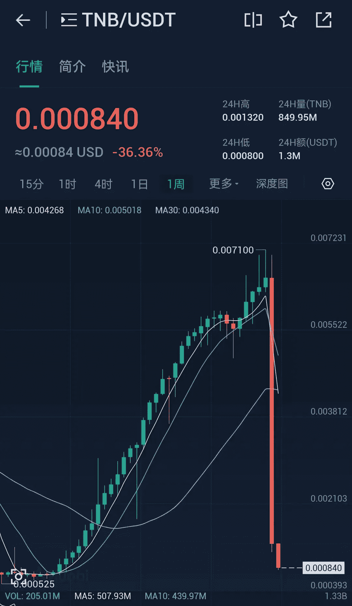
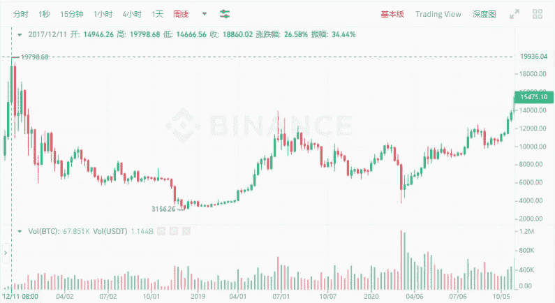
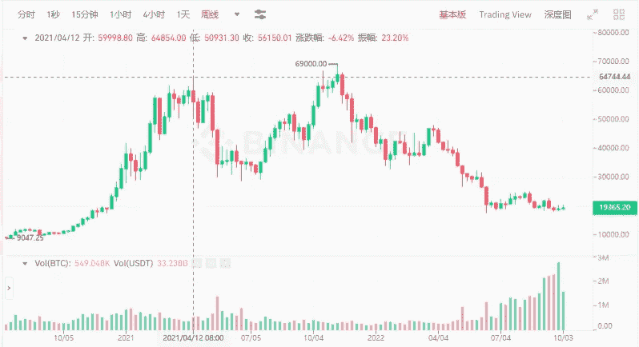
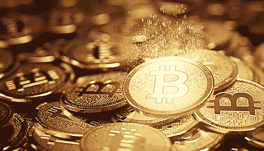
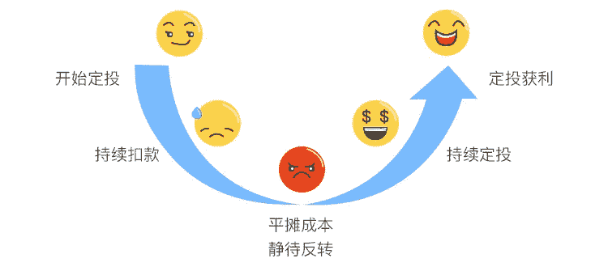

# BTC 上一轮牛市最大跌幅 84%，本轮可能跌至 11000 美元？

> 原文：<https://medium.com/coinmonks/the-biggest-drop-of-btc-in-the-last-bull-market-was-84-and-this-round-may-fall-to-11-000-5311e10ad69f?source=collection_archive---------13----------------------->

我今天看了 TNB 的周线图。左周线一直在步步高升，从 0.000525 到 0.0071 的高位，涨幅 13.5 倍；

这个市场充满了不确定性。涨的时候是很好的目标，每周都不让人失望，但是到了该出市的时候，也是毫不含糊，几乎直奔零。

当然，没有哪个目标会永远上升。买的时候，风险明确；任何项目的回报越高，风险就越大。

TNB weekly trend

如果说去年 11 月 8 日比特币 69K 美元的历史高点是熊市的开始，那么熊市已经走了近 11 个月。

根据以往的经验，以 4 年为一个周期，目前的低迷还需要 2 年。

在上一次牛市中，比特币在 2017 年 12 月 11 日达到历史高点 19798 美元，随后持续下跌，至 2018 年 12 月跌至 3156 美元，跌幅超过 84%。

2019-2020 年，低位震荡，缓慢回升；2021 年迎来牛市，4 月涨到 64k 美元，市场狂欢；下跌波动半年后，11 月升至 69k，迎来双牛市。

进入 2022 年后，一路下跌，6 月跌至最低点 17622，跌幅超过 74%。如果跌幅达到上一轮的 84%，本轮有望跌至 11000 美元？

2017 Bull Market BTC Weekly Volatility

在此期间，比特币努力保持在 2 万美元以上，今天跌至 19237 美元。没有人知道这是最低点，还是还有更低的点。

链条上的交易量锐减，燃气费下降，各种新项目相对低调上马。最明显的感觉就是各个小区很安静，没有人在发红包。

老韭菜说，越来越多的人悄悄离场，大部分人都受不了了，然后就会迎来牛市。

2022 Bitcoin weekly trend

当然，历史不可回望，趋势不可预测；过去的趋势不一定适合未来。

有人说这个周期可能是短期熊市，会继续有小牛市机会；有人对市场持悲观态度，毕竟大环境不利；更多的人在思考如何抓住当下的机会。

没有人知道底部在哪里。所有的下跌都是阶段性的底部。逢低成功后，可以在高点卖出。这是一个循环操作。

不知道底部在哪里，很少有人能准确踩到底价点，很少有人抄底成功。

The current price of BTC is $19,400

有的人做固定投资，选择某个标的，每个月或每周投资固定金额。

更低或更高都有可能买入，但熊市持续震荡，很难准确预测下周走势。从长远来看，抓住当前的相对低点是一个巨大的机会。

身边有一些朋友，每周都有投资。根据自己的实力设定投资额度，选择合适的标的，分较长的时间段进行规划，比如 2 期以上。
朋友们选择定投的目标，大部分比例是相对稳定的 BTC。虽然涨幅可能没有其他小硬币大，但是不确定性会小一些。

Fixed cast smile curve

如果在定投过程中担心手动加仓时受情绪影响，也可以选择平台的定投功能，定投时间和金额会根据计划自动投入并执行。

当然，如果选择了烂标，也有归零的风险。如果 BTC 归零，整个密码市场将基本归零，整个区块链探索将以失败告终。

市场继续发展。既然无法判断接下来一周的涨跌，不如做好当下可以把握的部分，做好影响圈，种下未来希望的种子。

以上只是我个人观点，没有投资建议。我是楚小莲，我正在关注元宇宙和 web3。

> 交易新手？试试[加密交易机器人](/coinmonks/crypto-trading-bot-c2ffce8acb2a)或者[复制交易](/coinmonks/top-10-crypto-copy-trading-platforms-for-beginners-d0c37c7d698c)