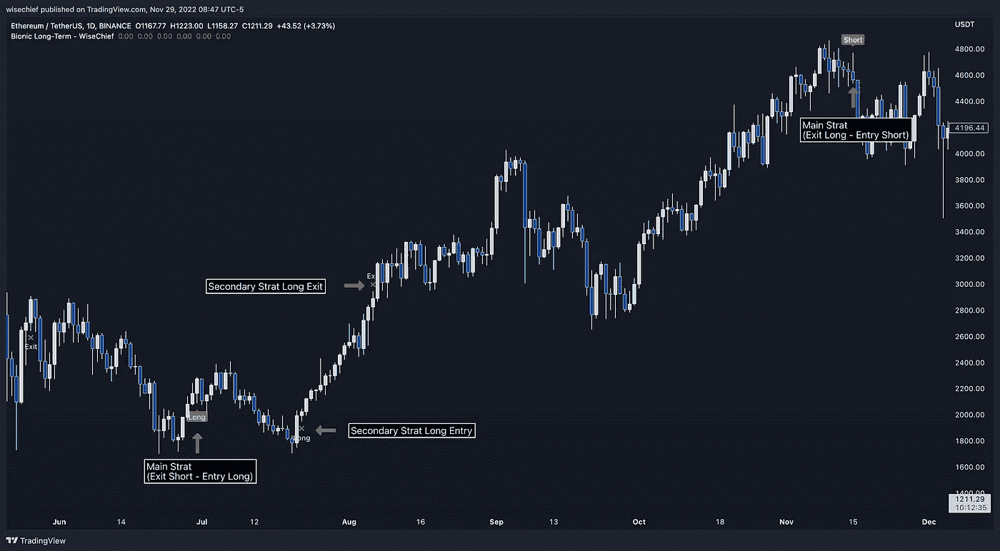
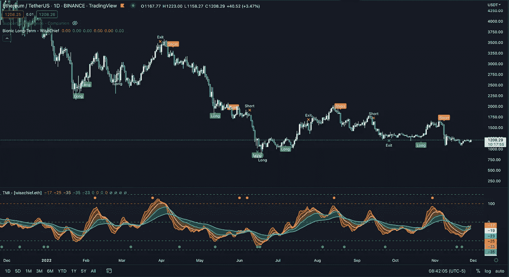
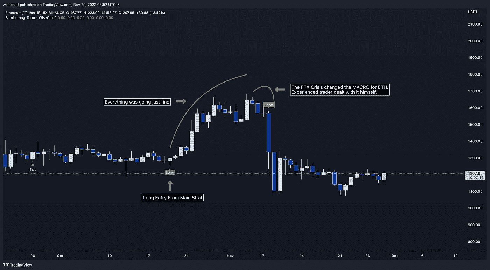

# 仿生策略——所有算法交易策略应该如何发展

> 原文：<https://medium.com/coinmonks/the-bionic-strategy-or-how-all-algorithmic-trading-strategies-should-be-developed-a0a6b15330a0?source=collection_archive---------0----------------------->

几周前，我写了一篇关于我如何在' 21-'22 熊市中 880%交易以太坊的故事[(此处阅读)](/@wisechief/ex-deutsch-b-trader-who-made-880-in-crypto-bear-explains-how-you-can-do-it-too-e576261d7d89)。然后，多亏了几个人，我决定在 TradingView 上发表我的长期策略，并解释它的概念。

# 策略不可能 100%自动化。

交易者可能希望指标单独工作，不需要用户交互。但是，一个技术指标本身是不应该赚钱的！

没有一个指标是万能的，足以处理所有的市场状况或重要消息。因此，即使是领先的对冲基金也在使用算法交易和广泛的人类研究。

成功在于交易者和他的工具的结合。

一个指标可以处理前所未有的信息量，这就是它的全部目的。但是，另一方面，交易者了解这个领域。他了解经济日历的影响，并密切关注与他交易的证券相关的新闻。

> **仿生策略提供高质量的趋势分析软件，提供多头/空头机会，并由一名在德意志银行拥有超过 15 年交易经验的人进行监控。**

# 仿生策略

这个概念是要超级集中，以达到最大的成功率。我选择了一个资产和一个时间框架。 [$ETH](https://www.tradingview.com/symbols/ETHUSD/) 是我的选择。

首先，对于它的流动性，还因为它的强大的社区和历史。因此，该策略适合长期交易者、持有者和 DCA 人员，也适合希望更好地了解低价竞标走向的用户。

The TMI (below the chart) is the basis of the Bionic Strategy

基于我的振荡指标，TMI 通过价格行为条件、标准差、需求/供给区域等分析市场趋势和下跌。

从这一点来看，策略知道了 [$ETH](https://www.tradingview.com/symbols/ETHUSD/) 的方向，并会根据许多条件和分歧来决定进入头寸的正确时机。

*   **因此，“主要策略”是自动化的，但一个新闻故事可能会震动整个市场。**增值就在这里。**如果策略对消息没有反应，那么我会采取行动，在电报上通知 DM 中的用户平仓，改变方向。**

**自 2021 年 5 月成立以来，我只需要在 FTX 危机期间这样做一次。我们做多了，所以我手动做空，并在 2012 年 11 月 8 日提醒所有人，这样我们就可以同时交易了。**

****

**The only time WiseChief had to intervene — the beauty of marrying a highly skilled trader with a powerful algorithmic solution.**

*   ****“二级战略”**是 100%自动化的，不能手动更改。这个策略在“主要策略”中寻找较小的交易例如，如果“主要策略”是多头的，那么次要策略中的所有交易也是多头的。**

# **不是每个人都适合做长线交易。**

**从我上一个故事中你已经可以看出，我的交易不会给情绪留下任何空间，我非常重视耐心。**

**事实上，做一个长期交易者只需要很少的行动。不管你怎么想，大多数散户交易者无法关掉“买/卖按钮”的冲动，他们需要肾上腺素！**

****

**A better, less costly adrenaline rush — Photo by [Jp Valery](https://unsplash.com/@jpvalery?utm_source=medium&utm_medium=referral) on [Unsplash](https://unsplash.com?utm_source=medium&utm_medium=referral)**

**交易者被日内交易所吸引，因为它很耗时。
但是放松！长期交易利润更高，耗时更少，也更安全。这种策略还包括无杠杆交易，因此需要大量资金来启动。**

# **一些结果**

**自 2011 年 5 月开始后验测试，仅针对**主要战略:****

*   ****净利润:** +817.49%**
*   ****同期市场:**-48.59%**
*   ****胜率:** 88.89%**
*   ****平均获胜概率:** 36.77%**
*   ****平均亏损 PNL:** 14.05%**

> *****如果你想了解更多的战略，获得访问权，或者想聊天，随时与我联系电报！*****

***跟着我；我会写我的交易策略、宏观经济和秘密天使投资。我将回答这样的问题:如何为摆动交易创建完美的交易视图设置？如何在预算内交易？如何管理你的风险？***