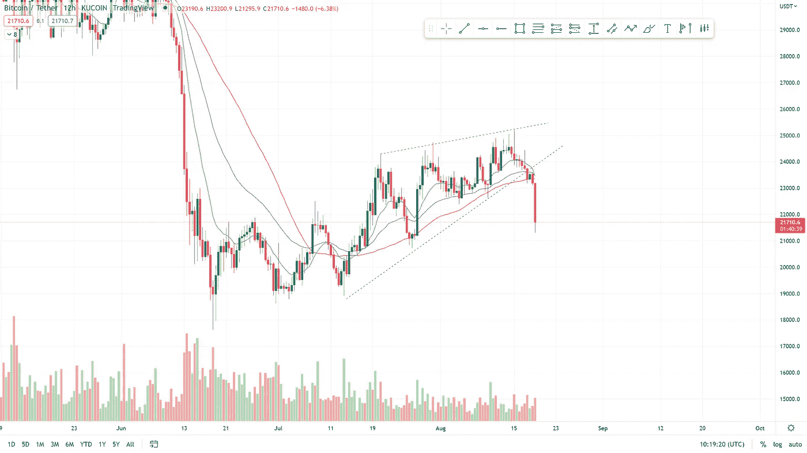
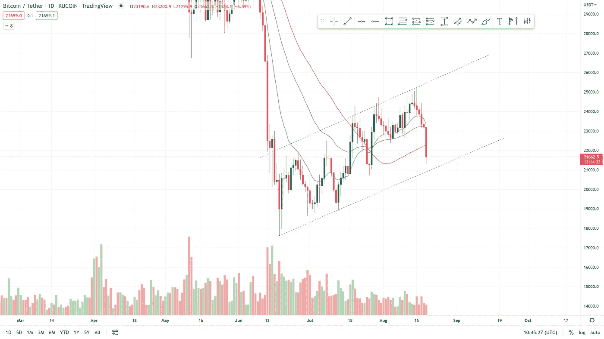
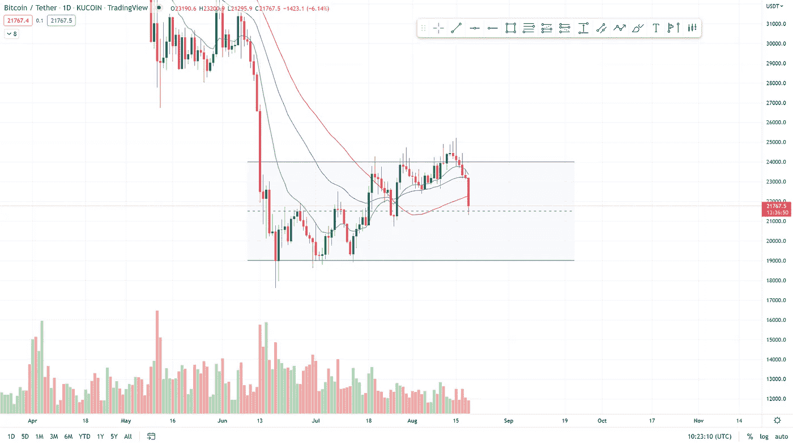
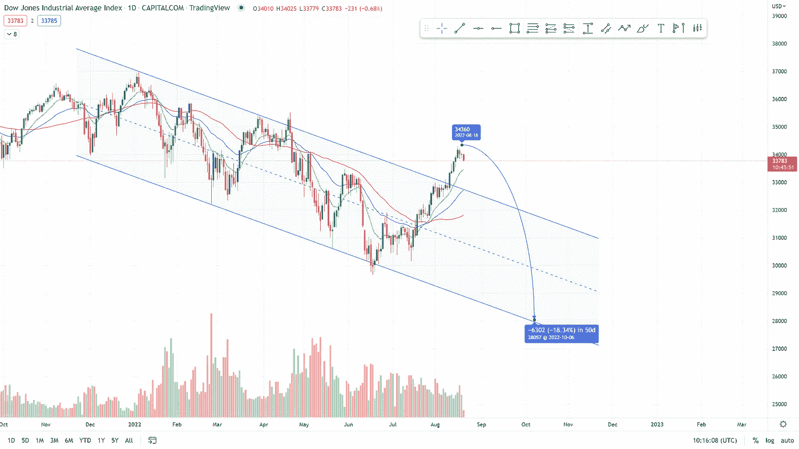
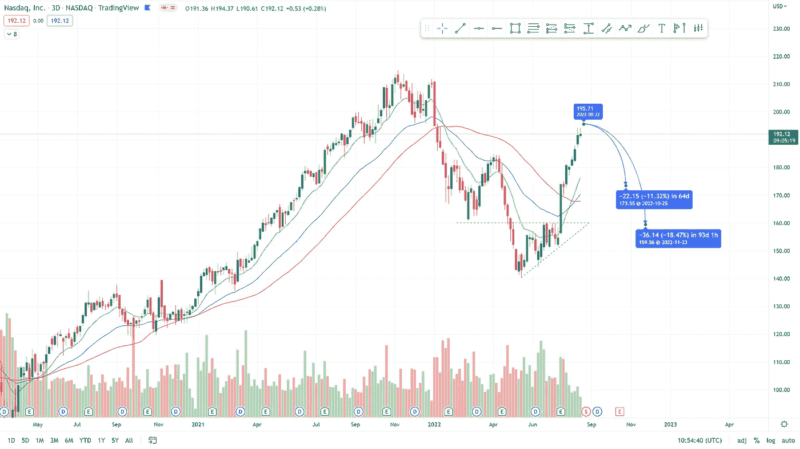
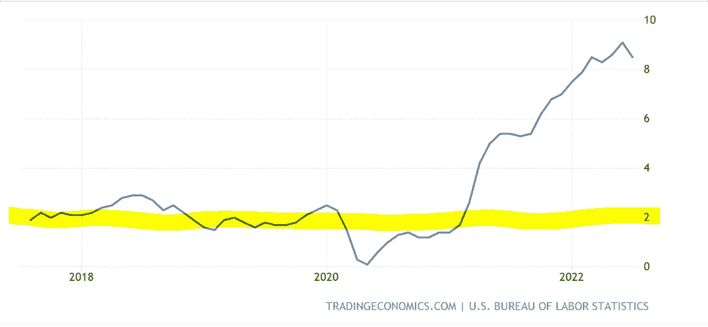
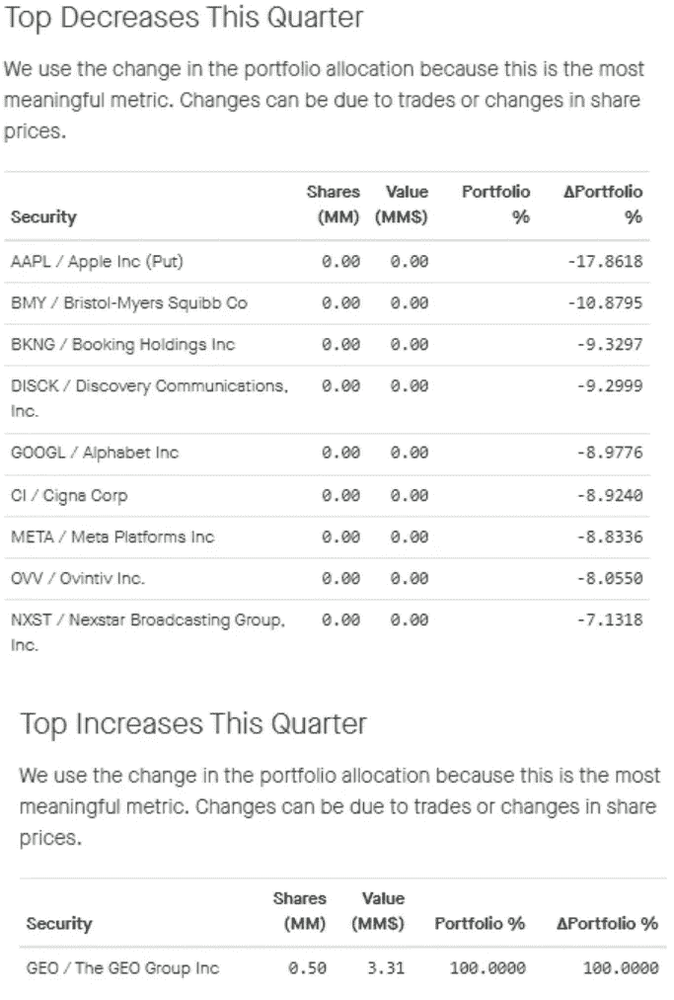

# 比特币和股票的回撤已经开始

> 原文：<https://medium.com/coinmonks/the-bitcoin-and-stock-retracement-has-begun-b89bc62c5e47?source=collection_archive---------57----------------------->

This edition of the boomish.org newsletter was published on the 19th of August

**在本周的时事通讯中**

*   比特币终于打破楔形看跌
*   30 美元见顶，如果它是旗帜，可能是一个牛市陷阱
*   纳斯达克分析显示，如果市场反转，下跌的路还很长
*   美国财政部制裁龙卷风现金，许多反响随之而来
*   美联储会议纪要显示，美联储将继续加息，最终会放缓加息步伐
*   “大空头”迈克尔·伯里卖出了所有股票，只有一只股票因“即将到来的严重经济衰退”而被抛售。

‍

‍

**比特币价格分析**

比特币终于打破了我们在最近几期简讯中连续公布的楔形格局(图 1)。

自从 8 月 18 日楔形的击穿和重新测试以来，比特币已经大幅跌至 21000 点的支撑区域。

虽然上周新闻简报中提到的旗帜图案看起来仍然完好无损，但上升楔形的影响很可能超过旗帜的支撑力(图 2)。

考虑到今天新闻简报中的 US30、NASDAQ 和加息分析，这一标志更有可能被打破。

比特币显示实力并证明底部可能存在的最后机会是，它在 19000-24000 美元的 5000 美元区间形成一个矩形盘整模式(图 3)。

诚然，许多投资者对这一区间的强度和持久性没有信心。

*图 1 12H BTC 2022 年 5 月—2022 年 8 月(TradingView)*

*图 2 1D BTC 2022 年 3 月—2022 年 8 月(交易视图)*

*图 3 1D BTC 2022 年 4 月—2022 年 8 月(交易视图)*

**US30 价格分析**

美国 30 指数也被称为道琼斯工业平均指数(DJIA)

自 2021 年 11 月下旬以来，美国 30 指数在日线图上整齐地遵循了牛市形态(图 4)。

2022 年 4 月，我们看到了第一次突破，但没有持续，并很快变成了牛市陷阱，在 5 月中旬创造了新低。

在 8 月 8 日，我们看到了另一个突破，这一突破一直被阻止。

不幸的是，考虑到我们目前所处的经济环境，这种永久性突破将我们带到新的历史高点的可能性极低。

如果当前的突破变成了多头陷阱，形成了新的低点，就有可能重新回到旗帜形态的下限。

这种对低点的重访将使美国 30 下跌约 18%，在 28000 点持平。

*图 4 1D 美国 2021 年 10 月 30 日—2022 年 8 月(交易视图)*

**纳斯达克价格分析**

自上升三角形复苏模式走出 5 月低点以来，纳斯达克指数经历了一轮持续的强劲反弹。

纳斯达克在突破 2022 年 4 月 1 日的高点 184.6 点后，创下了更高的高点。

纳斯达克多头已经成功实现了超过 5 月低点 38%的反弹，尽管纳斯达克的结构继续看起来非常乐观，但它肯定会回调。

回调很容易让我们重新回到 170 点的水平，跌幅为 11%。如果更广泛的市场开始一个比多头希望的更大的回调，在 160 点重新形成一个上升三角形，使纳斯达克指数回落超过 18%(见图 5)。

*图 5 3D 纳斯达克 2021 年 4 月—2022 年 8 月(交易视图)*

**美国财政部制裁龙卷风现金**

‍

**什么是龙卷风现金？**

Tornado Cash 本质上是以太坊网络上的匿名交易，消除了资金来源和去向的所有痕迹。

Tornado Cash 是关心交易隐私的加密用户中常用的 Dapp。

**发生了什么**

不幸的是，该协议也被网络罪犯用来洗钱。该制裁称，龙卷风是朝鲜黑客青睐的工具，根据该报告，这些黑客窃取了超过 70 亿美元。

尽管有证据表明这些数字很可能被夸大了，实际上 70 亿美元是自发布以来通过 Tornado Cash 交易的加密货币总额。

**去 Fi 的后果**

对 tornado cash 的制裁导致许多加密交换和 DeFi 应用程序中断了与 tornado cash 应用程序的交互。

更糟糕的是，一些去伪存真的应用程序切断了与曾经和 Tornado Cash 交互过的钱包的联系。

**名人违反制裁**

除此之外，Twitter 上的一名用户宣布，他们已经开始通过他的 tornado cash 帐户向名人和大加密影响者的公共地址发送少量 ETH。

一些名人参与其中，包括比特币基地首席执行官布莱恩·阿姆斯壮、吉米·法伦和史蒂夫·青木。通过发送这些少量的 ETH，这些名人通过与受制裁的 Tornado 协议进行交互，违反了美国财政部的制裁。

在与 Tornado Cash 协议的任何形式的互动中违反制裁可能会导致高达 1000 万美元的罚款和 10 年的监禁。

**荷兰警方逮捕开发商**

龙卷风制裁的最后，最令人不寒而栗的事件是荷兰政府逮捕了一名龙卷风现金开发商。

他被捕的原因还不清楚，荷兰政府已经在他们的 FIOD 网站上发表了声明。

该声明宣称，这部成文法典可能被视为犯罪。这种发展可能有危险的影响，并为程序员和开发人员设置了一个危险的范例。

被你为去中心化所写的代码逮捕似乎是一条危险的越线

Tornado Cash 是一个开源的分散式应用程序，因此它是一种公共产品。因为犯罪分子也使用开源应用程序而对其进行制裁，类似于因为犯罪分子也在高速公路上行驶而对其进行制裁。

总之，犯罪分子很可能会继续使用这种协议，因为根据定义，他们不遵守法律，而开发者和守法的用户是唯一遭受这些制裁的人。

‍

‍

**美联储会议纪要宣布进一步加息**

美国央行行长在最近的美联储纪要会议上宣布，他们预计未来几个月将进一步加息。

他们再次同意其他金融部门政府官员的观点，即一旦他们看到美联储的政策对通胀产生重大影响，加息的步伐可能会放缓。

目前的速度可能会持续下去，直到美联储看到通胀水平得到真正的控制。“……在一段时间内保持这一水平以确保通胀稳步回到 2%可能是合适的，”会议纪要称。

我们目前距离美联储的通胀目标还有 6.5%(图 6)。

*图 6 2018-2022 年通货膨胀统计*

‍

**‘大空头’迈克尔·伯利卖掉了所有股票，除了一只**

Michael Burry 的 Scion 资产管理披露显示，对冲基金已经抛售了其投资组合中的所有股票，包括苹果、Alphabet、Meta 和 Nexstar(图 7)。

迈克尔·伯里以前在大的经济衰退时有很好的远见，他的悲观无疑会引起对更广泛市场的恐惧。

*图 7 Micheal Burry 的持股(*[*fintel . io*](http://fintel.io/)*)*

BOOMISH 时事通讯由最相关新闻的简明每周报告组成！

[在这里订阅！](https://www.boomish.org/newsletter)

> 交易新手？尝试[加密交易机器人](/coinmonks/crypto-trading-bot-c2ffce8acb2a)或[复制交易](/coinmonks/top-10-crypto-copy-trading-platforms-for-beginners-d0c37c7d698c)