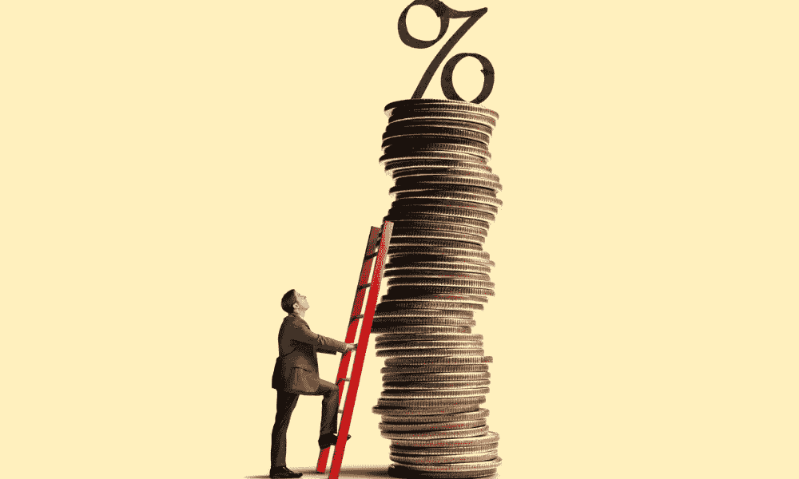

# 比特币的底部:何时到来？

> 原文：<https://medium.com/coinmonks/the-bitcoin-bottom-when-is-it-coming-831b162bdd63?source=collection_archive---------10----------------------->

When will Bitcoin rebound?

街上有血。世界上饱受战争蹂躏的地方，尤其是乌克兰的灾难性事件。重要的是要记住，当你用天塌下来的言辞说话时。尽管如此，crypto 还是深陷其中。

无论是 YouTube 上的密码专家，还是从宣布比特币底部已经到来的出版物中为我提供头条新闻的算法:不缺乏告诉你不要担心的“新闻”，一切都从这里开始！

但正如我们所知，这些 YouTubers 和出版物一年多来一直在呼吁 20 万美元的比特币。他们的预测是正确的。他们只差一分。

在本文中，我将概述比特币轨迹触底所需的宏观因素。

## 股市

毫无疑问，美国股市正处于熊市。问题是:底部在哪里？

在过去的一百年里，熊市都是短暂的(1987 年的黑色星期一和 2020 年的 Covid 暴跌)，只持续几个月，或者几年，有时最终导致衰退(2000 年互联网泡沫破裂和 2008 年的大衰退)。

尽管比特币狂热分子和[加密爱好者](/coinmonks/crypto-is-like-high-school-1f250368ebe4)梦想成真，但比特币和所有加密货币**并非**独立于股票市场。它们高度相关，因此，只要股市继续下跌，它们就会受到影响。

一旦股市显示出强劲的迹象，光明将从隧道的尽头开始照耀。但事情没那么简单。股票可能会在一段时间内规避风险。被高估的科技股不会复苏，相反，安全的押注可能会引领潮流。

即使没有衰退，股票市场在不久的将来也将是一个“规避风险”的环境。比特币及其衍生产品也不会例外。它们是风险资产类别的定义。

我们永远不会知道这些事情，但更有可能的是，股市正处于动荡之中，暂时不会回到“冒险”状态。

> 交易新手？尝试[加密交易机器人](/coinmonks/crypto-trading-bot-c2ffce8acb2a)或[复制交易](/coinmonks/top-10-crypto-copy-trading-platforms-for-beginners-d0c37c7d698c)

但是为什么呢？

## 通货膨胀！

五月份，通货膨胀率达到了 8.6%，是四十年来的最高值。大多数分析师预测，该指数将在 4 月见顶，结果只会进一步攀升。

但是通货膨胀和加密货币市场有什么关系呢？

> 比特币是通胀的对冲工具吗？绝对不会。

如果是这样的话，它的价格将保持在 50-60k 的范围内，如果不是创造新高的话。与此同时，它已经打破了主要结构，可能会比最近的低点 17，622 美元还要低。

比特币的稀缺性是它在通胀时期作为对冲工具的一个解释。但就像黄金不能真正保护你的投资组合免于死亡螺旋一样，比特币也不能。但是我有什么资格这么说呢？看看马克·库班对它的看法。

为了让市场好转，空气必须从通货膨胀的轮胎中出来，否则就被称为通货紧缩。但是这需要发生什么呢？

简单地说，价格需要下降。T2 有三种可能发生的方式。要么人们在接近年底时耗尽积蓄，零售商降价以鼓励假日消费。从我和我周围的人的情况来看，我要说的是，尽管温哥华是一个生活成本很高的城市，但我的积蓄已经消耗殆尽了。

但是零售只是这块蛋糕的一小部分。我们需要让日常生活中的宏指令贬值，这样投资者就不会担心房屋供暖，并考虑重新投资风险更高的项目。燃料、能源、食物、衣服都比去年贵了很多。

一旦美联储开始看到通缩数据，信贷紧缩将会缓解。一旦借贷成本降低，这些资金将从寻求杠杆资金的机构买家手中流入市场。

## 又一个新低

自 1 月以来，少数几名[分析师](https://www.youtube.com/c/alessiorastani)呼吁比特币价值 2 万美元，而其余看涨者则反对这一数字。大约在 3 月份，其他人开始转向，并承认 BTC 将不得不重新测试 2017 年 12 月上一轮牛市的高点。

对一些人来说，接近 20k 水平是不可想象的，许多弱手放弃了他们的位置。但由于如此多的人宣布 20000 点为新低，它并没有完全“冲走”所有的短期持有者，而熊市必须这样做。

就像当多头控制了一个上涨的市场来推动价格上涨时，空头控制了一个下跌的市场，并将价格推至最低点。

> 熊市是市场的混合体:机构、鲸鱼和散户都一样，带着不同的动机相互作用。

许多专家表示，需要(许多人表示他们希望)价格再出现一次可怕的下跌，以进一步淘汰弱势群体。考虑到 BTC 目前的结构，这种可能性似乎很大。

需要证据？华尔街分析师最近下调了他们的股票预测。翻译过来就是:对近期财务前景非常悲观的情绪。

好消息是:这是一个[逆势信号](https://www.youtube.com/watch?v=pdiqUbWJfdI) **。**过去 10 年，每当华尔街分析师这样做时，股市都会调整。明确地说，这意味着股票在降级后的 6 到 12 个月内有时会上涨 80%。

## 结果

几乎可以肯定，市场的新低点即将到来。希望这意味着不久之后会有一个非常好的反弹。熊市中经常出现“熔脸”反弹。

但是自去年年底以来，*2*美元*万亿*已经从 crypto 的市值中泄露。仅自 6 月中旬以来，就有 2000 亿美元化为乌有。

> 从本质上说，市场扭转局面的唯一方法是让数万亿美元重新涌入市场，无论是股票、密码还是债券。我们需要鲸鱼集体行动，积极的监管，以及整个国家变得乐观。

如果你正在寻找一个机会，你正在寻找。在接下来的几个月中考虑使用 DCA 方法，但是要做好准备，这需要更长的时间。百万富翁是在熊市中产生的，但不是一夜之间。

If you’re smart, there’s money to be made in times of economic strife.

> 加入 Coinmonks [电报频道](https://t.me/coincodecap)和 [Youtube 频道](https://www.youtube.com/c/coinmonks/videos)了解加密交易和投资

# 另外，阅读

*   [block fi vs Celsius](/coinmonks/blockfi-vs-celsius-vs-hodlnaut-8a1cc8c26630)|[Hodlnaut 审核](/coinmonks/hodlnaut-review-best-way-to-hodl-is-to-earn-interest-on-your-bitcoin-6658a8c19edf) | [KuCoin 审核](https://coincodecap.com/kucoin-review)
*   [Bitsgap 审查](/coinmonks/bitsgap-review-a-crypto-trading-bot-that-makes-easy-money-a5d88a336df2) | [Quadency 审查](/coinmonks/quadency-review-a-crypto-trading-automation-platform-3068eaa374e1) | [Bitbns 审查](/coinmonks/bitbns-review-38256a07e161)
*   [加密复制交易平台](/coinmonks/top-10-crypto-copy-trading-platforms-for-beginners-d0c37c7d698c) | [Coinmama 评论](/coinmonks/coinmama-review-ace5641bde6e)
*   [印度的加密交易所](/coinmonks/bitcoin-exchange-in-india-7f1fe79715c9) | [比特币储蓄账户](/coinmonks/bitcoin-savings-account-e65b13f92451)
*   [OKEx vs KuCoin](https://coincodecap.com/okex-kucoin) | [摄氏替代度](https://coincodecap.com/celsius-alternatives) | [如何购买 VeChain](https://coincodecap.com/buy-vechain)