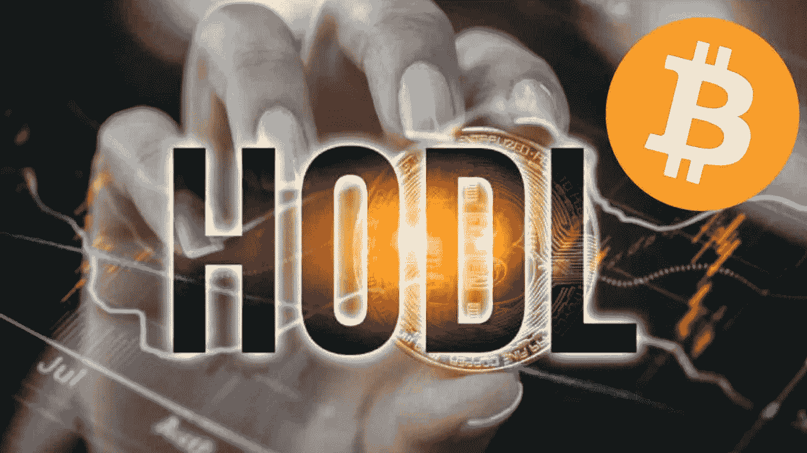

# 比特币 HODL 心态

> 原文：<https://medium.com/coinmonks/the-bitcoin-hodl-mindset-b43532842dfc?source=collection_archive---------11----------------------->

市场存在恐惧和不确定性，你能感受到吗？

比特币和加密价格自其历史高点以来已经下跌了近 70%或更多。股票也一直在下滑。所有这一切都是基于不断增长的通货膨胀，利率上升，世界各地发生的战争。此外，各国政府已经开始克制自己，不再像过去那样支撑金融市场…