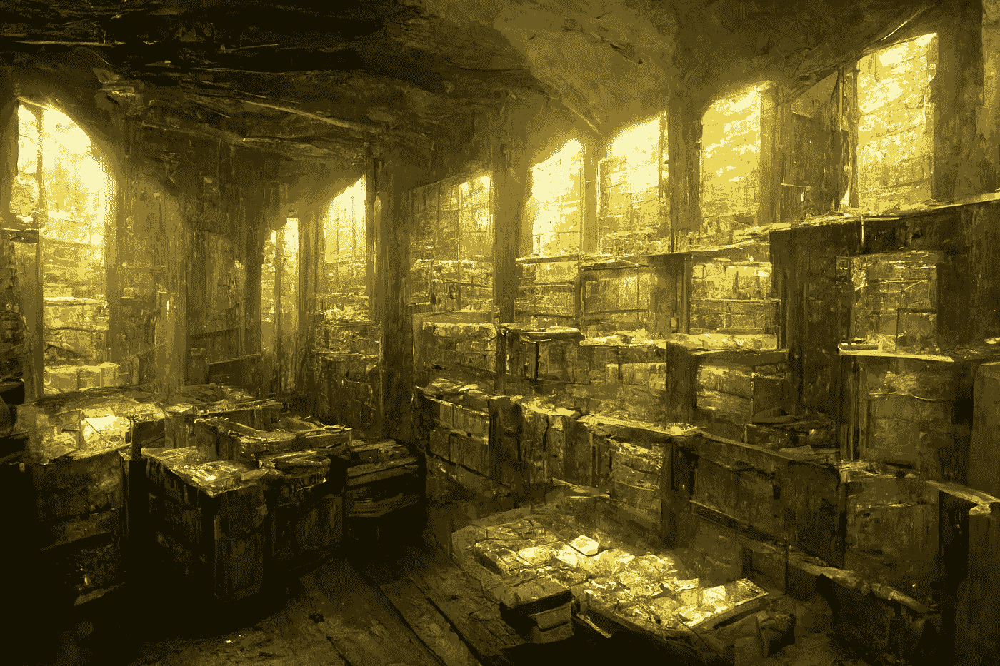

# 比特币时刻和青铜时代的崩溃

> 原文：<https://medium.com/coinmonks/the-bitcoin-moment-and-the-collapse-of-the-bronze-age-56198e54075d?source=collection_archive---------14----------------------->

**Credit:** Created by the author with Midjourney

## 直到今天，还不完全清楚青铜时代的伟大帝国是如何如此迅速地完全消失的。作为一场破坏性的技术革命，新熔炉的发展和广泛使用可能有助于导致古物自己的比特币时刻。

在公元前 12 世纪，大约。2200 年前，中东及其周边地区可以建立看似高度功能化的社会，有许多组织结构，对于今天生活的人来说听起来非常熟悉。有组织的税吏，不同城邦之间的外交，复杂的联盟关系，以及以青铜为基础的高度发达的工业。

整个时代因锡和铜的金属化合物而得名。要了解青铜在那个时代所扮演的角色，人们只需看看塑料化合物在今天的经济和社会中所扮演的角色。塑料便宜、可靠，可用于各种产品。如今，塑料遭受了很多负面报道，这是因为它的一个特性，而不是它的一个缺陷。塑料是一种高度可持续的材料，不会随着时间的推移而变质。它在保持其完整性方面做得如此出色，以至于世界上的一些地区正在被严重污染，仅仅是因为塑料在它应该做的事情上做得太好了。

**Credit:** Created by the author with Midjourney

很难想象今天没有塑料的经济和社会环境。这同样适用于 2000 多年前从埃及到波斯的城市，以及它们最常用的材料:青铜。如果你生活在那个时代，你会去工作并使用你的青铜工具。你完成工作后，就可以回家了。在那里，你美丽的妻子会用青铜盘子盛着美味的食物欢迎你。你的妻子会用青铜锅准备食物，你们两个会用青铜餐具吃饭。基本上，所有东西都是由青铜制成的。

由于青铜是由铜和锡制成的合金，稳定的生产会带来一些特殊的问题。为了确保这两种原材料的持续供应，有区别的劳动组织，建立适当的贸易路线，缔结外交联盟，以及提供适当的安全保障成为必要。

**Credit:** Created by the author with Midjourney

## 主流材料

有了这些复杂的先决条件，人们可以想象不是每个人都有能力生产青铜制品。没有中央政府的充分监管和控制，稳定的生产可能是不可能的。

自然，在经济和政治权力更加集中的地方，必然会出现某些中心。人们可以很容易地想象，这些中央权力中心也利用他们的权力来表达他们的利益和愿望，而不仅仅是他们周围的环境。由于小城市不必为大城市和州所畏惧，所以大城市和州可能不得不接受与后者的不吸引人的安排。

**Credit:** Created by the author with Midjourney

由于他们无法获得大量有影响力的经济资源，他们无法威胁到各自地区大玩家的主权。如果他们有适当的工具，他们可以反抗，或者至少让他们的关注和愿望被听到。当然，在这种情况下，由于他们的经济和军事实力，他们会赢得一些尊重。

**Credit:** Created by the author with Midjourney

## 铁爪来了

在青铜时代的晚期，铁加工的技术基础变得更加广泛。这项改变游戏规则的技术起源于公元前 13 世纪和 12 世纪的罗马尼亚和保加利亚地区，后来进入了青铜时代帝国的相关地区。人们不应该低估这项技术在其出现期间可能产生的影响。

生产青铜制品和武器需要大量的资源，并且需要复杂的贸易网络来保护。另一方面，铁矿床相当普遍，更容易回收，这大大减少了开发自己的生产所需的资源量。雪上加霜的是，青铜武器比它们的铁武器更糟糕。铁器时代成功于青铜时代，而不是相反，这是有原因的。当你有铁的工具和武器可用时，除了审美偏好之外，不再需要它们的青铜对应物了。

可想而知这扰乱了多少政治和社会秩序。较小的社区可以开始为自己的利益而竞争，而不是小型的、自上而下治理的、具有重大政治和经济影响力的中心。

**Credit:** Created by the author with Midjourney

由于青铜武器的高成本，即使是相当有影响力的政治实体也只能控制相对较小的军队。生产廉价耐用的铁制武器使更多的男性拿起武器为自己的利益而战。从青铜时代到铁器时代的转变也是从重要的、受到严格管制的政府结构到能够代表自己的较小的政治单位的转变。

## 法定货币体系是我们自己的金融青铜时代

今天的金融体系可以追溯到二战后西方国家之间的一种安排。1944 年的所谓布雷顿森林协定表明，美国不仅是所谓自由世界的领导者，也是金融世界的领导者。协议的主题是美元作为事实上的全球储备货币的定义。不是每个国家的银行都持有黄金，而是在兑换成美元的同时，黄金应该被运送并集中储存在美国。想法很简单:美元和黄金一样好，为什么要持有黄金呢？

理论上，这是可行的。你通过固定两者之间的汇率将美元的价值与储存的黄金联系起来:你用 *y* 美元得到 *x* 数量的黄金，反之亦然(最初，它被设定为每金衡盎司黄金 35 美元)。如果美元得到维持，那么它确实会和黄金一样好，至少从价值储存的角度来看是这样。

**Credit:** Created by the author with Midjourney

除了美元成为事实上的国际储备货币，它还专门用于购买石油。也许这仅仅是因为这种货币受欢迎和广泛使用，或者也许是由于美国政府采取的政治措施。虽然我对这一点没有定论，让读者自己拿主意，但至少可以提出一个论点，即美元继续专门用于购买石油对美国有很大的利益。

这两种政治措施的结合将美元推上了国际贸易事实上的默认选项。当一个人可以简单地用美元兑换并与其他所有人进行交易时，为什么要用过多的不同国家的货币来迷惑自己呢？

虽然这在理论上简化了国际贸易，但也带来了负面影响。请记住，只有当美国遵守其固定黄金和美元汇率的承诺时，整个系统才有意义；当然，这个承诺没有兑现。

**Credit:** Created by the author with Midjourney

多年来，美国没有坚持严格的财政和金融政策，而是印了越来越多的美元。对美国政治家来说，这是一笔出色的交易:首先，你可以向选民承诺耗资巨大的大型政府项目。如果你赢了，本质上是贿赂选民，你可以稀释由于所有交易和持有美元的国家的额外债务而导致的通货膨胀。总的来说，美国处于非常有利的地位，至少在一定程度上，可以输出他们的通货膨胀。

好吧，但这是怎么做到的？

这样想:一件商品的价格取决于相对于需求的现有供应量。如果对一种产品的需求很高，但供应很少，它就变得更贵，反之亦然。如果一个人增加了流通中的货币数量，那么相对于你可以用来消费的物品数量来说，货币供应量就会自动增加。结果是流通货币的购买力下降。

如果你想知道的话，这就是通货膨胀是如何发生的。在我们当前的金融体系中，只要有贷款，就会创造出额外的货币。由于这个原因，有些人倾向于称之为债务制度。唯一阻碍创造任意数量货币的是立法和监管。原则上，没有物理边界，只有政治边界。因此，如果你在一个法定的金融体系中拥有政治权力，你也可以影响货币创造。

一般来说，虽然过去几十年来每个执政的政党都基本上滥用这种权力，但在这一过程中至少有一些天然的限制。如果你太快地印太多的钱，通货膨胀会很严重，很可能会让你失去你刚刚买到的政治生涯。正因为如此，从某种微弱的意义上来说，债务创造受到了人们潜在的建立一个暴徒和掩体的力量的限制。

**Credit:** Created by the author with Midjourney

不过，对美国来说，这种情况有所不同。由于美元事实上是国际储备货币，并且世界各地的人们用美元交易他们的石油和其他商品，因此对美元的需求远远超出了美国的领土边界和公民。因此，当你增加流通中的美元数量时，供应并不局限于美国国界。粗略地说，对美元的需求是美国公民的国内需求加上国际贸易的需求。当你因为为国家政治项目承担更多债务而增加美元供应时，消费能力的下降会稀释到国内和国际对美元的需求，而不仅仅是国内需求。

人们可以想象，美国，尤其是其政界，从美元作为国际储备和贸易货币的选择中受益匪浅。

正如今天所采用的，法定货币体系需要大量的监管和立法环境。有太多的银行监管、像 SWIFT 系统这样的国际结算结构，以及像 WTO 或 IMF 这样的跨国机构。总而言之，掌控国际储备货币似乎是一种值得保护的地位。它保证了国家支出和债务分配的大幅增加，而通胀对国民和经济的影响只有所缓和。

**Credit:** Created by the author with Midjourney

对其他行为者来说，这一系统并不同样有益。需要保持美元作为国家储备货币并能够参与国际贸易，这使得为自己实施严格的财政和货币政策变得更加困难。温和的政治压力确保了美元继续被用于国际支付结算。对于非美国演员来说，这意味着持有的现金随着时间的推移越来越贬值，但却没有任何好处。作为一个非美国演员，你的钱由于另一个国家的政治项目而贬值。

因此，我们最终可以得出结论:以美元为基础的中央集权的法定货币体系导致了对美国政治决策及其成本的补贴，而没有从那些相同的政治项目中受益。总的来说，这是一个非常没有吸引力的提议。

类似于许多较小的演员在青铜时代面临的情况，今天的较小的演员发现自己同样面临着面对美国和欧洲的伟大霸权的无能为力。
有没有类似于铁炉的东西，不过是为了 21 世纪？

## 比特币，21 世纪农民的钢铁

青铜时代崩溃前后的基本情况是，并不是每个政党都平等地致力于维护当前的制度。这些中心控制了政治和经济，而其他派别不得不向霸权主义者的要求低头。有一个重要的投资主流受益于现有的系统。还有一些主流之外的人，他们对这个系统的延续不感兴趣。

使较小的演员能够代表他们的利益的是能够产生更高温度的熔炉的发展，这样他们就可以炼铁了。由于铁比锡或铜更常见，生产金属产品和武器变得更简单，因此更多的人可以开始使用这种材料。

**Credit:** Created by the author with Midjourney

现在，外来者能够生产他们自己的商品和武器，他们不再依赖主要的中心，并对更独立的关系感兴趣。

同样，今天的主流主要是由美国的货币霸权所定义的。每个拥有美元或至少部分由美元支持的货币的人都必须使用随着时间推移而贬值的货币，并补贴美国国内的政治项目。从这种情况下解放出来会是什么样子呢？在政治和经济上比美国或欧洲更弱的国家的问题是，他们很容易受到压力，在许多情况下，依赖。

比特币开始发挥作用了。许多人想知道伟大的区块链革命会在哪里发生，以及哪块石头会落在它该落的地方，从而引发对全球金融体系运作方式的彻底改革。

还有一些怀疑论者认为整个事情被夸大到了一个几乎无法理解的程度。他们说，比特币当然会消亡，它完全一文不值，全球融资的中央权力机构将继续存在。毕竟，区块链没有内在价值！So 或 similar 听起来可能是对即将到来的技术不信任的典型表现。

如果这两种立场都同样荒谬呢？不，比特币并非一无是处，如果你在谈论内在价值，而你同时没有对奥地利经济学的教义和论点进行适当的反驳，你或许应该找些书来读一读。当然，不，不是欧盟、中国或美国会在某一天抛弃整个国际金融体系，并在比特币网络及其第二层解决方案的基础上从零开始重建。他们为什么要这么做？他们是从当前安排中受益匪浅的主流。

尤其是那些在当前体系中没有真正利益的小角色，他们从以铁制品的形式引入廉价而实用的金属制品中获益最大。同样，今天在经济和政治上无能为力的行动者最感兴趣的将是混合。首先:他们有什么可失去的？他们已经没有从当前的体系中获利。其次，通过使用比特币，他们回击了主流参与者及其持续的提案，这些提案通过拒绝使用不足的钱，导致用自己钱的购买力损失来补贴国内政治。

**Credit:** Created by the author with Midjourney

那么，我们的金融青铜时代崩溃会是什么样子呢？在我看来，人们可以特别看看南美或非洲国家，它们将从实施比特币作为官方支付手段中受益最大。此外，随着时间的推移，阿拉伯世界可能会产生巨大的变化。正如我从 Saiffadean Ammous 的播客和他邀请的许多穆斯林经济学家那里了解到的，当前的法定货币体系存在真正的宗教问题。这完全不符合伊斯兰法律和传统。

全世界都在印钱，你越晚得到自己亲手新创造的货币，你就越用自己货币的贬值来补贴它的价值。从博弈论的角度来看，在当前的金融体系中，禁止利息的宗教框架可能是你可能处于的最糟糕的境地。因此，比特币可能是穆斯林人口发展符合各自宗教信仰的自己的金融和货币体系的第一个严肃提议。

比特币的转型将首先是缓慢的，然后是突然的。我猜测这种令人毛骨悚然的爬行动物可能会从哪里获得动力:

*   南美国家
*   非洲国家
*   穆斯林国家

这总结了我最好的猜测，虽然你的可能和我的一样好！我认为青铜时代的崩溃和全球金融体系的现状有相似之处。相关的相似之处是一个复杂的跨文化系统，在这两种情况下都有明显的受益者和输家。没有激励让每个人都参与并努力保护建筑。

就在青铜时代崩溃之前，技术进步带来了政治和经济解放的可能性，大输家成了昨日的赢家。人们可以想象同样的事情再次发生，但最终，要由读者自己来判断比特币是否是 21 世纪的铁。

## 来源

[1][https://en.wikipedia.org/wiki/Late_Bronze_Age_collapse](https://en.wikipedia.org/wiki/Late_Bronze_Age_collapse)
【2】阿默斯，赛弗迪安博士:比特币标准(播客)
【3】利普斯，费迪南(2002)黄金战争:从瑞士的角度看反对健全货币的斗争

> 交易新手？试试[密码交易机器人](/coinmonks/crypto-trading-bot-c2ffce8acb2a)或[复制交易](/coinmonks/top-10-crypto-copy-trading-platforms-for-beginners-d0c37c7d698c)