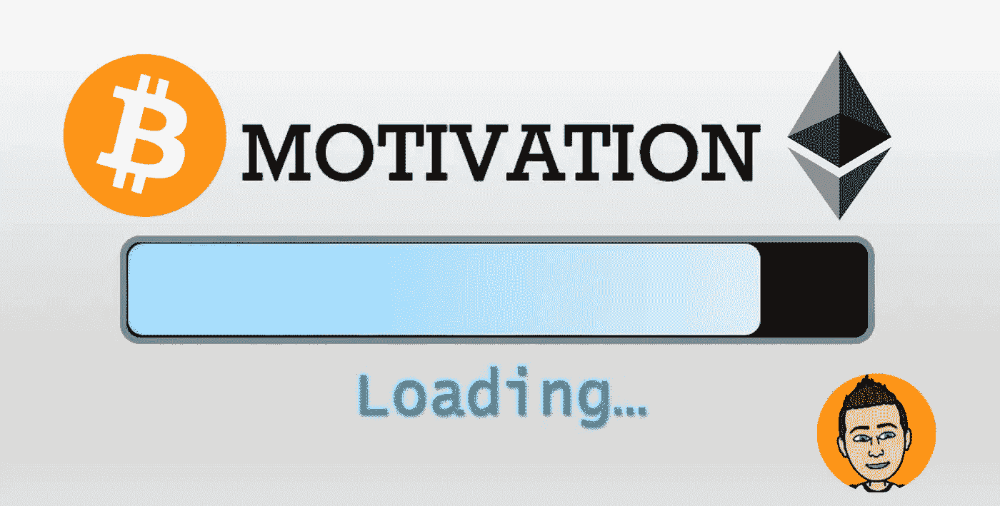

# 你需要具备的比特币动机

> 原文：<https://medium.com/coinmonks/the-bitcoin-motivation-that-you-need-to-have-a3940ffe6792?source=collection_archive---------26----------------------->

熊市不仅是建仓的时候，也是反思的时候。回顾上一个周期，你做得好的事情，以及你犯的错误。如果我们从不花时间反思自己的错误，我们又怎么能指望从中吸取教训呢？随着许多“专家”声称金融市场，包括加密，正处于全面崩溃的边缘，这意味着我们正在耗尽…