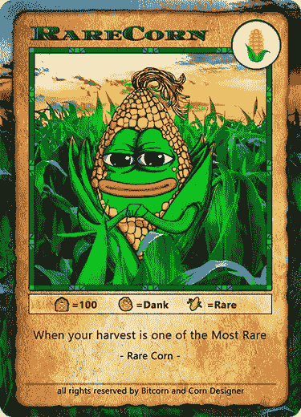

# 比特币悖论

> 原文：<https://medium.com/coinmonks/the-bitcoin-paradox-f5966bdfd75b?source=collection_archive---------41----------------------->

> 是时间链，不是区块链

*大写并不重要，但理解才重要*

我也不是一个作家…但是今天我决定成为一个作家，因为这是一个…嗯，什么是正确的词…这是一个灵光乍现的时刻？

# 什么是悖论？

悖论(直接来自 oogle-google)是一个看似荒谬或自相矛盾的陈述或命题，当被调查或解释时，可能被证明是有根据的或真实的。

让我们过一会儿再回到这个话题。

我刚刚通过我的同事发现了 timechain，也就是俗称的区块链技术，我的同事刚刚从他的堂兄那里知道了它，我的同事的投资组合上涨了 1%，所以他现在是一个投资天才，对吗？他告诉我所有这些“超级酷”的硬币和代币，我可以买到它们来改变世界。他们将摧毁旧经济，而我们是新世界的先驱。天哪，我太激动了。我会变得非常富有。

我买哪一个？没关系。他们都要去月球。有一个项目是世界计算机，一堆其他的代币也是在它上面创建的。哦，还有这张照片上有一只狗，真可爱。哦，还有一只是另一只狗，哦，哇。哦，还有一种货币应该是比比特币更好的世界新货币。我为什么要把我爸爸辛辛苦苦挣来的钱投资在原版上，而我可以从这部电影中发财？哦，然后还有一个为了流动性的目的把它们连接在一起？我知道那是什么意思，但是我的朋友刚刚告诉我这个要去月球的。埃隆肯定与此事有关。哦，还有这个…

听起来熟悉吗？

我选哪个？为什么我不在黑暗中试一试，挑选一些照片很酷的照片，或者从 coinmarketcap 中挑选一些流行的照片…

也许我对这个领域并不陌生。我是 2015 年入行的。我的朋友告诉我关于比特玉米的事。当时我正在学习编码，对技术非常感兴趣。我读了白皮书，就像…哇哦…这是一些下一代无政府主义者储备货币置换欣快强烈的情绪波动——我最初的想法。

我不想投资原版。对我来说“太晚了”。采矿太贵了。这枚硬币已经是 2000 美元一枚了。不会吧。我可以投资这个赚钱。或者是那个。或者那边那个。哦，看看这个，这个比玉米好多了…

玩了几年市场，没赚到多少钱，有一个家庭要担心，所以我不断地卖出，然后在另一个硬币上跳回来。重复冲洗。

长话短说。我在 2017 年从那次事故中被搞砸了。对我来说太糟糕了。比如一万块的损失。这是我一生的积蓄。我告诉我老婆只有 1k…嘘。嗯，实际上你可以告诉她，因为她离开了我的纸手屁股，但主要是因为不同的原因。

不管怎样，这些年来我一直在市场上进进出出，看到一个又一个新项目，一个又一个新项目，一个又一个失败的项目，一个又一个失败的项目。黑了又黑。等等。你明白了。

值得注意的是，我已经阅读了我参与的大多数项目的白皮书。我研究了创始人。我看了一些代码。观察代码库。看了他们的推特账户。吞噬 reddit。我做了尽职调查。但我从未完全投入过，当我投入时，我会一次又一次地换手。这个项目那个项目。

快进到今天。在比特币上坐了大半天后，我开始听 Pomp 的播客。喜欢那家伙。在听了他一小时又一小时的内容后，我终于明白了…比特币悖论…

存在于那里的每一个时间链…都可以建立在比特币之上…

过了这么久，你想知道我投资组合的 99%是什么吗？比特… mf…玉米…

为什么呢？这其中的矛盾之处是什么？

时间链…这个词很重要。区块链。我们在讨论安全问题。稳定。适应性。别出心裁。连续性。不变性。想到任何一个 altcoin。想到任何项目。nft。不管怎样…所有的…所有的都可以放到比特币上。所有这一切都可以依靠比特币的外层。坐一会儿，停止阅读。所有这一切都可以依靠比特币。所有的一切。

好吧，你没有停止阅读，让我进一步向你推销。悖论。让我们回到这个词和它的关系。

大多数知识渊博(在加密领域)并且不在乎以美元形式赚取更多货币财富的人，大多都投资了比特币。他们可能持有一些其他 alt 作为虚拟保险，或者直接和离散地与比特币竞争，但仍然……他们的大部分投资组合都以比特币为权重。都是堆砌 sat。该死的美元。我们关心的是 sat。更多的 sat。更多的 sat。更多的 sat。

由于比特币时间链的长度，它是现存最安全、最分散的链条。我们迟早都会意识到这个事实。比特币可能永远不会停止存在，而且可能永远是老大。它有能力成为建造一切的技术。那么，为什么新来者会立刻分心，并开始过度多元化进入 sh*tcoin 项目呢？因为我们觉得，我们可能永远不会拥有像持有 100 或 1000 个比特币的乔·什莫(joe shmo)那么多。但最终，攀比是快乐的小偷。你可能永远也不会在正确的时间赶上子弹头列车，而不会失去一条试图在正确的时间上车和下车以超过乔·什莫的腿。你很可能会受到损害，失去更多的财富，因为你认为 xyz 币会是这样或那样，同时会赚 x 的钱…

兄弟…唉…没有上限…事实…在遥远的未来，比特币很可能价值数万亿。这是最安全的链条，而且很可能永远如此。这是这场比赛中的乌龟。带着你想骑的金色外壳。所有这些其他项目都是兔子。野兔最后输了。一旦比特币可以做到这一切，它将会，它将会在通往数百万、数十亿和数万亿的路上，当你可以跳上马车奔向你非常富裕的未来时，你很可能还在试图搭乘一辆子弹头列车。

我有很多聪吗？不能和某些人相比。但与那些试图跳上每一列经过的子弹头列车的人相比，绝对是这样。但这只是因为我终于明白了…等到比特币无所不能的时候，你可能早在几年前就想拥有它的大部分了。美元成本平均法的最佳时期是在昨天 3000 点左右。除非你认为子弹头列车是你的最佳选择，否则出发永远不会晚。但我真诚地希望你不要为了赶上进度而跳上跳下，结果被砍掉了一条腿。

这就是悖论。你开始接触加密货币/区块链/时间链技术。你立即开始学习它是如何工作的(希望如此)。你会想，哇，比特币太贵了，当我可以拥有更酷的比特币，我会变得超级富有的时候，为什么还要投资呢…是的，你会告诉自己，我可以保证一百万次。

矛盾的是，迟早，我们中最聪明的人，希望还有你，最终会骑在金海龟的背上。我们骑向我们的未来，在那里我们拥有我们财富的真正所有权，由有史以来最强大的分散网络来保护。然而，我们可能会扔一些硬币在兔子身上，试图赢得这里和那里的赌注。但是我们可以这样做，同时对自己咯咯地笑，因为我们知道我们拥有的可能是几百年后唯一重要的东西。

矛盾的是，把我们带进来的，却是我们最终最关心的。唯一一个诞生了这个未来和辉煌现在的是比特币。向你的上帝中本聪祈祷，感谢他为你编码的财富、安全和所有权。其他的一切都是令人分心的事情，而且风险极高(风险随着时间的推移而增加),因为为什么我们中的任何人会深入投资于除了可以做所有事情并且最安全的东西之外的任何东西呢？

欢迎来到比特币悖论。

附言

*   也许悖论不是一个合适的词，但它感觉像是一个合适的词，所以我要保留它。好的，再见。感谢阅读。
*   这里有一个小的 btc 钱包，如果你认为这是一本好书，你可以捐给它:
*   **BC 1 qsd q 9 C4 a7 ha 68 wa C4 t 76 LG 6 wqqiufmahzz 5 DDD 6 f**
*   此外，我去了一个非常小的学校，我很肯定我的智力受到了挑战，所以你可以随意撕这个，但我袖手旁观它。

把血氧饱和度叠加。

**n̷x̷s**