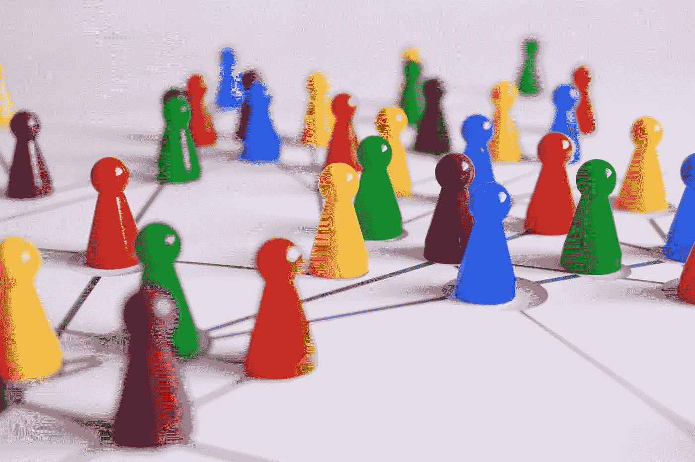

# 区块链和高等教育:安全、保障和可负担性？

> 原文：<https://medium.com/coinmonks/the-blockchain-and-higher-education-safety-security-and-affordability-e1f33a5fcc34?source=collection_archive---------62----------------------->

区块链是一项革命性的技术，正在撼动世界各地的行业。它有可能改变我们做生意的方式，也对教育产生巨大影响。在这篇博文中，我们将探讨区块链使教育受益的三种方式:学生记录、数字文凭和降低成本。

首先，我们必须首先定义区块链的工作定义。区块链是一个分布式数据库，允许安全、透明和防篡改的交易。区块链被称为“无信任”系统，因为它不需要第三方中介来验证或批准交易。这是可能的，因为区块链的权力分散，这意味着它不受任何一个中央当局的控制。

现在我们已经对区块链有了一个实际的了解，让我们来探索它是如何使教育受益的。

区块链是一个安全、透明和不可变的分布式数据库。这使它成为保存学生记录的完美工具。大学可以使用区块链存储成绩单、成绩和其他重要数据。雇主、学生和其他拥有适当权限的大学可以访问这些数据。区块链为学生记录提供了单一的真实来源，从而减少了欺诈并提高了透明度。过去，学生记录通常存储在纸上，这使得它们容易丢失或被篡改。此外，纸质记录往往需要经过漫长而繁琐的过程，这一过程的数字化将使访问这些文件更快。区块链提供了一种更安全的方式来存储这些数据。

为什么这很重要？区块链有潜力通过安全改革教育系统。通过提供一种安全、透明的方式来存储和共享数据，区块链可以帮助降低成本、提高效率，并促进学生、校友和雇主之间的协作，从而实现从学术界到日常工作的无缝过渡。

区块链的好处不仅限于学生成绩。区块链还可以用来创建防篡改和不可动摇的数字文凭。

数字文凭是区块链让教育受益的另一种方式。基于区块链的数字文凭防篡改，无法伪造。这对于想要验证求职者资格的雇主来说很有价值。对于那些希望与其他人共享证书而不必担心证书被篡改的学生来说，这也是很有价值的。

在数字文凭中使用区块链可以帮助雇主节省时间和金钱。无需要求发行机构认证纸质副本，只需要链接，这对于所有各方都更容易，因为不需要任何进一步的行动，因为文档是经过验证的、真实的且易于访问。在这种新型证书上存储记录有一个很大的好处；申请人不能伪造他们的学历证书，所以有价值的候选人只根据他们的证书被录用。

最后，区块链通过降低成本使教育受益。基于区块链的教育平台正在开辟以前不存在的负担得起的教育途径。这使得更多的人能够接受教育，这将对整个社会产生积极影响。例如，现在有一些平台使用区块链将学生与在线课程和其他教育资源联系起来。这些平台为传统教育模式提供了替代方案，并为那些可能无法获得优质教育的人开辟了新的机会。区块链正在发挥作用，使教育更容易获得和负担得起，这将对整个社会产生积极影响。有了区块链，我们可以创造一个教育程度更高、更加繁荣的世界。

此外，使用区块链代币可以为捐赠者提供一种直接支持学生和教育工作者的方式，从而有助于资助教育。

区块链显然对教育产生了积极影响。学生记录、数字文凭和更低的成本只是区块链发挥作用的一些方式。随着这项技术的不断发展，关注它非常重要，因为它有可能彻底改变我们学习和分享知识的方式。

区块链在教育中的潜在应用是广泛而多样的。通过利用这一技术的力量，我们可以创造一个更有效、更安全、更方便的教育系统，让所有社会成员受益。区块链技术有可能通过让教育变得更负担得起、更容易获得和更安全来彻底改变教育。感谢您的阅读！我希望这篇文章是有益的。

> 交易新手？试试[加密交易机器人](/coinmonks/crypto-trading-bot-c2ffce8acb2a)或者[复制交易](/coinmonks/top-10-crypto-copy-trading-platforms-for-beginners-d0c37c7d698c)