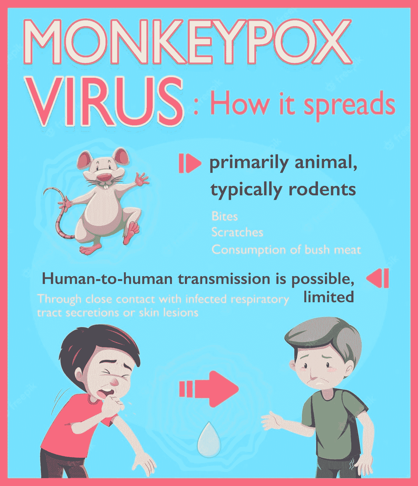

# 区块链以及它如何拯救我们免于猴痘

> 原文：<https://medium.com/coinmonks/the-blockchain-and-how-it-could-save-us-from-monkeypox-a1a2a99f9a01?source=collection_archive---------39----------------------->

Source: FreeImages

在最近的新闻中，一种潜伏了几个世纪的致命疾病爆发了。它被称为猴痘，并且正在卷土重来。如果区块链科技公司对此有什么可说的，那就不会了。区块链是一个去中心化的账本，可以用来记录几乎任何事情。

像比特币这样的加密货币是如何利用区块链技术的一个例子。但它的用途不仅限于数字货币和数字合同；任何时候你需要存储一些信息，并确保没有人可以访问或更改它，区块链将派上用场。

我将解释你需要知道的关于区块链的事情，以及为什么它能拯救我们免受猴痘病毒和其他疫情病毒的侵害！

# 什么是猴痘？

猴痘是一种传染性病毒疾病，可发生在人类和其他一些动物身上。症状包括发烧，淋巴结肿大，皮疹形成水泡，然后结痂。症状持续时间通常为两到四周。可能有轻微的症状，也可能在没有任何症状的情况下发生。儿童、孕妇和免疫系统受抑制的人出现严重病例的风险更大。除了疫苗之外，对猴痘没有特殊的治疗方法，建议人们休息和喝大量的液体。

# 区块链如何将我们从猴痘和其他病毒中拯救出来

区块链技术可以通过跟踪运动来帮助预防和抗击疾病的传播，如猴痘和其他疫情病毒。就猴痘而言，如果携带病毒的人去了另一个国家，区块链技术可以用来帮助当局跟踪此人的行动，以便在疾病传播之前将其控制住。

例如，如果一个人访问了一个存在猴痘的国家，后来被发现携带这种病毒，区块链技术可以用来准确跟踪这个人在哪里，以及他们乘坐了什么飞机、火车或公共汽车。这可以帮助卫生官员阻止疾病的传播。

# 区块链如何阻止疾病传播

除了跟踪运动，区块链技术还可以用来存储和显示关于疫苗接种的信息。如果一个人已经接种了某些疾病的疫苗，并且要去一个没有疫苗的地方旅行，区块链可以用来提供接种疫苗的证明。

例如，如果有人接种了疫苗，他们需要去一个存在猴痘的国家旅行并通过海关，区块链技术可以用来跟踪他们的接种。这有助于防止疾病的传播。

想象一下，世界卫生组织或约翰霍普金斯大学已经实现了一个通用的区块链，可以被世界上每个政府和卫生机构使用。

# 结论

区块链可能是自互联网以来最重要的发明。在未来，区块链技术可以用来跟踪病毒的传播，存储关于疫苗接种和其他健康数据的信息，甚至可以预防像猴痘这样的致命流行病。

> 那么，你觉得这篇文章有帮助吗？如果你喜欢我的其他文章，请给我买杯咖啡。为什么请我喝咖啡？没有第三方广告，没有附属链接，没有跟踪 cookies。只是诚实的内容。谢谢！给哈利买些咖啡。
> 
> 👉 [GearChain.io](http://www.gearchain.io) —零知识区块链和 SCM 的 DApp 构建者