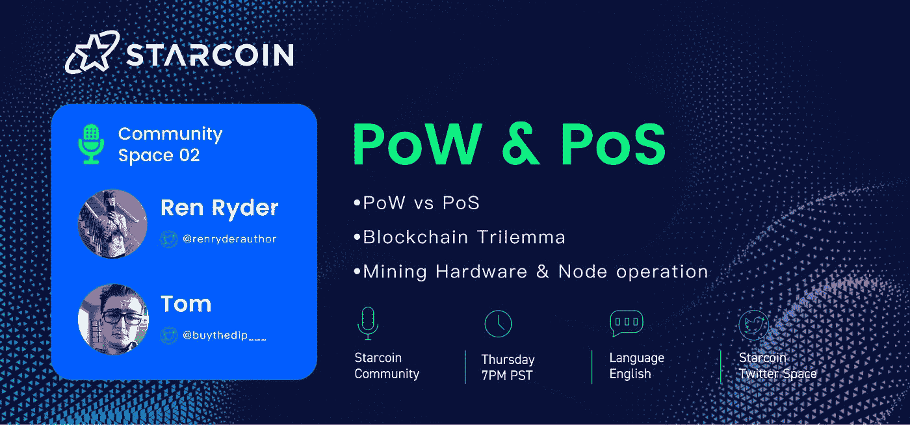
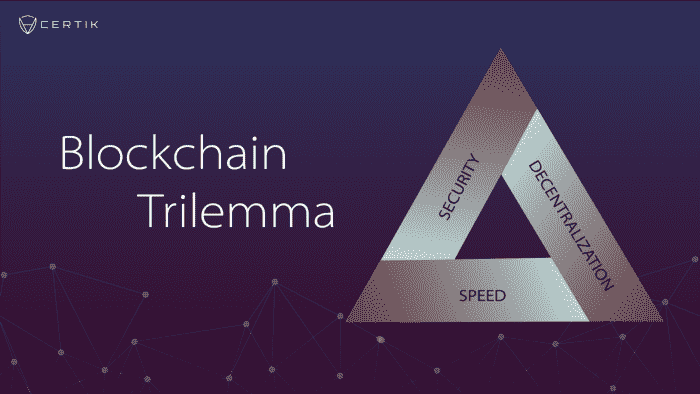
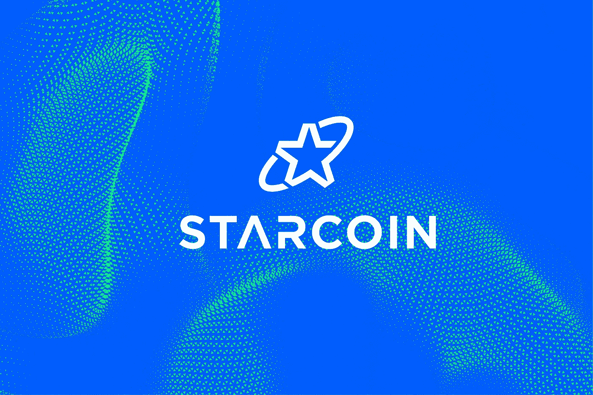
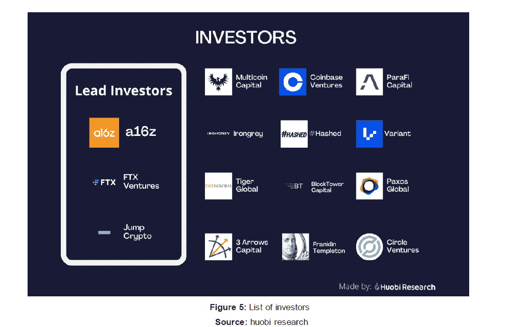

# (✨,✨)区块链三难困境，PoW vs PoS & Mining

> 原文：<https://medium.com/coinmonks/the-blockchain-trilemma-pow-vs-pos-mining-starcoin-blockchain-live-twitter-space-2-b71a17d17d45?source=collection_archive---------13----------------------->

# 区块链三难困境

最初由 Vitalik Buterin(以太坊的创始人)提出，区块链三难困境是加密领域理论上可解决的困境，它围绕三个原则:*去中心化、速度和安全*。求解等式的一部分会导致其他部分的成本，反之亦然。

> **去中心化**:区块链是去中心化的，当它不依赖于任何中心化的组件时，比如我们传统互联网中的 ICANN，或者 PoS 中用于块验证的大型节点。
> 
> **速度**:当以太坊这样的传统区块链扩大规模，网络被用户淹没时，随着用户争夺块空间，交易速度变慢，汽油费相应上涨。
> 
> 安全:一个安全的区块链可以抵御 51%和其他常见的恶意软件或 DDoS 攻击，不会受到错误代码或长时间停机造成的错误的困扰。

T om:

> Starcoin 是一个智能合约区块链网络，通过多层实现无限扩展。第一层保证安全和无权限，第二层实现面向应用的扩展，从而构建 Web3 和元宇宙的基础设施。
> 
> Starcoin 的第 1 层基于增强的 PoW，提供了一系列丰富的、可自由组合的、开箱即用的通用底层标准，包括 Token、DAO、NFT、Oracle 等。，一个分散的数字资产网络。
> 
> 通过面向资源的智能合约编程语言 Move，Starcoin 使链上所有资源成为一等公民，拆分并明确智能合约状态的归属，并提供对程序安全性进行形式化验证和数学证明的能力，尽可能保证用户链上财产的安全和自由。
> 
> Starcoin 的二层通过统一的架构抽象出不同的二层方案，不同的应用可以根据自己的需求选择不同的二层方案，实现无限扩展。

下面是一段摘录，详细介绍了直接来自 Starcoin 创始人 Tim 的 PoW & PoS 简介。

# 蒂姆:

> 理论上，PoW 和 PoS 都旨在解决如何在区块链中跟踪帐户(即生成新的块)的问题。通过算术能力的工作证明，矿工争夺跟踪新块的权利，并且竞争跟踪账户的权利的矿工接收由这个新块产生的奖励；每个公共链使用一个唯一的散列算法。PoW 最初是为了让普通 CPU 或者 GPU 挖矿而设计的。随着行业的发展，矿工或专用算术设备应运而生。PoW 的特点是门槛低，实现简单，不需要财务担保(赌注)，任何感兴趣的用户都可以参与。
> 
> 争夺记账记录的用户提交一定数量的资产，然后节点以随机方式分配记账权限，宣布更多令牌的用户获得更多奖励。如果用户在记录保存过程中不当对待系统，系统将扣押用户担保的所有资产。为了确保所有节点以诚实的方式参与挖掘，PoS 机制采用了基于兴趣的博弈机制。一方面目前 PoS 门槛比较高，需要一定的资产承诺，另一方面考虑到节点的数据规模和通信效率，普通用户实际上很难随意参与。

# 分权与集权:

更多的审查、更多的监控是监管机构进入加密领域的自然结果。随着数字货币在民族国家正式采用和创造数字货币(如美联储和萨尔瓦多等)的同时获得优先地位，个人对货币的使用将越来越受到监控，而美国等政府则隐藏其黑色预算，进一步剥夺了普通公民的权利，有利于企业精英。分散的工作证明区块链更加抵制审查，但随着监管压力的增长，所有连锁店将被迫决定是否屈服于日益增长的监管压力。

OFAC(外国资产控制办公室):由于与朝鲜有关的洗钱活动，对 Tornado Cash 的制裁是加密领域监管压力增加的一个典型例子。比特币混合器 Tornado Cash 是智能合约协议被贴上恐怖分子标签的第一个例子。随着这些压力的增加，区块链将不得不决定是否遵守越来越多的制裁名单，这越来越多地影响到加密货币领域越来越多的用户。

# 汤姆:

> 在当前基于 PoW 的公链中，PoW 不仅是一种安全的共识机制，也是一种令牌分发策略。在 PoW 链的经济模型中，代币首先被分配给矿工，然后被转移到其他生态系统。
> 
> 然而，对于像 BTC 这样以价值存储为目标的连锁店，这种模式可以形成一个生态闭环。但对于智能合约链来说，代币的价值取决于链上生态的繁荣程度，因此代币分发策略应该向上层生态应用倾斜，同时代币需要通过生态建设来分发，而不是简单地通过矿工来分发。
> 
> 从长远来看，基本的链上生态效益最终纳入国库。如果国库中的资金最终能够覆盖未来的 R&D 投资和矿工奖励，这意味着该链的经济模式已经自我启动。

# 那么，区块链的去中心化是什么样子的，为什么它如此重要？

对货币供应的控制意味着对人口的控制。当所有的基本必需品都需要货币时，政府严格控制货币供应的依据就变得显而易见了。银行里的钱可以被冻结、扣押、延期:我们全球金融体系的现状是完全可控的。这就是比特币和其他数字货币的自我监管如此重要的原因——它排除了中间商，让我们回到了易货经济。由于当前的社会经济环境，实物现金(纸币、硬币、货币)继续变得不那么流行，信用卡和数字货币正在占据主导地位。随着这种多方面的发展继续下去，重要的是 Web3 替代品继续出现，以对抗数字货币日益增长的审查。

## 密码存在的基础，以及它“打算”解决什么问题。

从 Web2 中央集权的核心要素转移到 Web3 基础设施，是各种民族国家的社会从 IMF、美联储和贸易融资、政治家和企业精英的旧卫兵手中夺取权力的道路。一种去中心化的硬加密货币能够抵御审查，并能够在监管压力不断增加的环境中发挥作用。一个完全去中心化的区块链是不可能关闭的，这是由它的性质决定的:它是如此的分散，以至于没有一个失败的临界点。

> 汤姆:股权证明是一种低劣的加密技术，是由少数关键组织控制的全球金融市场的影子副本。

# 星币是一个多层的区块链

L1:4600 TPS(~雪崩)

L2:ZK-近即时共识和两个数量级更大的交易能力的汇总。

Starcoin 实力的一个关键组成部分在于其核心团队以及他们在建设区块链时所做的决策。

乐观汇总最多需要 3-7 天来完成事务和同步层，而 ZK-汇总表示接近即时确认。除了对用户不友好之外，这种延迟也是许多新用户信任链上交互的障碍。尽管开发成本和难度可能较低，但在考虑区块链是否在应对区块链三难困境时有效扩展时，第 1 层-第 2 层扩展的乐观汇总是不够的。

*问:Starcoin Layer 2 上线后的预期表现如何？*

*答:Starcoin 第二层即时确认，第二层的交易会自动累计到第一层，需要 5-10 秒的上传时间。一般来说，第二层并不是一个无限可扩展的技术，一般的实现可以比第一层的性能高 2 个数量级。如果需要更高的性能，可以使用进一步的分层(如三层解决方案)来实现无限的可伸缩性。*

**star coin 第 2 层扩展的预计效率比其 4600 TPS 的 L1 高出两个数量级。最终，可以开发和部署第 3 层解决方案来实现无限的可伸缩性。**

Starcoin 的精神围绕着去中心化。一切都以分散的方式进行。这是一个真正的公共区块链，任何人都可以互动和参与。它的所有核心组件都是开源的，从最终用户的角度来看，它是真正透明和可验证的。星币是一个透明的、社区所有的区块链(由它的道提供动力)，这也是它最大的优势所在。

# 星币::行动

我们在上一篇文章中详细讨论了这一点，但 Move 是脸书专门为其区块链项目 Diem 开发的编程语言。随着大型加密金融公司播种区块链项目 Aptos 和 Sui，围绕 Move 编程语言的 L1 生态正在不断扩大。例如，Aptos 投资者包括:

# 汤姆在移动:

> Starcoin 拥有面向分布式金融网络的新一代分层智能合约。从设计之初，安全性问题就是最重要的考虑因素。一方面，Starcoin 希望解决常见的安全问题，另一方面，Starcoin 希望降低开发者的安全门槛。最终，Starcoin 选择了 Move 作为智能合约语言。Move 有很多优点，最大的亮点是安全性。Move 在不增加开发者负担的情况下，引入了很多针对智能合约场景的安全特性。
> 
> 不涉及太多技术细节，Move 的面向资源编程是一种全新的编程模式，可以轻松避免很多常见的安全问题，降低开发门槛。
> 
> 在 Solidity 项目中，每个人通过一个契约产生的数据都存储在一个集中的账户中。这是一种非常不安全的做法，有很大的安全风险。一方面，某个用户的个人数据集中存放在另一个账户是不合理的——另一方面，一旦合同出现安全问题，所有人的数据都会遭受损失。这种集中化的元素是 Solidity 的一个核心安全缺陷。
> 
> 在 Move 项目中，数据被分散存储在个人账户中，明确了数据的所有权属于各自的用户，同时只有他们可以主动操作自己的数据。这样数据分散存储，即使契约中有 bug，黑客也没有权限修改每个人的数据，大大缩小了漏洞的范围，保护了数据，同时避免了大数组带来的安全问题。
> 
> Move 引入了一个资源类型，从虚拟机层面保证资源类型遵循上述约束，既不能删除，也不能复制。开发者只需要简单地将该结构声明为资源类型，该结构就会受到虚拟机的保护，从而避免了很多常见的安全风险，比如内存复制导致的无限额外发行漏洞。

# 采矿

# 汤姆:

> **增强的星币共识:**
> 
> 了解区块链的人都知道，比特币一个非常大的亮点就是通过算法保证了人与人之间的基本信任。这就是我们所说的 PoW 共识，可以理解为一种算法信用体系，也是比特币的基石。相比 PoS 等其他集中式或半集中式的共识解决方案，星币坚定地选择了 PoW，以确保星币网络在去中心化条件下的安全性。同时，为了解决中本聪共识算法的一些局限性，进一步加强一层的安全性，Starcoin 对共识做了一些非常有趣的优化。
> 
> 星币共识是中本聪共识的加强版。为了加快分块生成和减少事务确认时间，引入了运行时数据如大叔分块率，它能以较低的延迟检测网络拥塞，并自动动态调整分块生成时间、难度和分块奖励，从而最大限度地利用网络，同时尽量避免网络带来的不确定性风险，同时减少用户等待时间，提高用户体验。当全网计算能力波动较大时，难度可以快速反应，起到保护星币网的作用。

# 矿用硬件> > > GPU、CPU、FGPA、ASICS

Starcoin 的共识来自 Cryptonight-R，这是 Monero 在转移到 RandomX 之前的八种变体之一。Starcoin 对 cryptonight 算法 cryptonight-rs 的采用仍然是一种 cpu 密集型算法，尽管有些困难，但制造商可以为其设计 ASIC 矿工。制造商 Goldshell 和 ST-box 的主要经销商 DXpool 在 2021 年的某个时候小规模生产了大约 2000 个 ST-box。由于新的、更大和更高效的矿工变体的生产严重依赖于制造商的巨额资本支出(约 300 万美元)，PoW 加密货币的市值越高，就越有可能成为目标。

我个人的想法是，未来几批 ASIC 矿机将不可避免地生产出来开采 Starcoin，但时间不确定。如果你对使用 gold shell ST-box 开采 starcoin 感兴趣，最佳做法是从可验证的分销商处购买——尽管要记住，由于库存有限，价格可能会有很大差异。

# 采矿池

层提供了一个框架，用于将许多矿工的集体哈希表引导到一个单独的池中。Starcoin 的网络目前由几个采矿池和剩余的“未知”hashrate 组成:hashrate 无法识别，但可以归因于那些节点采矿。

现有采矿池之间的 hashrate 分布如下:

凯勒波尔(33%)

DXPOOL (57%)

普林(10%)

总 hashrate 直接转化为抵御 51%攻击的安全性。由于矿池引入了一些集中化的元素，所以有一些关于邪恶问题的小问题:如果一个矿池捕获了足够多的 hashrate，并且他们有恶意，他们可以攻击他们想要保护的系统。然而，由于其费用结构产生的持续、不间断的利润流，矿池被激励为“好的”。由于任何原因，矿工可以随时通知将他们的哈希表转移到另一个提供商，因此，由于相对缺乏价值，矿池为了自己的利益攻击区块链的可能性很小，随着矿池在链的成功中获得既得利益，这种可能性会进一步下降。然而，将 hashrate 分散在可用的采矿池中以确保最坚硬、最分散的区块链仍然是有益的。这就是为什么较小的矿池&社区经营的矿池在单个矿池获得大部分 hashrate 的情况下提供了有价值的替代方案，特别是对于那些由于任何原因无法开采到自己的节点的技术含量较低的矿工。

# 运行您自己的节点和节点挖掘

[由社区成员 an_change 维护的精彩指南](https://wiki.starcoin.movemove.org/v/english/get-started/run-node/faq)，为那些有兴趣通过 docker、windows 或 ubuntu 运行 Starcoin 节点的人提供了清晰的演练。分散的节点阵列是繁荣的区块链的重要组成部分。独立链验证:运行完整节点会创建链的完整副本。节点越多，网络就越坚固、越安全，并且可以抵御恶意节点/参与者。此外，有可能在本地挖掘自己的节点，根据我自己的说法，这对于那些寻求技术挑战的人来说是一个有价值和有回报的前景。

*这就是 Twitter 空间#2 的总结，由 star coin block chain(Ashely&lemon hx)进行，由 Tom 和我主持。请继续关注下一期，它将于 9 月 16 日 22 日在我们的下一个空间之后发布。*

(✨,✨)

~任

> 交易新手？试试[密码交易机器人](/coinmonks/crypto-trading-bot-c2ffce8acb2a)或[复制交易](/coinmonks/top-10-crypto-copy-trading-platforms-for-beginners-d0c37c7d698c)