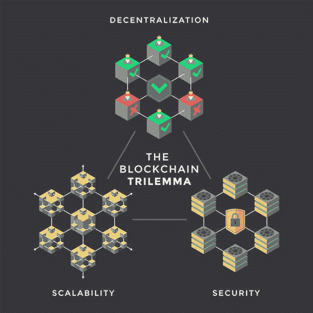

# 区块链困境——什么是区块链，如何解决

> 原文：<https://medium.com/coinmonks/the-blockchain-trilemma-what-is-it-and-how-to-solve-it-66fe7c19a830?source=collection_archive---------30----------------------->

**Source: FreeImages**

区块链三难问题是所有分散系统都必须解决的一个众所周知的问题。概括地说，这种三难困境——也称为权衡三角形或不可能性定理——指的是任何区块链系统都必须平衡的冲突目标，以便同时保持安全性和可伸缩性。让我们深入研究一下。

# 什么是区块链三难困境，如何解决？

这个术语来源于困境，即在两个或更多困难或不利的选择中做出选择。三元悖论的定义是三个选项中的一个困难的选择。区块链三难困境就像是第 22 条军规或权衡取舍，必须在任何区块链网络的以下三个主要目标之间做出选择:去中心化、可扩展性和安全性。

# 分散

分散化的定义很简单:它指的是系统中节点的数量。有很多全节点的网络比没有几个全节点的网络更分散。如果你的平台不是分散的，你将仍然是一个集中的和秘密的系统的一部分。

你的区块链平台应该让任何坏演员几乎不可能接管 51%的攻击。节点总数、成为一个验证节点的要求以及赌注饱和限制都取决于您的平台的集中或分散程度。

# 可量测性

可扩展性是指网络在特定时间内执行计算的能力。如果您的平台不可扩展，您只能与小型网络进行交易，这意味着您无法扩展到全球级别。可伸缩性取决于块大小、新块时间、每秒事务(TPS)和事务成本(或汽油费)。

为了构建一个可扩展的区块链平台，可以实施扩展解决方案，如第 1 层的[分片](https://learn.block6.tech/how-to-achieve-scalability-in-blockchain-layer-2-sharding-a384ea24ee69?source=your_stories_page-------------------------------------)或第 2 层的嵌套区块链、侧链和汇总。

# 安全性

你的区块链平台应该受到很好的保护。如果坏人控制了你的平台，那么包括财务和应用程序数据、你的项目声誉、社区等等一切都将崩溃。

因此，为了构建良好的安全基础设施，在您的平台中实现良好的一致性算法是至关重要的。查看流行的共识算法，如[利益证明(POS)、委托利益证明(DPOS)、纯粹利益证明(PPOS)](https://learn.block6.tech/what-is-a-consensus-algorithm-and-why-does-it-matter-36b64c3785bb?source=your_stories_page-------------------------------------) 以及[实用拜占庭容错(pBFT)和 RAFT](https://learn.block6.tech/what-the-byzantine-generals-problem-in-blockchain-means-and-how-to-solve-it-d97045662eb4) 。此外，您的智能合同应该经过严格审核。

# 行业合规的区块链三元悖论。

对于行业中的一些人来说，实现所有这三个方面几乎是不可能的，或者可能需要以不同的方式处理。一些企业在访问区块链网络时甚至可能不会寻求分散化。

数据隐私问题和法规，如 [HIPAA](https://www.cdc.gov/phlp/publications/topic/hipaa.html) 、 [CCPA](https://oag.ca.gov/privacy/ccpa) 和 [GDPR](https://gdpr.eu/) 通常会阻止企业在完全分散的网络上运营。即使使用模糊处理或加密，某些商业信息也是如此敏感，以至于不能在任何级别上披露。您可能还会认为区块链的某些方面是分散的，而其他方面仍然是集中的。

这就是为什么像金融和医疗保健这样的行业因为法规遵从性而非常谨慎，因此更喜欢许可的网络和集中的数据存储。也就是说，在 Defi 的金融行业中有许多创新者，同时遵守国内和国际法律和标准。

物流、零售和供应链行业也受到区块链的干扰。全球运输商和制造商正在部署[工业 4.0 计划，](https://www.forbes.com/sites/bernardmarr/2018/09/02/what-is-industry-4-0-heres-a-super-easy-explanation-for-anyone/?sh=19ee52a89788)利用私有区块链来保护他们的闭环供应链。然而，完全没有许可、不可信的区块链可以增强跨行业合作，并通过通用协议刺激更广泛地利用技术突破。后者是我正在努力的领域。

# 最后的话

自 2016 年维塔利克·布特林首次提出区块链三难理论以来，区块链技术取得了显著发展。幸运的是，你经常可以找到许多突破性的好消息，甚至可以找到一些声称他们已经解决了问题的区块链网络。这些解决方案可能对您有所帮助，并且根据您的项目需求，您可以精心制作甚至更好的东西！🧑‍🚀

> 那么，你觉得这篇文章有帮助吗？如果你喜欢我的其他文章，请给我买杯咖啡。为什么请我喝咖啡？没有第三方广告，没有附属链接，没有跟踪 cookies。只是诚实的内容。谢谢！给哈利买些咖啡。
> 
> 👉 [GearChain.io](http://www.gearchain.io) —供应链管理的零编码区块链和 DApp 构建器

> 交易新手？试试[密码交易机器人](/coinmonks/crypto-trading-bot-c2ffce8acb2a)或[复制交易](/coinmonks/top-10-crypto-copy-trading-platforms-for-beginners-d0c37c7d698c)