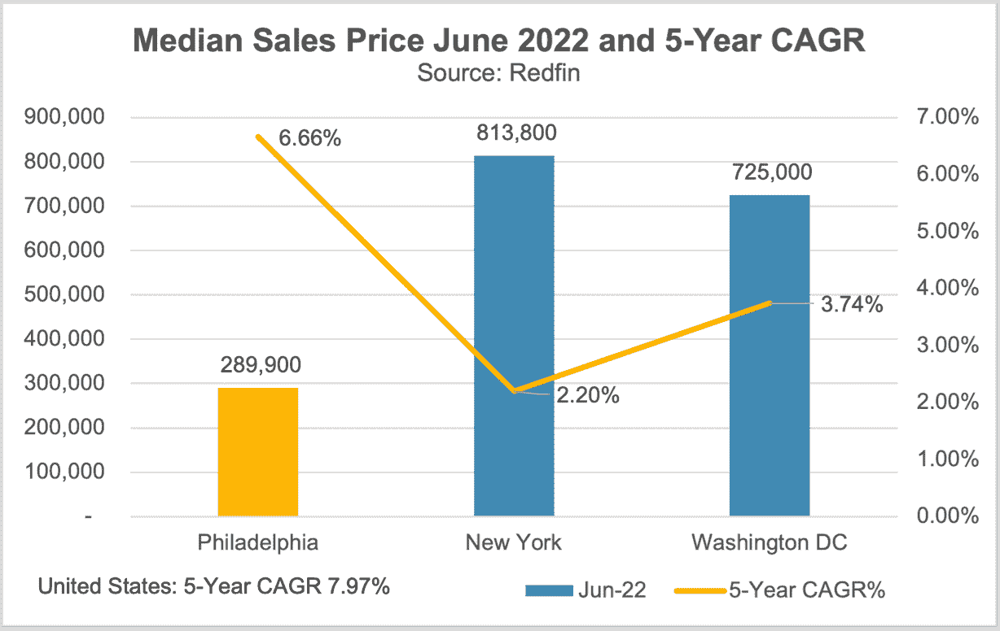
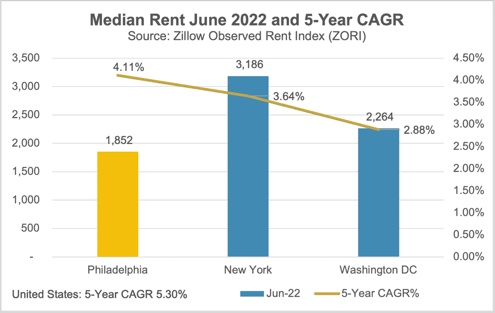
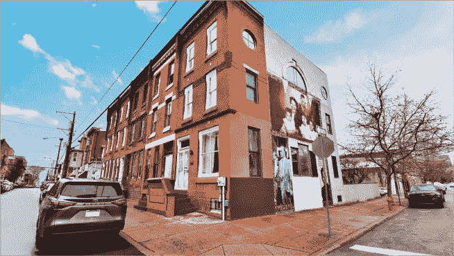
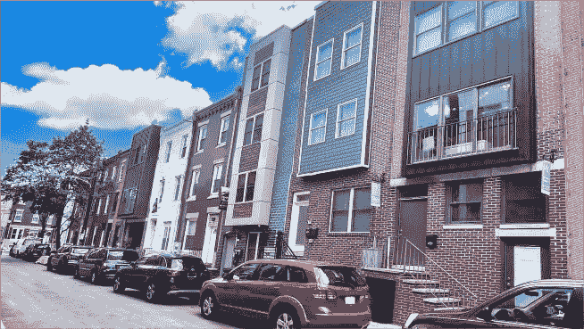
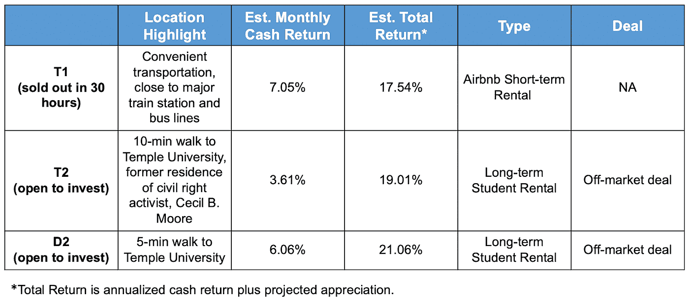

# 蓬勃发展的费城房地产市场

> 原文：<https://medium.com/coinmonks/the-booming-philadelphia-real-estate-market-523a9e24eed7?source=collection_archive---------14----------------------->

当你想到费城时，你会想到什么？兄弟之爱之城，独立宣言还是费城 76 人队？费城以其文化景观而闻名，现在正将其重点转向尖端思维，并转变为一个现代化的大都市。

它是全国人口第六多的城市(157 万)。平均年龄为 34.6 岁，约 31.2%的人口拥有学士学位或更高学位。多元化的经济继续为其居民创造更多的就业机会，并促成了今年 5 月 4.0%的历史低失业率(低于去年的 6.5%)。

区位优势、人口结构和经济动态促成了费城房地产市场在过去 5 年的稳定增长，我们预计在未来几年，受 **3 个主要宏观社会经济驱动因素**的影响，费城房地产市场的表现将会更加强劲。

**驱动因素 1:费城现在是下一代国家生命科学创新中心的所在地，带来了大量的人才流入和引人注目的就业机会。**

费城因其门口有大量的研究设施和学术团体而闻名。位于大学城附近的宾夕法尼亚大学和德雷克塞尔大学将被改造成一个以研究为导向的住宅和商业区，拥有高增长的公司、技术和创意初创企业。生命科学将是大学城未来腾飞的重点。

在大学城附近，费城学生人数最多的另一所著名大学天普大学(Temple University)也在医疗保健领域努力创新，将机器人和人工智能技术引入临床实践。这些大学共同带来的研究力量，尤其是在疫情之后，将费城定位为一个崛起的国家创新中心。

在过去 10 年中，大学城的房地产开发投资超过 50 亿美元。 [**Ark7 现在在费城提供 3 处房产**](https://www.ark7.com?tc=ACQD5) ，都靠近大学和研究机构，有稳定的租金收入。

**驱动因素 2:作为主办城市之一，费城将在社会生活的各个方面举办 2026 年世界杯，预计将带来 1.6 亿至 6.2 亿美元的经济增长和不断增长的房地产市场。**

费城一直是体育迷的理想居住地，因为它是北美“四大”主要体育联盟的十三个主办城市之一。

作为 2026 年美国世界杯的 11 个主办城市之一，费城将获得千载难逢的机会，在世界舞台上大放异彩，吸引全球数百万游客和数十亿球迷观看比赛。

根据波士顿咨询集团(BCG)的一项研究，2026 年国际足联世界杯的各个主办城市将获得约 1 . 6 亿至 6 . 2 亿美元的增量经济活动。费城可以期待看到更多的就业机会和工人收入的增加，特别是在城市的基础设施，交通，零售和酒店业，以及生活环境的改善。

国际体育赛事通常也会给主办国或主办城市的房地产市场带来积极影响。2012 年，伦敦被选为奥运会的主办城市，在奥运会之前，伦敦的房地产价格上涨了 26%,而这种情况在奥运会之后还在继续。当 2026 年临近时，费城预计也会出现类似的趋势。

**驱动因素之三:费城 2035 年规划概述了该市对可持续发展和卓越生活品质的愿景，这是费城一项为期 20 年的综合发展计划，预计将在大约 10 年内为该市带来 70 万新居民。**

该计划由费城城市规划委员会制定，旨在通过利益相关者的投入和广泛的研究来塑造费城的未来。该计划分析和实施战略，以确保城市的 18 个规划区经历长期的可持续性和在全球舞台上的竞争力。

一个强大的大都市中心、多样化的社区和工业遗产区已经被确定为费城城市发展的三个领域。

Philadelphia2035 目前围绕三大主题组织:繁荣、联系和更新。Thrive 关注经济发展问题，以解决住房、就业和闲置土地问题，帮助费城建设健康的社区，创造就业机会，为该市带来新公司或发展现有公司。Connect 关注公共交通和公用事业，以改善地铁、公共汽车、电车和火车，并使公用事业适应更多用户和更好的能源消耗。Renew 强调城市中的自然和历史，以扩大供居民娱乐的公园和小径，并改善城市的人行道、公园和公共空间。

该计划不可或缺的一部分是增加所有行业的就业机会，预计到 2035 年将有 70 多万人居住在该市，这将创造更多的住房需求，并促进费城房地产市场的长期发展。

**三大宏观社会经济驱动因素可能会使费城成为一个更加强大的租房市场，目前有 46%的家庭出租而不是拥有自己的主要住所。一些关键指标进一步帮助我们放大费城现有的房地产市场，并让投资者更好地了解其长期投资潜力。**

费城是一个投资者可以找到特殊租售比的市场，特别是与附近的纽约或华盛顿特区等东北城市相比。2022 年 6 月费城的租售比为 0.63%(租金中位数除以房屋价值中位数)，高于全国平均水平(0.46%)、纽约(0.39%)和华盛顿特区(0.31%)。

目前的销售价格中位数为 289.9 美元(6.66% 5 年期 CAGR)，目前的租金中位数为 1852 美元(4.11% 5 年期 CAGR)。事实上，这里的销售价格并没有过热，未来有更大的升值潜力。近三年的销售价格比超过 99%，与 2020 年同期相比，上市天数中位数从 49 天减少到 32 天。

(data source: redfin.com and zillow.com)

费城通常被认为是租房和买房都很实惠的地方。其租金收入比在 2020 年为 26%，远高于全国平均水平(租金中位数占家庭收入中位数的百分比)。费城的住房负担指数(HAI)在 2020 年是 217，这表明一个中等收入的家庭有足够的收入(多 117 倍)来申请中等价格住房的抵押贷款。

最后但并非最不重要的是，宾夕法尼亚州是一个对房东友好的州，没有州政府强加的租金控制或限制。从法律上讲，房东可以行使权利，驱逐 10 天后未能按时支付租金的租户，这是一项投资者应该密切关注的租赁政策。

Ark7 现在在费城提供 3 处房产，每月现金分配高，升值前景好，可以增加你的投资组合，对冲通货膨胀。

Photo of T1

Photo of T2

Photo of D2

T1 首次向投资者发售，仅 30 小时就销售一空。我们随后收购了 T2 和 D2 市场，以应对费城的受欢迎程度，他们现在开始投资。

[**今天报名**](https://www.ark7.com?tc=ACQD5) 抓住费城投资机会。

脚注:

这些主要的运动队是美国职业棒球大联盟(MLB)的费城费城人队、国家橄榄球联盟(NFL)的费城老鹰队、国家篮球协会(NBA)的费城 76 人队和国家曲棍球联盟(NHL)的费城飞人队。

住房负担能力指数(HAI)是由美国全国房地产经纪人协会提供的，指数为 100 意味着中等收入家庭的收入正好足够申请中等价格住房的抵押贷款。

综合家庭收入指数为 120.0 意味着中等家庭收入的家庭有 120%的必要收入，有资格获得覆盖中等价格现有单户住宅 80%的传统贷款，假设首付为 20%。

> 交易新手？尝试[加密交易机器人](/coinmonks/crypto-trading-bot-c2ffce8acb2a)或[复制交易](/coinmonks/top-10-crypto-copy-trading-platforms-for-beginners-d0c37c7d698c)