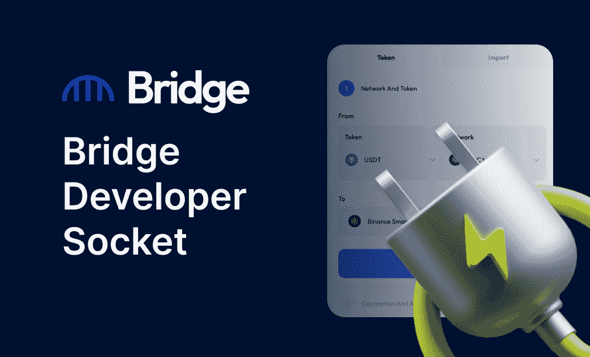

# 桥接套接字:在任何 dapp 中实现跨链功能

> 原文：<https://medium.com/coinmonks/the-bridge-socket-enabling-cross-chain-functionality-into-any-dapp-73d16e4d2af9?source=collection_archive---------18----------------------->

## Soket 是开发人员的一个工具，帮助他们在任何 dapp 中插入和启用跨链功能。

Interoperability

我们生活在互操作的时代，但是仍然有许多 web3 项目仍然在努力与其他链连接，所以今天，我很高兴地介绍 [**桥插座**](https://github.com/bridgeNetworklabs/bridgeContract/blob/master/contracts/socketDocumentation) 。这种即插即用的解决方案允许任何 dapp 将跨链桥接功能集成到其应用中，而无需构建和管理复杂的跨链基础设施。该插座可用于 dex、跨链农业、借贷、市场等等。

一旦集成，插座**产生费用**在桥接网络和 dapp 之间分配。这给了 dapps 一个额外的收入来源，因为他们的用户与应用程序交互。

桥套接字协定是一个无状态的协定，它不持有令牌余额。它与多个网桥网络核心合同交互，但不是核心合同本身的一部分。有了 Bridge Socket，项目可以将 Bridge Network 的功能直接集成到他们的 dapps 中，并为他们的用户提供简单、安全和高效的跨链体验。

几个项目已经开始集成来自私人发布的测试版的桥插座。我们很高兴向更广泛的社区开放这一点，以推动互操作性向前发展。

**如何集成桥插座**

要集成套接字，请在此查看完整的 GitHub 文档:

 [## 主 bridgeNetworklabs/bridge contract 上的 bridge contract/socket documentation

### 此文件包含双向 Unicode 文本，其解释或编译可能与下面显示的不同…

github.com](https://github.com/bridgeNetworklabs/bridgeContract/blob/master/contracts/socketDocumentation) 

与插座团队联系，寻求合作伙伴关系和技术支持等。，请在这里随意提交您的信息 [**。**](https://forms.gle/2HNhXNu4ob2qBUzK8)

***联系我们待*** 更新

网址:[https://www.bridgenetwork.com/](https://www.bridgenetwork.com/)

电报:[https://t.me/BridgeNetwork0x](https://t.me/BridgeNetwork0x)

推特:[https://twitter.com/bridgenetwork0x](https://twitter.com/bridgenetwork0x)

不和:[https://discord.com/invite/PGHnWapB8u](https://discord.com/invite/PGHnWapB8u)

https://www.reddit.com/r/bridgenetwork0x/

> 交易新手？试试[密码交易机器人](/coinmonks/crypto-trading-bot-c2ffce8acb2a)或者[复制交易](/coinmonks/top-10-crypto-copy-trading-platforms-for-beginners-d0c37c7d698c)