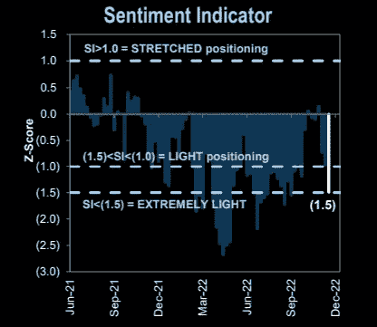
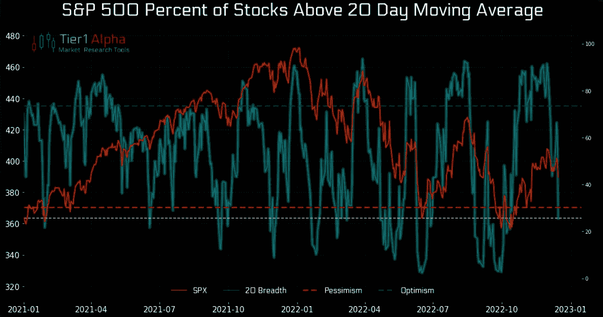
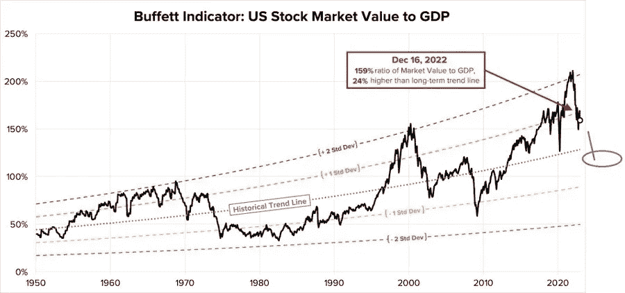
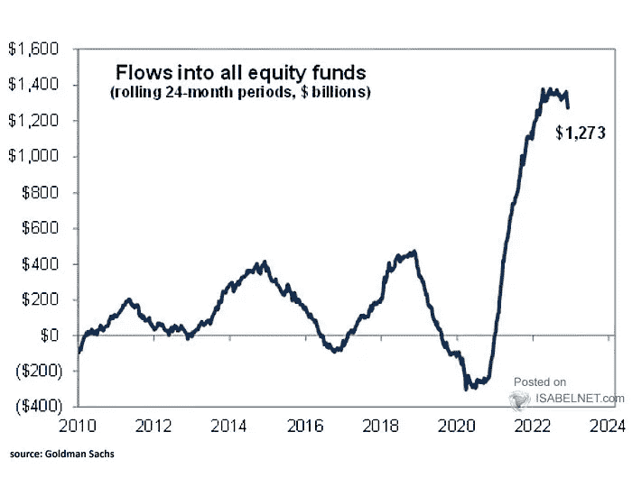
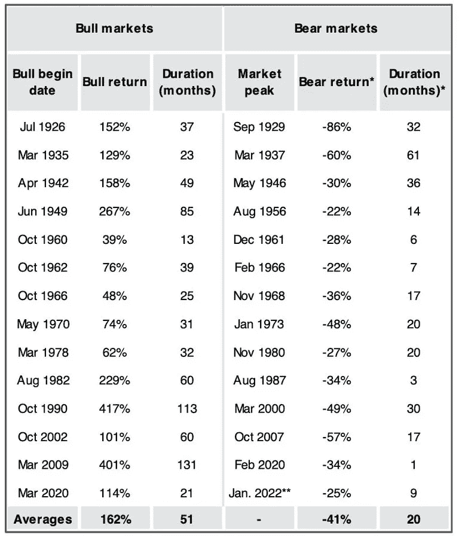
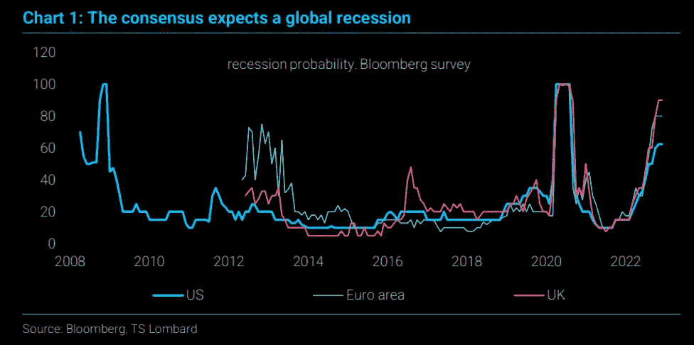

# 巴菲特指标，熊市回报，通货膨胀一波接一波

> 原文：<https://medium.com/coinmonks/the-buffett-indicator-bear-market-returns-inflation-comes-in-waves-f8f7d5d254f3?source=collection_archive---------30----------------------->

嘿，我是基兰！市场又将迎来新的一周，以下是需要注意的关键事件，以及来自投资银行的最有趣的宏观研究。我希望能在本周的[贸易挑战](http://www.traderseed.io/)中与你交谈，并且一如既往，如果你有任何问题，请在下面给我留言。

# 每周观察列表

在上周的重磅经济日历之后，本周的事件应该影响较小，然而市场往往会在你最意想不到的时候震惊和惊讶。在数据方面，我们将在周二获得美国住房市场健康状况的最新数据，周四获得美国国内生产总值，周五获得个人收入和支出数据。

> 多样化的密码持有，了解[币安替代品](https://coincodecap.com/binance-alternatives)

# 宏观视角

**人气极端买。**在上周的股票突破尝试和随后的失败之后，许多人已经被清算，根据高盛的情绪指标(衡量“零售、机构和外国投资者相对于过去 12 个月的股票头寸”),头寸“极其清淡”。读数低于-1.0 或高于+1.0 表明极端头寸，这对预测未来回报具有重要意义。”

**坏广度又回来了。**几个时段内从乐观到悲观的水平。高于 20 天移动平均线的股票百分比大幅下跌。标准普尔 500 指数成份股中，目前只有 66%仍坚守 50 天均线，而此前这一比例为 90%。

**巴菲特指示器。市场仍然被高估。**有点长远眼光。当美国股市市值/ GDP 比率波动到另一个极端 20%到 30%时，熊市通常会结束……当前的市场仍然被严重高估。

还没有投降。为什么市场仍可能被高估？嗯，正如我们从流入股票基金的资金中看到的那样，尽管所有的悲观情绪，我们仍然没有看到资金回流那么多。

**熊市回报。**回到 1926 年，牛市平均回报 162%，熊市平均亏损 41%。标准普尔 500 指数目前从历史高点下跌了 25%。

**衰退是共识。对 2023 年全球经济的共识是相似的，都预测停滞或轻度衰退。正如我们所知，这种共识通常是错误的，如果我们看到一场全球衰退，这将是每个人都预期的第一场衰退。**

通货膨胀是波浪式发展的，我们刚刚看到了第一波。这是一个很好的长期图表，值得深思。如果这十年像上世纪 70 年代那样发展，我们只是刚刚开始。

我希望你觉得这很有趣，很有用。**我每周一写这个简讯**，所以**一定要关注我**！像往常一样，把风险管理放在第一位，安全交易，保持敏捷。

祝你一周愉快！
基兰
**www.traderseed.io**

想交易本周的市场吗？ 100k 程序从 **$75** 开始！！点击这里查看新节目 [**！**](http://www.traderseed.io/)

[**查看节目**](http://www.traderseed.io/)

> 交易新手？尝试[加密交易机器人](/coinmonks/crypto-trading-bot-c2ffce8acb2a)或[复制交易](/coinmonks/top-10-crypto-copy-trading-platforms-for-beginners-d0c37c7d698c)
> 
> 分散加密持有量，了解币安的替代方案
> 
> 加入 Coinmonks [电报频道](https://t.me/coincodecap)和 [Youtube 频道](https://www.youtube.com/c/coinmonks/videos)获取每日[加密新闻](http://coincodecap.com/)

## 另外，阅读

*   [复制交易](/coinmonks/top-10-crypto-copy-trading-platforms-for-beginners-d0c37c7d698c) | [加密税务软件](/coinmonks/crypto-tax-software-ed4b4810e338)
*   [网格交易](https://coincodecap.com/grid-trading) | [加密硬件钱包](/coinmonks/the-best-cryptocurrency-hardware-wallets-of-2020-e28b1c124069)
*   [密码电报信号](/coinmonks/top-3-telegram-channels-for-crypto-traders-in-2021-8385f4411ff4) | [密码交易机器人](/coinmonks/crypto-trading-bot-c2ffce8acb2a)
*   [最佳加密交易所](/coinmonks/crypto-exchange-dd2f9d6f3769) | [印度最佳加密交易所](/coinmonks/bitcoin-exchange-in-india-7f1fe79715c9)
*   [面向开发者的最佳加密 API](/coinmonks/best-crypto-apis-for-developers-5efe3a597a9f)
*   最佳[密码借贷平台](/coinmonks/top-5-crypto-lending-platforms-in-2020-that-you-need-to-know-a1b675cec3fa)
*   [免费加密信号](/coinmonks/free-crypto-signals-48b25e61a8da) | [加密交易机器人](/coinmonks/crypto-trading-bot-c2ffce8acb2a)
*   杠杆代币的终极指南