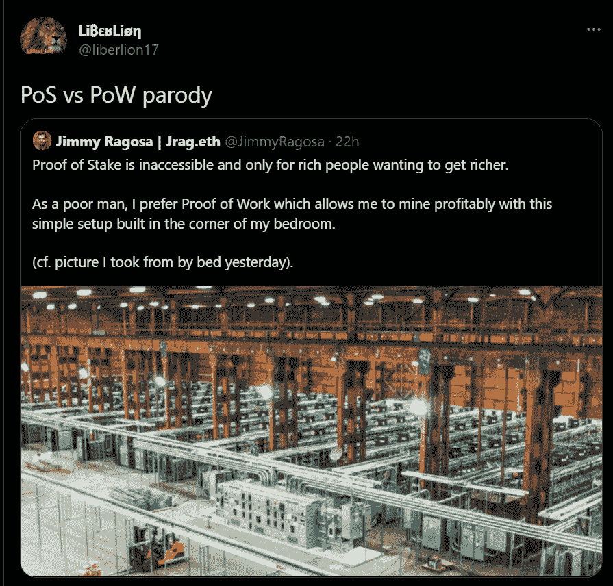

# 共识中的拜占庭将军问题

> 原文：<https://medium.com/coinmonks/the-byzantine-generals-problem-within-consensus-b33b8a2253ad?source=collection_archive---------10----------------------->

拜占庭将军问题，也称为拜占庭错误，是分布式计算系统的一种情况，它被开发来描述一致性和完整性的情况，在这种情况下，为了避免系统的灾难性故障，参与者必须就协调一致的策略达成一致，但要知道这些参与者中的一些可能不值得信任。

> 从顶级交易者那里复制交易机器人。免费试用。

在拜占庭故障中，诸如服务器之类的组件可能看起来出现故障并且工作不一致，但是检测系统无法检测到，这使得其他组件很难声明它无法将其从网络中排除。拜占庭容错(BFT)是计算机系统对这种情况的抵抗力。

拜占庭将军问题是由美国计算机科学家 Robert Shostak 在 20 世纪 70 年代末提出的，然后在 1982 年与科学技术研究中心[的 Leslie Lamport 和 Marshall Pease 合作开发的。](https://lamport.azurewebsites.net/pubs/byz.pdf)

# 问题的陈述

拜占庭军队的将军们包围了一座敌人的城市。他们和各自的部队在周围保持一定的距离，不能决定是进攻还是撤退。战争计划需要协调，否则他们很可能会输掉战斗。

军方高官怀疑他们中至少有一个叛徒，这使得他们很难一起做出决定。

一个将军可以向其他人发送一条消息，宣布他将发起攻击，而实际上他打算下令撤军，并导致其他人失败。

但是怎么同意呢？

问题是找到一种算法，保证忠诚的将军们达成一致，并且是协调一致的多数。

研究表明，仅使用消息，这个问题是可解的，当且仅当三分之二以上的将军是忠诚的。例如，前述作者在他们的研究中解释说，当一个叛徒可以迷惑总共六个忠诚的将军中的两个，即一半的将军时，问题就出现了。

这个简单表达式的解决方案是有问题的，为了解决这个问题，研究人员提供了一系列方程和算法，这些方程和算法通过一个“不可侵犯”的消息系统进行传输，即加密。

# 区块链拜占庭将军问题

在任何分布式计算系统中，缺陷几乎是不可避免的。假设有一次停电，节点突然下线，或者有一个恶意的行为者想要对系统造成破坏。网络能否继续正常运行并继续支持可靠的通信？还是整个系统突然停止工作或者变得容易受到攻击？

在中等安全的网络中，一些简单的事情，如一些节点离线，对网络没有明显的影响。抵御这些场景的能力被称为拜占庭容错。能够处理更多拜占庭故障的网络被认为具有更高的容忍度，这意味着它们比那些不能处理它们的网络更安全。

总账分布在一个区块链网络上，在世界各地都有若干台计算机(节点)，每一个街区都有即时更新，这样每一个利益相关方都可以信任那个网络上记录的交易。

因此，这个想法是，每个拜占庭将军(每个节点)都有他的每个同事的计划的完整副本(区块链的账本)，那么拜占庭的错误，背叛的产物，实际上是零。

当每个人都同意他们有相同的结果，然后节点验证一个块。即使有人想引入错误的信息——这就是拜占庭将军的问题所在——他也不能这样做，因为每个人都有相同的信息，并认为这是事实，这导致了共识。这是一个 BFT 系统，它是通过共识算法实现的，该算法运行在存储所有分类账信息的网络的每个节点上。

不能容忍拜占庭错误的系统的典型后果是区块链分叉。如果一个系统是容错的，这意味着尽管存在故障(在这种情况下是恶意节点),系统的成功将是可能的，当然，只要这些故障不是“太多”。

# 用工作证明和利害关系证明解决拜占庭将军问题

工作证明(PoW)是区块链技术的先驱，利益证明(PoS)是一种替代的创建后共识算法。

PoS 最初由 [PeerCoin](https://peercoin.net/) 和 [Nxt](https://nxtplatform.org/) 分别在 2012 年和 2013 年实现，旨在避免 PoW 的一些已知弱点，最明显的是硬件成本和功耗。

在 PoW 协议中，新的交易和加密货币的发行通过挖掘在账本上结算，其中矿工与计算能力竞争来伪造每个区块。

另一方面，在 PoS 中，验证者节点是随机选择的，但是对于分配了更大委托量的节点来说更“幸运”,因此池操作者用他们的加密货币资金竞争吸引新的委托者，与他们分享每个伪造块的奖励。

PoW 产生了一种过度激励，在这种激励下，矿工(共识的唯一参与者)获得加密货币的发行和每个区块的交易费。他们有“赢家通吃”的计划。

PoS 验证机不需要昂贵的采矿设备，只需要一台标准计算机、一个互联网连接和保持授权策略的活跃性。

像战俘一样，波斯也解决了拜占庭将军的问题，尽管手段不同。算法中确定了对拜占庭故障的容限。

PoS 使分布的和不协调的“将军”(生产者节点)能够基于共识算法达成一致，这对于 Cardano 来说是 Ouroboros，尽管事实上通信不是瞬时的并且发送了潜在矛盾的信号:

*   将军们通过存放他们的货物成为验证者。
*   预设算法选择一个将军作为下一个块的验证者。
*   该协议然后选择另一个将军成为验证者，引用前一个块形成一个增长链。因此，很明显，大多数将军都致力于打造和验证最长的链条，以及最密集的区块。
*   将军们知道，在 PoS 共识算法下，每个区块创建的速度越快，一段时间后，他们将能够判断是否有足够多的将军在同一条链上工作。

这以更有效和环保的方式解决了拜占庭将军的问题，消除了与 PoW 相关的高电力和硬件成本。这样做的同时，也消除了集中在大型采矿场的大型矿工所受益的规模经济。

PoS 让所有用户都有机会获得与他们的资金成比例的奖励。

虽然电力矿工可以立即处理开采的加密货币，例如支付他们的高成本，但 PoS 鼓励验证者将他们的资金留在节点上，用于网络共识，从而有更好的机会被选为区块生产者。此外，保留验证奖励是可行的，因为它们不必像 PoW 那样支付高昂的节点维护成本。

# 并不是所有的事情都是积极的

虽然 PoS 在理论上更民主，因为它给所有用户相同的机会参与网络共识(直接或通过委托)，并避免 PoW 遭受的规模经济问题，但往往会产生一定的集中，其中大的变得更大，小的在参与中变得越来越弱。这个问题被称为财阀统治，即拥有更大权力的少数人的统治。富人“运气更好”。

随着这些巨大利益的积累，它们很可能会相互勾结，而不是相互竞争。

这种参与的集中也意味着形成了一种 51%攻击都有可能的场景，此时共识被恶意行为者所主导。

对于 51%的攻击，在 PoW 中，攻击者需要购买足够的挖掘设备来获得 hash-power 以接管网络。在 PoS 中，攻击者必须购买全部授权货币的 51%。

PoS 协议的支持者认为，如果发生攻击，网络可以分叉，从而破坏攻击者授权的数量。然而，这在很大程度上取决于分叉网络能否经受住攻击带来的信任损失。

许多 PoS 网络还要求验证者持有通常锁定在节点上的大量区块链加密货币，普遍存在具有大量资金的赌注池，通常是机构，对 PoW 中的采矿农场具有类似的影响，从而导致更大的集中化。

Cardano 的情况并非如此，它不需要最低承诺，对老虎机领头人的抽牌也没有太大影响。这样做的负面后果是引入了“无皮肤的游戏内”演员，他们是没有任何损失的验证者。

PoS 中这些问题的缓解可以通过改变共识协议的参数来解决，鼓励诚实参与，例如，可以建立委托金额和所需承诺之间的关系，以便杠杆作用保持在不夸大的值，也就是说，承诺金额不小于委托的某个值，因此可以“参与游戏”。

*本文由我署名，原载于*[*【AdaPulse】*](https://adapulse.io/the-byzantine-generals-problem-within-consensus/)*。*

[liberlion.com](http://liberlion.com/)

> *加入 Coinmonks* [*电报频道*](https://t.me/coincodecap) *和* [*Youtube 频道*](https://www.youtube.com/c/coinmonks/videos) *了解加密交易和投资*

# 另外，阅读

*   [Bookmap 评论](https://coincodecap.com/bookmap-review-2021-best-trading-software) | [美国 5 大最佳加密交易所](https://coincodecap.com/crypto-exchange-usa)
*   [加密交易机器人](/coinmonks/crypto-trading-bot-c2ffce8acb2a) | [造币评论](https://coincodecap.com/coingate-review)
*   最佳加密[硬件钱包](/coinmonks/hardware-wallets-dfa1211730c6) | [Bitbns 评论](/coinmonks/bitbns-review-38256a07e161)
*   [新加坡十大最佳加密交易所](https://coincodecap.com/crypto-exchange-in-singapore) | [购买 AXS](https://coincodecap.com/buy-axs-token)
*   [红狗赌场评论](https://coincodecap.com/red-dog-casino-review) | [Swyftx 评论](https://coincodecap.com/swyftx-review)