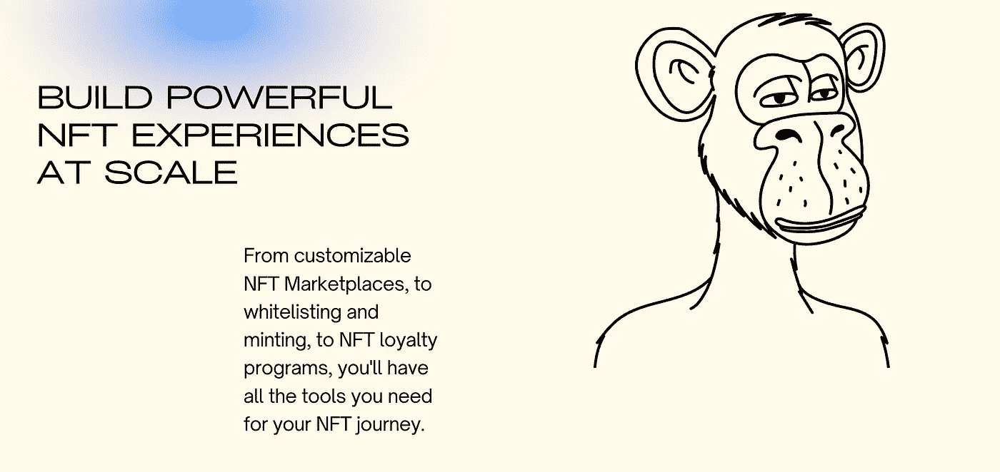

# 为中东和北非地区的品牌构建 NFT SAAS 平台的案例

> 原文：<https://medium.com/coinmonks/the-case-for-building-an-nft-saas-platform-for-brands-in-the-mena-region-13c8849c96b0?source=collection_archive---------20----------------------->

现在看来，地球上的每家公司都在寻求建立自己的 NFT/Web 3 战略，并进入这个领域。(包括中东)。许多人知道他们在做什么，有些人不知道，但大多数人没有资源，特别是技术知识和 web3 开发人员需要创造什么。好吧，那么他们真正需要的是什么:

1.  一个地方铸币 NFT 和获得所有未来交易的版税。
2.  一个简单的方法来登上没有加密用户。
3.  在客户自己的网站上为他们提供定制的 NFT 体验。
4.  创建自己的代币(如宜家代币),供顾客购买非功能性食物时使用
5.  从长远来看，通过 NFTs 为他们的公司创造可持续的重要收入流

当前像 OpenSea 等传统市场的问题是，它们在个性化体验方面非常有限。就你的收藏品展示方式和买家的整体体验而言，你几乎肯定会和其他所有创作者一样。另一个问题是，一些平台，如 Hypermint(由 Moonpay 所有)，已经为品牌创建了 SAAS 平台，但没有考虑到当地的中东和北非市场。那么中东北非市场有何不同。第一，也是最重要的是监管，中东北非地区很少有银行允许你用信用卡购买 NFTs 和 crypto。其次，他们对中东和北非公司的销售努力是不存在的，或者至少可以说是微不足道的。

这里的想法是创建一个平台，卸载所有的 web3 技术工作，提供一个 API/几行代码，复制到品牌的现有代码库。这将允许公司在自己的网站上创建 NFTs、mint、transfer 等所有功能，而不用担心所有需要的 web3 分支工作。

## 挑战

1.  创建一个强大的销售框架，以适应中东和北非地区的需求，并可以扩展。
2.  克服法律障碍，包括向公司提供一些法律知识(如在阿联酋有业务)，作为入职流程的一部分。
3.  聘请所需的技术人才来解决一个相对较新的问题，并建立一个平台，使企业能够扩大到数百万 NFT 用户。

请在评论区告诉我你的想法，如果你有任何想法，请联系我:-)

> 交易新手？试试[加密交易机器人](/coinmonks/crypto-trading-bot-c2ffce8acb2a)或者[复制交易](/coinmonks/top-10-crypto-copy-trading-platforms-for-beginners-d0c37c7d698c)