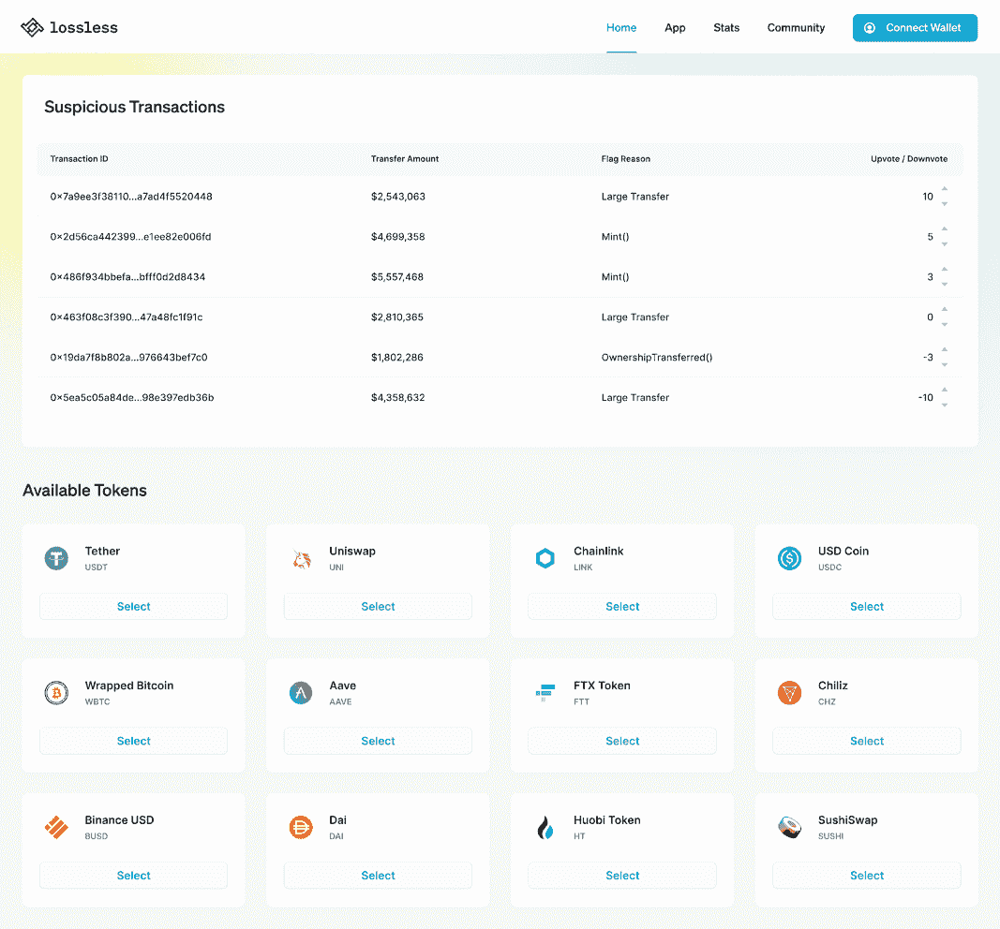

# 无损加密的案例:解决加密的最大问题

> 原文：<https://medium.com/coinmonks/the-case-for-lossless-crypto-solving-cryptos-biggest-problem-e1fb57e1a9ae?source=collection_archive---------19----------------------->

# 介绍

2018 年 4 月 20 日，以太坊的联合创始人维塔利克·布特林(Vitalik Buterin)在推特上写道，“应该有人来发布一个名为“可逆以太”的 ERC20，它由以太 1:1 支持，但有一个可以在 N 天内恢复转移的 DAO。”

加密货币因其不可改变、快速和匿名的特性而成为黑客的攻击目标。据区块链领先的数据公司 Chainalysis 估计，仅在 2022 年，加密货币黑客就窃取了超过 1000 万 2B。美国消费者新闻与商业频道还报告称，2020 年加密货币盗窃案增加了 516%，2021 年加密货币价值达到 32 亿美元。其中，72%的被盗资金来自 DeFi 协议。

就在 3 天前，世界上最大的加密货币交易所币安宣布价值 5.7 亿美元的 BNB 代币被盗，导致交易所暂停链，这表明一些“分散”的加密货币实际上有些集中。

既然我们已经了解了加密货币盗窃是当今加密货币面临的最大问题之一，那么潜在的解决方案是什么呢？

# 解决方案:无损协议(LSS)

黑客攻击发生后，可逆令牌冻结网络罪犯窃取的加密资金。

无损协议是一种工具，通过简单地将一段无损协议代码插入其本机令牌的代码中，来帮助受黑客攻击影响的加密货币实体取回被盗资金。这段代码允许无损监控和冻结基于特定参数的欺诈交易，同时仍然保持分散。无损通过让各方参与并要求各方努力追回被盗资金来实现这一目标。

Lossless 的目标是推出一个配备仪表板的平台，让白帽黑客能够发现潜在的欺诈行为。该平台还允许实现 bot 友好的 API，以自动发现潜在的欺诈交易并通知独立的白帽黑客。如果发生了真正的黑客攻击，白帽黑客将有能力冻结交易，并为此获得无损令牌奖励。该奖励系统旨在激励 DeFi 和白帽黑客社区为所有参与者创建一个更安全的 DeFi 生态系统。

无损还计划实现“无损决策机构”，它将充当有多个参与者的 DAO，例如；在$LSS 持有大量股份的投资者、审计公司和白帽黑客，以便为实现无损协议代码的加密货币提供可信和公正的决策机构。这个决策机构负责核实黑客攻击，冻结和归还被盗资金。

# 无损协议是如何工作的？

无损协议有一个两步过程:

1.  黑客钱包的初步冻结—潜在黑客钱包的 24-48 小时即时冻结将基于技术，并将奖励识别黑客的人。
2.  黑客验证—决策机构将通过与令牌的创建者和公司交谈来调查潜在的黑客，以确定在撤销交易之前提交的信息是否有效。

第一步:初始冷冻

对于任何人谁是赌注$LSS 令牌，他们有能力报告可疑交易显示在无损协议仪表板上，如上所述，并显示如下。

Lossless protocol 的团队已经为所有白帽黑客实现了黑客定位工具，让他们在定位潜在黑客时发挥优势。根据协议，这是开源代码，允许任何人在其上构建供他们使用。此外，值得注意的是，这是一个赢家通吃的激励结构，这意味着最快识别欺诈交易的人将获得所有 LSS 奖励。

步骤 2:验证黑客攻击

在潜在的欺诈交易被冻结后，决策机构将决定交易的意图。

决策机构将包括:

1.  令牌创建者—在其令牌中实施无损协议代码的令牌的创建者。
2.  无损公司——创建无损协议的个人。
3.  无损委员会——拥有大量 LSS 代币和加密审计公司的投资者。

这一决策机构的建立是为了促进权力下放，不给予任何一个团体绝对的权力。

如果决策机构证实黑客入侵，该地址将被再冻结 14 天，委员会将制定一项永久冻结和撤销交易的提案。

# 美元 LSS 币有什么用？

为了确保白帽黑客利用他们的时间和精力来发现欺诈交易，必须有一种机制来激励这些努力。这就是$LSS 问世的原因。

$LSS 代币的一些用途是:

1.  黑客发现者因发现欺诈交易而获得 20 美元 LSS 代币的奖励.
2.  为了冻结交易，潜在的黑客检举者需要投入至少价值 5000 美元的 LSS。

# 无损协议在行动:DeFi 安全项目“无损”如何帮助从 Cream Finance hack 追回 1670 万美元

Lossless 是一家分散式金融(DeFi)安全机构，在 2021 年 8 月发生的 Cream Finance 漏洞利用期间，已协助恢复了 5，152.6 个以太网。

Lossless 认为白帽安全专家 Pascal Caversaccio 是成功追回被盗资金的关键。

今年 8 月，Cream Finance 的 ETH 和 Amp 代币遭受了高达 1900 万美元的闪电贷款攻击，违反了贷款协议。在被利用之后，Cream 声明它将通过协议收取的费用支付被吸走的资金，以补偿受影响的用户。

Lossless 详细介绍了资产追回过程，并表示它利用其在黑客世界中的广泛关系，归还了在闪贷攻击中取走的资金。

Lossless 还表示，该项目正在寻求推出一种黑客缓解工具，该工具将允许协议开发人员采用一种“亲自动手”的方法来防止他们平台的这种恶意利用。

据报道，这种缓解措施的一部分将包括对可疑交易实行 24 小时冻结，以便有时间进行有力的调查。

无损公司的首席业务发展官 Dominykas A. van Otterlo 告诉 Cointelegraph，黑客缓解工具将利用该项目的知识库，同时手动追踪黑客。无损计划为以太坊、多边形和币安智能链网络中的 DeFi 项目提供安全支持，并部署在第二层协议上。

根据 10 月 1 日的一份 Cream Finance 声明，Lossless 和 Caversaccio 从成功的资金回收中获得了 50%的 bug 奖金。"这是我们第一次如此大规模的回收."

DeFi 平台继续成为黑客和机会主义奸商的受害者，他们利用智能合同代码中的漏洞从这些项目中吸走资金。

事实上，今年 8 月，保利网络(Poly Network)多个网络遭受了 6.1 亿美元的巨额黑客攻击。负责的实体最终归还了被盗资金，但这一事件为 DeFi 领域普遍存在的安全漏洞提供了一个指针。

DeFi 项目继续向白帽黑客提供漏洞奖金，以发现逃脱代码审计过程的漏洞。据报道，9 月，白帽程序员亚历山大·施林德温(Alexander Schlindwein)从 Belt Finance 获得了 105 万美元的 bug 奖金。

# 关键要点

1.  它工作了。正如您在上面看到的，无损协议是 Cream Finance 能够找回 1670 万美元被盗资金的唯一原因。
2.  实现是免费的。是的，它可以在你的令牌代码中免费实现所有支持的链(**以太坊、BNB 链、多边形、雪崩和 Fantom)。**只有在发现真正的黑客攻击并成功撤销欺诈交易的情况下，才会收取 7%的费用。
3.  截至发稿时，**无损协议的市值只有 1000 万美元。一种具有实际效用的加密货币，其市值只有 1000 万美元，却被成功用于预期用途，值得在你的投资组合中进行少量配置。**
4.  他们刚刚推出了 Aegis，它可以识别恶意行为模式，分配风险分值，并实时通知项目团队可能的威胁。这个项目每天都在开发和改进他们的代码。

来源:

1.  [https://Twitter . com/vitalikbuterin/status/98726267036184577](https://twitter.com/vitalikbuterin/status/987262267036184577)
2.  [https://forkast . news/could-reversible-crypto-transactions-阻截-黑客-犯罪-斯坦福-研究-火花-辩论/](https://forkast.news/could-reversible-crypto-transactions-tackle-hacker-crime-stanford-study-sparks-debate/)
3.  [https://www . CNBC . com/2022/01/06/crypto-Scammers-take-a-record-140 亿-in-2021-chain analysis . html #:~:text = Scammers % 20 around % 20 the % 20 world % 20 book，% 243.2% 200 亿% 20worth % 20of %加密货币](https://www.cnbc.com/2022/01/06/crypto-scammers-took-a-record-14-billion-in-2021-chainalysis.html#:~:text=Scammers%20around%20the%20world%20took,%243.2%20billion%20worth%20of%20cryptocurrency)
4.  【https://morioh.com/p/c2e315632bdf 
5.  [https://www . Reuters . com/technology/hackers-steal-around-1 亿-加密货币-币安链接-区块链-2022-10-07/](https://www.reuters.com/technology/hackers-steal-around-100-million-cryptocurrency-binance-linked-blockchain-2022-10-07/)
6.  [https://coin telegraph . com/news/defi-security-project-lossless-helps-recover-16-7m-from-cream-finance-hack](https://cointelegraph.com/news/defi-security-project-lossless-helps-recover-16-7m-from-cream-finance-hack)

> 交易新手？尝试[加密交易机器人](/coinmonks/crypto-trading-bot-c2ffce8acb2a)或[复制交易](/coinmonks/top-10-crypto-copy-trading-platforms-for-beginners-d0c37c7d698c)