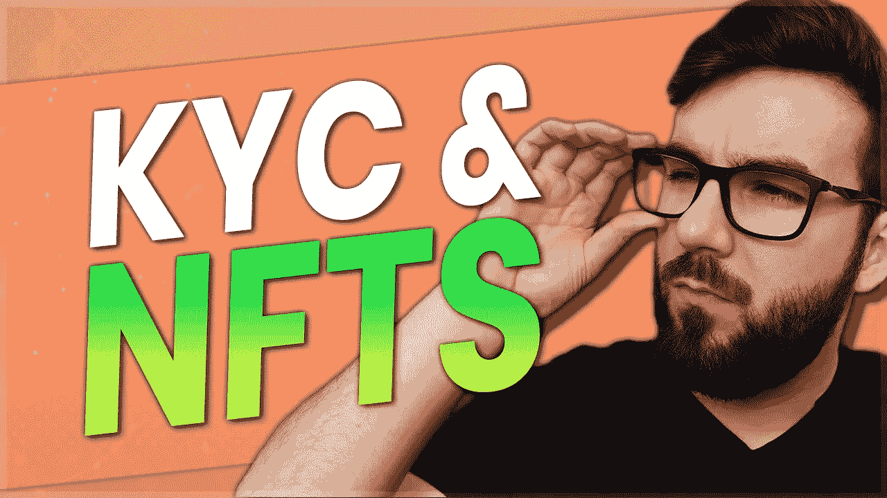

# 非正规金融服务的集中化——KYC 和撤资

> 原文：<https://medium.com/coinmonks/the-centralization-of-nfts-kyc-withdrawals-e1f9c9237502?source=collection_archive---------23----------------------->

我注意到一个日益增长的趋势，更多的 NFT 市场是集中的，需要 KYC，并且不允许在多种情况下提款。让我们来谈谈 NFT 空间中这个日益严重的问题的几个例子。

[https://peakd.com/hive-167922/@scottcbusiness/ymngircz](https://peakd.com/hive-167922/@scottcbusiness/ymngircz)

[https://rumble . com/v1 boqc 3-the-centrification-of-nfts-kyc-and-extractions . html](https://rumble.com/v1boqc3-the-centralization-of-nfts-kyc-and-withdrawals.html)

[https://d . tube/v/scottc business/qmwlvz 6 r 8 grqxzp 3 nju 5 cjqvek 1 egdjnowcqodfgnpef](https://d.tube/v/scottcbusiness/QmWLvz6R8GrqxzP3NjU5cJQvek1eGDjnowkCQoDFgNpepF)

[https://odysee.com/@ScottCBusiness:4/veve-and-omi-nft:d](https://odysee.com/@ScottCBusiness:4/veve-and-omi-nft:d)

以下是一些需要注意的危险信号:KYC 要求交易非金融交易，交易不在链上，非金融交易不存储在你自己的钱包里，提款限制和约束，以及任何其他阻止你以分散方式交易或拥有非金融交易的障碍。

这是我的第 528 集/文章。我在这个内容上投入了大量的工作，所以如果你觉得它有价值，请喜欢，分享，评论和订阅！

**VeVe** 对于一些测试用户来说，他们可以在测试阶段退出，但这是非常有限的。

此外，因为所有的 NFT 都集中存储在它们的应用程序中，就像交换一样，所以您也没有 NFT 的真正所有权。他们还会限制你可以提取的金额，这使得你的资金更加难以取出。同样需要注意的是，提现要收 10%的手续费。https://help.veve.me/gems——你可以在他们的帮助中心了解更多。宝石不是真正的密码，它们只是在应用商店的应用点。你可以发送它们，并且你用它们做的任何事情仍然受到苹果&谷歌通过应用商店的监管。

> 交易新手？尝试[加密交易机器人](/coinmonks/crypto-trading-bot-c2ffce8acb2a)或[复制交易](/coinmonks/top-10-crypto-copy-trading-platforms-for-beginners-d0c37c7d698c)

求助 app 上说每 7 天只能提取最少 50 颗宝石，最多 50000。你确实需要交易足够多的钱，使你至少有 50 美元的价值，或者如果你大量卖出，你必须错开取款时间。但是根据他们最近的一个帖子[https://medium . com/veve-collectibles/veve-payout-what-you-need-to-know-c 00529 b 28891](/veve-collectibles/veve-payout-what-you-need-to-know-c00529b28891)——你至少需要 1000 颗宝石才有资格获得支付，100 颗宝石是最低提款额。所以，你需要价值 1000 美元的存款，而且你至少要提取价值 100 美元的存款。他们可能需要长达 5 天的时间来支付，他们也必须批准支付。

**Crypto.com 非功能性金融交易:**Crypto.com 和 KYC 在市场上存在同样的问题，这消除了以分散方式交易非功能性金融交易的可能性。——【https://crypto.com/nft/ 

**Theta NFTs:** Theta。电视仍然有和以前一样的问题，除了现在他们允许你把你的 TFUEL 撤到他们的 NFT 平台，你也需要 KYC 验证，不能退出。https://www.theta.tv/account/thetadrop-transfer——你可以每 30 天提取 400 燃料，目前大约只值 20 美元。

按下转接后，系统会提示您不能撤销。

[https://www.thetadrop.com/](https://www.thetadrop.com/)—这是他们实际的 NFT 平台，但你不想使用它，因为你无法取出你的资金。

你投资过 NFTs 吗？您是否从这些平台中的任何一个购买了 NFT 或无法提取资金？请在下面的评论中告诉我你对此的看法，别忘了订阅哦！

***免责声明:这不是理财建议，纯属娱乐目的。您看到的、听到的或读到的都是我的个人观点，所做的任何陈述都是基于我的观点，不应被误解为事实。我的加密组合可能是模拟的，也可能不是***

👥支持我&跟随我去别的地方👥

👉[http://www.scottcbusiness.com](http://www.scottcbusiness.com/)

在我的电报中提问:[https://t.me/cryptoandthings](https://t.me/cryptoandthings)

你可以在[https://cointr.ee/scottcbusiness](https://cointr.ee/scottcbusiness)上找到我所有的加密货币地址

你可以在这里找到我所有的推荐链接:[https://linktr.ee/scottcbusiness](https://linktr.ee/scottcbusiness)