# 新世界力量的挑战:美元的历史

> 原文：<https://medium.com/coinmonks/the-challenge-for-a-new-world-power-the-history-of-the-dollar-4c88ccacce78?source=collection_archive---------21----------------------->

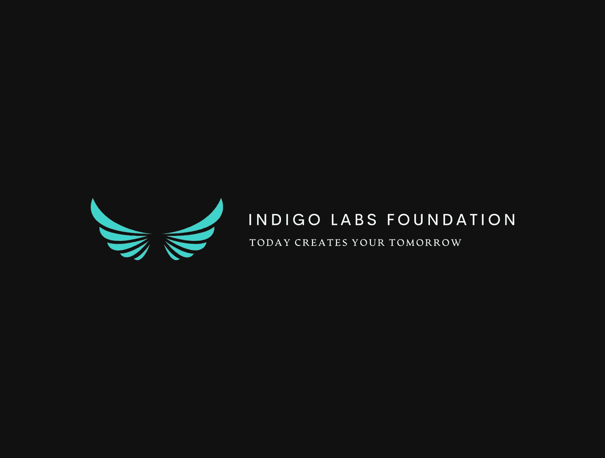

‘’There is no instance of a nation benefitting from prolonged warfare.’’ — Sun Tzu

纵观人类历史，许多国家都试图通过军事手段来控制和影响其他国家。然而，控制其他国家的最有效的工具随着贸易路线的建立而改变了。货币成为实现这些目标的最有力的工具之一。本文只关注货币的近期历史和当前的全球储备货币——美元。最后，我们认为，新超级大国面临的挑战越来越大，美元可能面临前所未有的风险。

## 囚徒困境

Allegory of the Prisoner's Dilemma

> 多萝西·汤普森曾经说过“和平不是没有冲突”。永远不要忘记，潜在动荡的基础强化了某种形式的和平与稳定。博弈论专家称之为囚徒困境的悖论，它描述了一种只有通过残酷竞争才能达到的危险而脆弱的平衡。囚徒困境是理解现代金融市场影子风险的最重要范式，它处于金融史上前所未有的多代债务周期的顶峰。
> 
> 艺术家迪亚兹·霍普(Diaz Hope)和罗斯(Roth)在他们题为“囚徒困境的寓言”的杰作挂毯中，形象地描绘了一座伟大的文明之塔，它建立在人类历史上合作与竞争的基础之上。艺术家们迫使我们面对这样一个事实:经过一万年的人类文明，我们现在正处于十字路口。今天，我们拥有人类历史上最高的生活水平，同时也有能力通过核战争从生态上摧毁我们的星球和我们自己。
> 
> 我们正处于有史以来最大概率尾部风险的最稳定时期。大多数美国人一生都没有经历过直接的战争，这在人类历史上是罕见的。**这意味着我们安全了吗？或者，这种风险是否以某种其他形式存在，随着时间和空间的推移而发生嬗变和变化，却没有被那些在我们的屏幕上厚颜无耻地兜售美国永久主导地位的大多数政治专家所发现？** ( [阿耳资本研究论文](https://artemiscm.docsend.com/view/t2rpfyivddgqg6n8))

# **布雷顿森林协定**

随着世界地缘政治力量的演变，储备货币来来去去。人类历史上有多种国际货币，包括[希腊德拉克马](https://en.wikipedia.org/wiki/Greek_drachma)、[罗马银币](https://en.wikipedia.org/wiki/Denarius)、[法国法郎](https://en.wikipedia.org/wiki/French_franc)以及数十种甚至数百种其他货币。然而，在 1530-1640 年间，西班牙银元成为美洲、亚洲和欧洲第一个真正的全球储备货币。从 1640 年起，荷兰的荷兰滑翔机成为欧洲的储备货币，但是在 18 世纪晚期，一场针对亚洲大英帝国的战争导致了荷兰东印度公司的破产。郁金香狂热泡沫后，法国成为一个共和国，入侵荷兰，并发行了当时占主导地位的贸易货币 Assignat，于 1720 年至 1815 年举行。19 世纪初以英国东印度公司的崛起为标志，这使英镑成为一种新的全球储备货币，因为英国公司是该行业的领导者，英国保险公司成为全球贸易的主要保险公司。

1939 年初秋，全世界惊恐地目睹了德国闪电战横扫波兰，再加上俄罗斯同时入侵，在 35 天内征服了整个波兰领土。随着一个又一个国家落入德国手中，其他欧洲成员害怕他们的土地会是下一个，开始将他们的黄金储备送往美国。美联储的黄金储备一度超过全球总量的 50%。

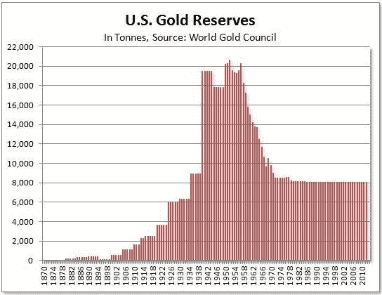

US Gold Reserves. World Gold council

随着战争逐渐平息，盟军显然会获胜，西方大国明白，他们需要就创建新的全球货币和经济体系达成新的共识。英国的最后一个超级大国受到了战争的巨大影响，因为纳粹德国的密集轰炸摧毁了大多数工业城市。其他欧洲国家，如法国，在不同的战争时期被德国和美国的炮弹击碎。另一方面，美国拥有全球大部分的黄金储备，拥有最好的借贷能力，并且经济没有受到损害。

欧洲国家明白送回黄金储备风险太大。因此，美元成为新的全球储备货币的事实上的选择。因此，准备重建国际货币体系，来自所有 44 个盟国的 730 名代表聚集在布雷顿森林的华盛顿山酒店，制定商业和金融关系规则。结果，1944 年 7 月 22 日，布雷顿森林协议签署，使美元成为新 WRC，参与国[将同步货币政策](https://ies.princeton.edu/pdf/E106.pdf)以避免竞争性贬值。简而言之，该协议意味着美元将与黄金挂钩，而其他货币将与美元挂钩。这表明所有国家仍然与黄金间接相关，并且仍然可以以每盎司 35 美元的固定汇率将美元兑换成黄金，这是一个硬兑换挂钩，美国[将捍卫这个挂钩。](https://www.thebalance.com/gold-price-history-3305646)

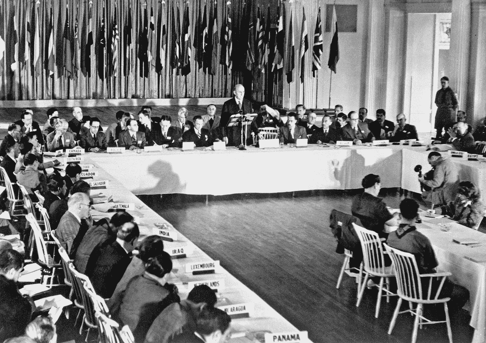

Bretton Woods Agreement, 1944.

# **尼克松休克**

在最初的几十年里，布雷顿森林体系运转良好。马歇尔计划于 1948 年宣布，为西欧盟国提供了超过 130 亿欧元(2022 年为 1200 亿欧元)的经济复苏计划。美元需求上升，因为各国希望他们购买美国商品——汽车、钢铁、机械等。由于美国拥有全球一半以上的黄金，该体系看起来是安全的。

裂缝在 20 世纪 60 年代枪炮黄油时代开始出现。约翰·肯尼迪总统遇刺后，林登·贝恩斯·约翰逊成为第 36 任美国总统。约翰逊进一步升级了美越战争，并建立了医疗保险、医疗补助和政府运营的先行计划。因此，大量增加的政府债务和美国国债形式的美元开始在外国央行储备账户中堆积。此外，随着德、日的复苏，美国占世界经济产出的比重从 35%下降到 27%,美联储的负国际收支和日益加剧的货币通胀导致美元越来越被高估。

在法国，布雷顿森林体系被称为“美国的过度特权”，因为美国永远不会面临国际收支危机，因为他们的进口是用他们的货币购买的。 [Barry Eichengreen](https://en.wikipedia.org/wiki/Barry_Eichengreen) 总结了这种特权:“印刷局印制一张 100 美元的钞票只需要几分钱，但是其他国家为了得到一张钞票必须支付 100 美元的实物”。然而，在 1965 年，当时的法国总统戴高乐做了一番计算，意识到美国发行了太多的美元；即使考虑到巨大的黄金储备，也不足以完全赎回。在他臭名昭著的“[标准演讲](https://www.usagold.com/cpmforum/favorite-web-pages-degaulle/)”中，他列出了这些论点，并开始积极地将美元兑换成黄金。

全球“挤兑美元”已经开始，到 1971 年，货币供应量增加了 10%。西德离开布雷顿森林体系后，不愿意让德国马克升值。瑞士在 7 月赎回了 5000 万美元，法国赎回了 1.91 亿美元。随着黄金储备的减少，美国离开布雷顿森林体系的压力开始加大，美国将只能拿着一袋由承诺支撑的毫无价值的美元。看到迫在眉睫的美元破产危机，美国第 37 任总统理查德·尼克松于 1971 年 8 月 15 日宣布，他将关闭黄金窗口，这意味着没有人能够从这一点赎回黄金。

尼克松的演讲在国际上不如在美国那样受欢迎。在政治上，尼克松的演讲是一个巨大的成功，因为美国人相信政府把他们从价格标尺中解救了出来。另一方面，1971 年 12 月， [G10](https://www.investopedia.com/terms/g/groupoften.asp) 国家制定了[史密森协议](https://www.investopedia.com/terms/s/smithsonian-agreement.asp)，该协议将重新设定贬值美元的汇率。然而，该计划并不成功。1973 年 3 月，十国集团呼吁六个欧洲成员国将他们的货币捆绑在一起，并共同使其对美元浮动，从而结束了固定汇率制度。这场危机被称为“尼克松冲击”。

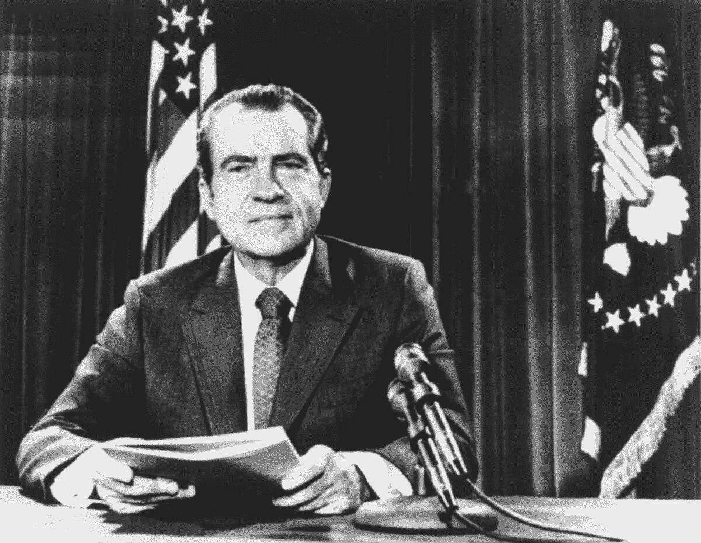

Nixon's speech closing the gold window.

# **石油美元**

黄金窗口关闭后，危机攀升，通胀飙升。美国的谷物出口价格翻了两番，同时石油输出国组织国家提高了石油价格。关于货币战争的讨论开始升温，尼克松政府知道他们必须采取措施止血。因此，传奇式的国务卿亨利·基辛格策划了一项与沙特和石油输出国组织国家的秘密协议。这项协议为石油输出国组织国家提供了政治和军事保护，而他们只能用美元出售石油。石油美元就这样诞生了。

这个协议是天才的，因为所有国家都被迫购买美元来获得石油，从而人为地增加了对美元的需求。此外，随着美元在外国储备中的积累，它们需要被循环利用，这意味着它们可以被引导为贷款或直接投资回到美国。

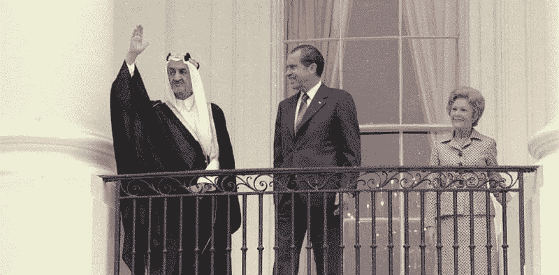

Secret petrodollars agreement

## **特里芬困境与外汇储备**

石油美元体系导致对美元的需求增加，目标实现了，但比想象的要好。**为了理解这一点，我们假设“您”是泰国政府**。你清楚地记得 1997 年的亚洲金融危机，当时你的经济蓬勃发展，而企业和房地产部门承担了大量债务，形成了巨大的泡沫。不久，泡沫开始破裂，导致最大的金融公司 *Finance one* 破产，而该国最大的开发商之一 *Somprasong Land* 违约。

外汇交易员开始抛售大量泰铢，攻击泰铢盯住美元的政策。想要捍卫它，你开始使用外汇储备在外汇市场购买泰铢。然而，随着你的储备耗尽，投机的下行压力导致货币贬值。结果，消费者失去了消费能力，而当货币升值时获得的贷款变得无法偿还。

但愿你已经吸取了教训，现在明白了在外汇储备中持有更多外汇以稳定本币的必要性。本质上，如果一个泰国持有美元，美元的影响可以忽略不计。但在现行体制下，所有国家都持有美元作为主要储备货币。导致美国国债面临巨大的购买压力。

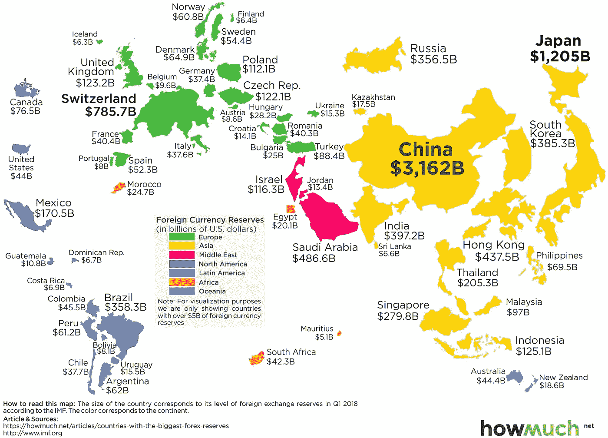

US dollars reserves in foreign countries.

这就是法国在 20 世纪 60 年代所说的“美国的过分特权”。他们明白，美国永远不会面临国际收支危机或债务危机，因为由于中央银行和石油美元系统，对美元的需求将一直很高。从本质上讲，美国可以廉价借贷，大肆支出，同时进口保持廉价，通胀被输出到国外。

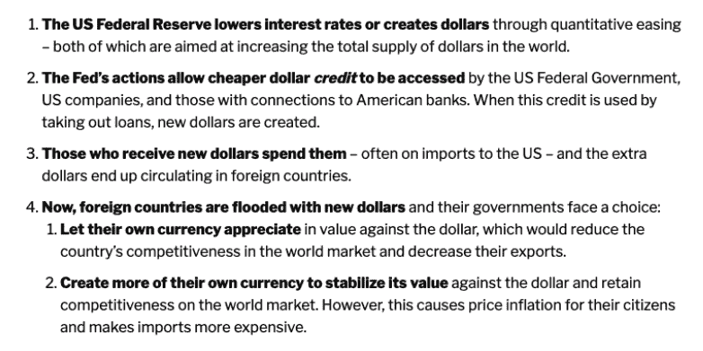

Export inflation, import cheap goods

为了满足美元需求，美国不得不维持持续的账户赤字，因为它需要汇回的美元多于汇回的美元。因此，WRC 持有者的账户赤字在不断增加，使这个国家变得没有生产力。这就是众所周知的特里芬难题:世界储备货币(美国)必须保持持续的贸易赤字，迫使它们成为净进口国。

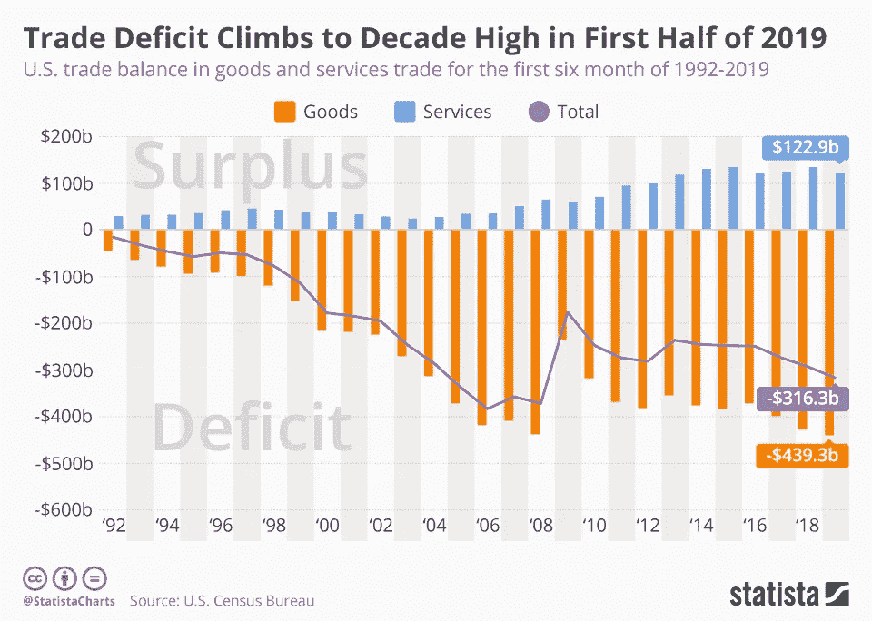

随着美元通过 SWIFT 支付系统继续主导全球贸易，其他国家开始交易以美元为基础的合同计价的商品。例如，当尼日利亚和智利进行金属贸易时，他们不会接受智利比索或尼日利亚奈拉，因为这两种货币都比美元小，流动性也差。事实上，根据 SWIFT 公开发布的报告，超过一半的全球贸易是以美元进行的。

这个过程被称为美元化，其他国家使用美元作为支付手段，即使他们对美元没有控制权。类似地，大多数加密使用与美元挂钩的稳定货币，大多数交易以美元进行。这提振了美元需求，而加密市场的增长可能会取代石油美元体系。

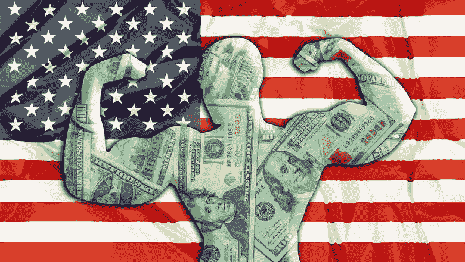

# **新超级大国的挑战**

通过这一过程，美国建立了人类历史上最重要的军队，同时在过去 80 年里打着几乎连续不断的战争，因为他们廉价借贷，挥霍无度。然而，美元的主导地位正在减弱，这可以从全球贸易中看出，在过去 20 年中，美元的国际角色从 70%下降到 60%。

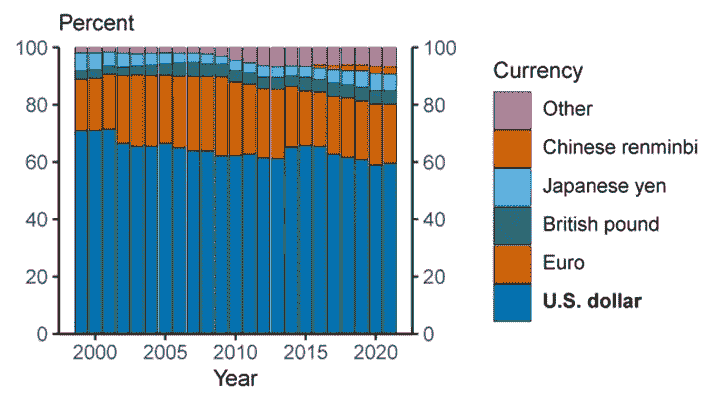

Dollar dominance

这被当前的战争进一步加速，这场战争始于 2022 年 2 月 24 日，俄罗斯入侵乌克兰。作为回应，美国及其盟友冻结了俄罗斯中央银行的储备，有效地切断了俄罗斯大约一半的价值近 6300 亿美元(€5980 亿美元)的战争资金。因此，俄罗斯通过在外汇市场上用美元购买卢布来稳定其货币的手段就不复存在了。这为俄罗斯及其主要盟友中国敲响了警钟，让它们摆脱对美元体系的依赖。因此，俄国、中国、南非、印度和巴西正在[开发一种基于所有五个国家的一篮子货币的新储备货币。](https://markets.businessinsider.com/news/currencies/dollar-dominance-russia-china-rouble-yuan-brics-reserve-currency-imf-2022-6)

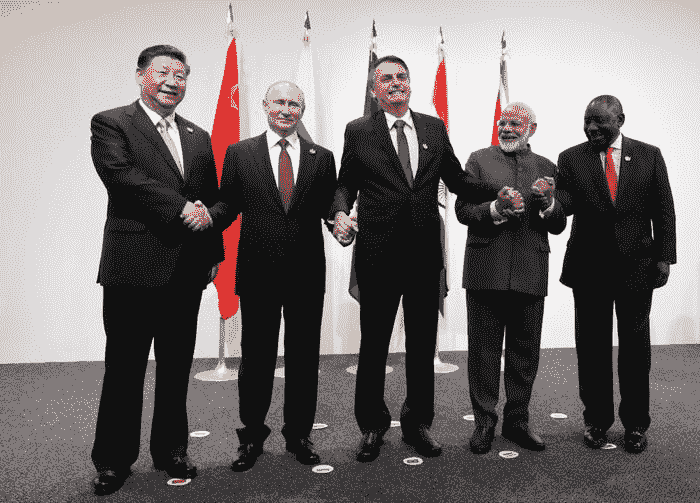

BRICS

此外，随着去年美国和中东紧张局势加剧，石油美元体系面临挑战。拜登政府没有对沙特阿拉伯采取更强硬的立场，不支持他们在也门的局部战争，或保护他们反对伊朗的立场，并公开指责他们对贾迈勒·哈肖吉的死负责。因此，沙特阿拉伯曾考虑用人民币交易对中国的石油销售，因为它是世界上最大的石油消费国，所以用人民币而不是美元交易似乎是一种直接匹配。然而，即使中国非常努力地保持人民币的稳定，它也远远不是一种储备货币，更不用说是一种透明的货币了。更详细地阐述了经济衰退:外部因素 2022(第二部分)。如果沙特阿拉伯真的这么做了，这将标志着远离历史忠诚的一大步，美元/SWIFT 体系也将终结。

# **尾注**

美元霸权帮助美国建立了人类历史上最大的帝国，拥有 800 多个海外军事基地。中国及其盟友正在挑战美元体系的现状，并以前所未有的速度缩小经济和实力差距。然而，主要的风险可能是在美国国内，罗马的故事是对历史上一个警告的回应:

> 一个复杂的社会，拥有强大的政治、法律和金融机构，并得到强大军队的支持，却没有被毁灭性的敌人入侵，而是从内部崩溃和腐败。一个脱离公民日常生活现实的精英统治阶级监管着一个收入不平等、环境恶化、政治腐败、社会恶化和经济绝望日益加剧的帝国，却没有采取任何措施加以阻止。( [罗马帝国的衰亡](https://www.goodreads.com/book/show/19400.The_Decline_and_Fall_of_the_Roman_Empire?from_search=true&from_srp=true&qid=oZSKjoDHpx&rank=1))

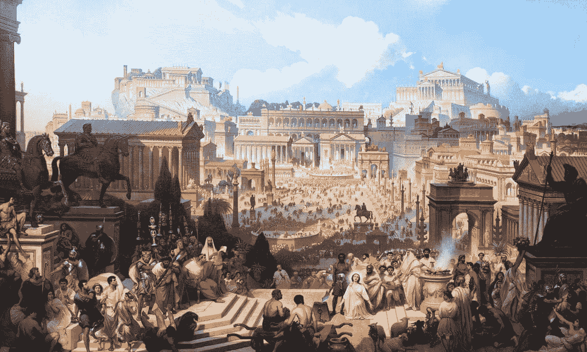

**有关 Indigo 实验室基金会的更多信息，请查看我们的社交:**

[推特](https://twitter.com/IndigoLabsFound) | [媒体](/@indigolabsfoundation)

> 加入 Coinmonks [电报频道](https://t.me/coincodecap)和 [Youtube 频道](https://www.youtube.com/c/coinmonks/videos)了解加密交易和投资

# 另外，阅读

*   [my constant Review](https://coincodecap.com/myconstant-review)|[8 款最佳摇摆交易机器人](https://coincodecap.com/best-swing-trading-bots)
*   [MXC 交易所评论](/coinmonks/mxc-exchange-review-3af0ec1cba8c) | [Pionex vs 币安](https://coincodecap.com/pionex-vs-binance) | [Pionex 套利机器人](https://coincodecap.com/pionex-arbitrage-bot)
*   [我的密码交易经验](/coinmonks/my-experience-with-crypto-copy-trading-d6feb2ce3ac5) | [《比特币基地评论》](/coinmonks/coinbase-review-6ef4e0f56064)
*   [CoinFLEX 评论](https://coincodecap.com/coinflex-review) | [AEX 交易所评论](https://coincodecap.com/aex-exchange-review) | [UPbit 评论](https://coincodecap.com/upbit-review)
*   [AscendEx 保证金交易](https://coincodecap.com/ascendex-margin-trading) | [Bitfinex 赌注](https://coincodecap.com/bitfinex-staking) | [bitFlyer 点评](https://coincodecap.com/bitflyer-review)